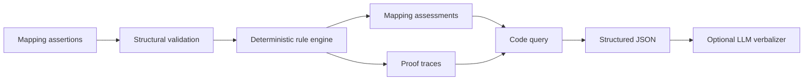

# Biomedical Mapping COKB Architecture

## Scope

The COKB extension formalises and executes knowledge about mappings between biomedical code systems already represented by OntologyRAG. It does not invent disease hierarchies that are absent from the source graph and does not treat an LLM response as a verified fact.

## Components

| COKB component | Implementation |
|---|---|
| `C` concepts | `CodeSystem`, `CodeConcept`, `MappingAssertion`, assessment, rule, premise, and proof classes in `ontology/biomedical_mapping_cokb.ttl` |
| `H` hierarchy | ICD code-system subclasses, mapping-target subclasses, and assessment subclasses |
| `R` relations | `mapsFrom`, `mapsTo`, `hasMappingLevel`, `producedByRule`, `hasPremise`, and provenance relations |
| `Ops` operators | Deterministic code/label normalisation, conflict detection, validation, merge, and ranking operations |
| `Funcs` functions | Find, assess, explain, and retrieve-proof functions exposed by `COKBRepository` |
| `Rules` | Ordered mapping rules in `scripts/cokb/rules.py`, mirrored by `rules/mapping_rules.json` |

## Runtime flow



The offline core comprises:

- `model.py`: immutable domain objects and proof schema;
- `operators.py`: normalisation and conflict operations;
- `rules.py`: explicit ordered rules;
- `reasoner.py`: deterministic rule execution;
- `validation.py`: dependency-free structural validation;
- `repository.py`: storage, queries, and RDF/JSON export;
- `shacl.py`: optional standards-based SHACL validation;
- `evaluation.py`: coverage-aware evaluation against the existing mapping-level gold data.

## Artifact separation

`cokb_build` writes:

```text
store.json
validation_report.json
proofs.json
asserted_graph.ttl
inferred_graph.ttl
proof_graph.ttl
```

Asserted mappings and inferred assessments are kept in different graphs. This prevents a rule or model prediction from being mistaken for source data.

## Trust boundary

The rule engine is deterministic. Model output belongs in a `ModelAssessment`; a model assessment is not promoted to a `RuleBasedAssessment` or source assertion. Unmatched cases return `UNASSESSED` instead of forcing A, B, or C.

## Full-graph integration

The committed ICD graph file is currently a Git LFS pointer. Once its real contents are restored, the source graph can be indexed as before and converted into the canonical `MappingAssertion` input contract. The sample JSON allows the COKB core, CLI, tests, and proof semantics to remain reproducible without the 262 MB graph object.
