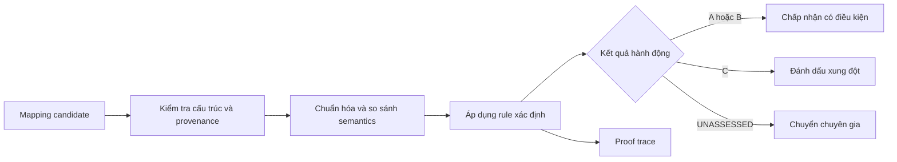
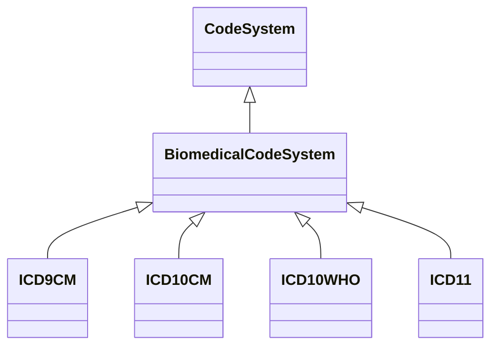
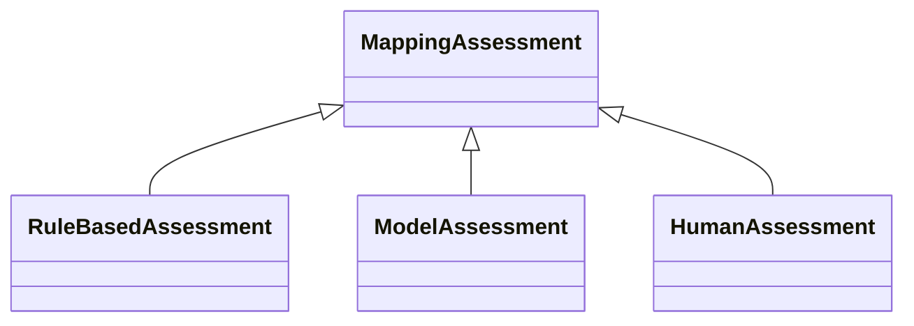
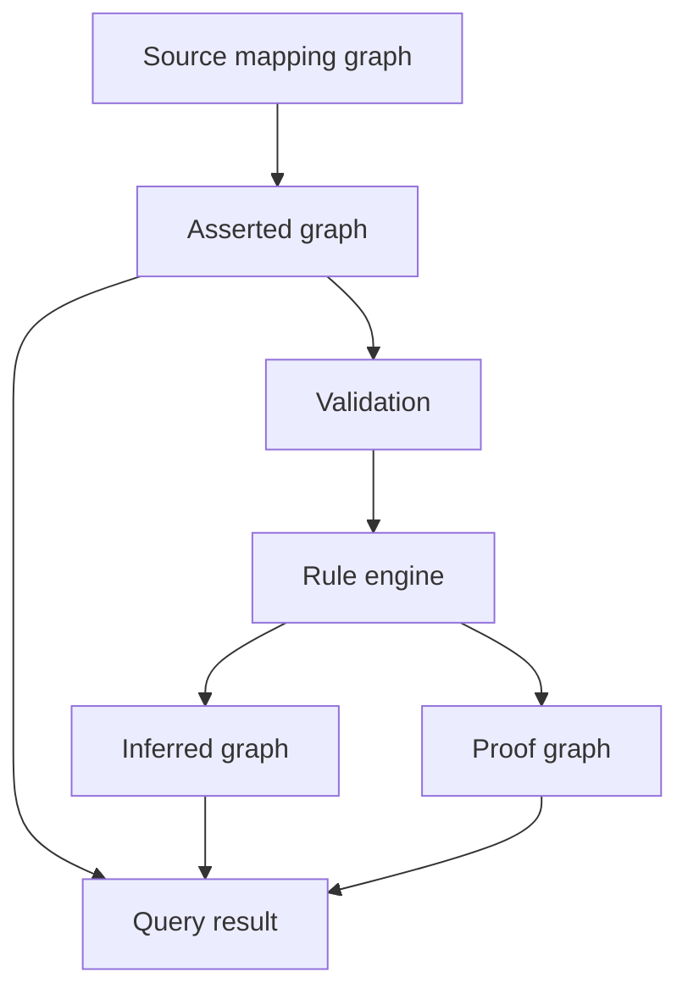
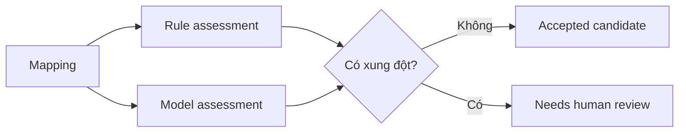
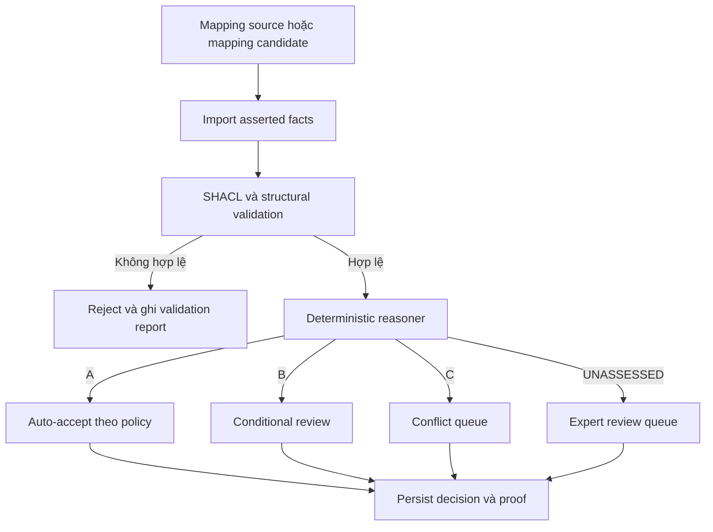

# Ý nghĩa thực tế và cách áp dụng Ontology COKB trong project

## 1. Tóm tắt

Project giải quyết bài toán đánh giá và giải thích ánh xạ giữa các hệ thống mã y sinh, chủ yếu gồm ICD-9-CM, ICD-10-CM, ICD-10-WHO và ICD-11.

Trong project này, COKB có ý nghĩa thực tế là **lớp kiểm soát quyết định cho dữ liệu ánh xạ mã**. Nó nhận một mapping candidate, kiểm tra dữ liệu và bằng chứng, áp dụng rule công khai, rồi trả về một trong các kết quả có thể hành động:

```text
ACCEPT       → mapping đủ điều kiện để chấp nhận theo rule
REJECT/FLAG  → mapping có xung đột cần loại hoặc cảnh báo
REVIEW       → chưa đủ bằng chứng, chuyển chuyên gia kiểm tra
```

COKB không chỉ trả lời “mã nào ánh xạ tới mã nào”. Nó còn cho biết **có nên tin mapping đó không, vì sao, dựa trên dữ liệu nào và rule nào chịu trách nhiệm**.

Để làm được điều đó, phần COKB có khả năng:

- kiểm tra cấu trúc dữ liệu;
- áp dụng toán tử và hàm xác định;
- suy diễn bằng các luật công khai;
- tách fact nguồn khỏi fact suy diễn;
- sinh proof trace gồm kết luận, tiền đề, luật và nguồn;
- từ chối kết luận khi chưa đủ bằng chứng.

Ý tưởng trung tâm là:

> Ontology lưu cấu trúc và fact; COKB kiểm tra và suy diễn fact bằng luật; RAG truy hồi phần tri thức liên quan; LLM chỉ hỗ trợ giao tiếp hoặc đưa ra một assessment riêng biệt, không thay thế nguồn sự thật.

---

## 2. Bài toán của project

### 2.1 Vì sao cần ánh xạ mã y sinh?

Các tổ chức y tế có thể sử dụng nhiều hệ thống mã khác nhau:

```text
ICD-9-CM
ICD-10-CM
ICD-10-WHO
ICD-11
```

Một khái niệm trong hệ thống nguồn có thể tương ứng với:

- đúng một mã trong hệ thống đích;
- nhiều mã đích;
- một mã đích tổng quát hơn;
- một mã đích chi tiết hơn;
- một mapping có nội dung xung đột;
- một mapping chưa đủ bằng chứng để đánh giá.

Ví dụ mapping tương đối rõ ràng:

```text
ICD-10-WHO K05.1: Chronic gingivitis
ICD-11     DA0B.Y: Chronic gingivitis
```

Ví dụ mapping có xung đột:

```text
Nguồn:
Gastric ulcer, unspecified as acute or chronic,
without hemorrhage or perforation

Đích:
Acute haemorrhagic gastric ulcer
```

Mapping thứ hai cùng đề cập đến gastric ulcer nhưng có ít nhất hai xung đột:

```text
acute       <> chronic/unspecified
hemorrhagic <> without hemorrhage
```

Do đó, hệ thống không chỉ cần trả về mã đích. Nó còn cần trả lời:

1. Mapping nào được graph khẳng định?
2. Mapping đến từ nguồn nào?
3. Hai nhãn có tương đương, tương thích một phần hay xung đột không?
4. Kết luận được tạo bởi rule, LLM hay chuyên gia?
5. Có những premise nào hỗ trợ kết luận?

### 2.2 Mục đích thực tế

Project hướng đến việc hỗ trợ chuyên gia medical coding:

- tìm mapping nhanh hơn;
- xem nhiều candidate mappings có cấu trúc;
- phát hiện các qualifier xung đột;
- phân biệt mapping chính xác với mapping chỉ đúng một phần;
- kiểm tra nguồn và proof trước khi chấp nhận kết quả.

Project không phải hệ thống chẩn đoán bệnh cho bệnh nhân.

---

## 3. Ý nghĩa thực tế của COKB

### 3.1 COKB biến mapping data thành quyết định có kiểm soát

Một triple `K05.1 mapsTo DA0B.Y` chỉ cho biết mapping tồn tại trong nguồn dữ liệu. Triple đó tự nó chưa trả lời được:

- mapping có chính xác về mặt ngữ nghĩa không;
- hai code có xung đột qualifier hay không;
- mapping có đủ bằng chứng để dùng tự động không;
- ai hoặc rule nào đã tạo ra kết luận;
- khi có lỗi thì phải kiểm tra lại ở đâu.

COKB bổ sung lớp quyết định nằm trên dữ liệu mapping:



Do đó, đầu ra hữu ích của COKB không phải chỉ là một target code, mà là bộ dữ liệu:

```text
(source code, target code, assessment, premises, rule, evidence, proof)
```

### 3.2 Một mapping được biến thành hành động như thế nào?

Trong implementation hiện tại, assessment có thể được diễn giải thành hành động nghiệp vụ như sau:

| Kết quả | Ý nghĩa | Hành động đề xuất |
|---|---|---|
| `A` | Hai nhãn tương đương sau chuẩn hóa | Có thể đề xuất chấp nhận tự động nếu policy cho phép |
| `B` | Mapping tương thích nhưng khác mức đặc hiệu | Chấp nhận có điều kiện hoặc yêu cầu kiểm tra ngữ cảnh |
| `C` | Có xung đột qualifier rõ ràng | Không tự động dùng; tạo cảnh báo để sửa hoặc review |
| `UNASSESSED` | Rules hiện có chưa đủ bằng chứng | Không đoán; chuyển sang human review hoặc nguồn bổ sung |

Việc ánh xạ `A/B/C/UNASSESSED` sang `ACCEPT/REJECT/REVIEW` là **policy của tổ chức**, không phải chân lý lâm sàng được hard-code. Project cung cấp assessment và bằng chứng để policy đó có thể được thực thi nhất quán.

### 3.3 Giá trị của `UNASSESSED`

`UNASSESSED` không phải lỗi chương trình. Đây là cơ chế từ chối có chủ đích khi knowledge base không có đủ rule hoặc evidence.

Trong một hệ thống mapping thực tế, trả về “chưa biết” an toàn hơn tạo ra một kết luận nghe hợp lý nhưng không kiểm chứng được. Trạng thái này cho phép:

- ngăn mapping yếu đi thẳng vào ETL hoặc báo cáo;
- tạo work queue cho chuyên gia coding;
- đo được vùng tri thức mà rules chưa bao phủ;
- ưu tiên bổ sung rule hoặc evidence dựa trên dữ liệu thật;
- không làm sai lệch accuracy bằng cách đoán mọi trường hợp.

### 3.4 Giá trị của proof trace

Mỗi kết luận được liên kết với:

```text
conclusion
premises
rule identifier
evidence sources
provenance
```

Proof trace giải quyết bốn nhu cầu thực tế:

1. **Kiểm tra:** chuyên gia thấy chính xác dữ liệu nào dẫn đến kết luận.
2. **Tái lập:** cùng facts và cùng rule tạo ra cùng kết quả.
3. **Audit:** có thể truy ngược kết luận đến nguồn và phiên bản rule.
4. **Sửa lỗi:** xác định lỗi nằm ở source fact, normalization, rule hay policy.

Nó không phải chứng minh y khoa rằng hai bệnh hoàn toàn tương đương. Nó là bằng chứng máy đọc được rằng **kết luận mapping đã được tạo đúng theo các facts và rules đang khai báo**.

### 3.5 COKB được dùng ở đâu?

Các tình huống sử dụng phù hợp gồm:

- **Data migration:** kiểm tra mapping trước khi chuyển dữ liệu giữa các phiên bản ICD.
- **ETL/data integration:** chỉ cho mapping đạt policy đi vào pipeline tự động.
- **Mapping quality assurance:** phát hiện exact matches, khác specificity và qualifier conflicts.
- **Human review:** xếp hàng các trường hợp `UNASSESSED` hoặc xung đột để chuyên gia xử lý.
- **Data governance:** lưu provenance, rule và proof phục vụ kiểm toán.
- **Research evaluation:** đo coverage, accuracy, abstention và proof completeness của một hệ tri thức.

COKB trong repo là proof-of-concept cho lớp kiểm soát này. Nó không phải hệ thống chẩn đoán, không thay thế chuyên gia y tế và chưa phải sản phẩm production cho toàn bộ ICD.

---

## 4. COKB là gì trong project này?

COKB được hiểu là một mô hình tri thức có các thành phần:

```text
C, H, R, Ops, Funcs, Rules
```

Trong đó:

- `C` — tập các khái niệm;
- `H` — quan hệ phân cấp giữa khái niệm;
- `R` — các quan hệ tri thức;
- `Ops` — các toán tử biến đổi hoặc kiểm tra;
- `Funcs` — các hàm truy vấn, đánh giá và giải thích;
- `Rules` — các luật suy diễn.

Trong repo, COKB không chỉ là một file OWL/Turtle. Nó gồm cả:

1. ontology vocabulary;
2. SHACL shapes;
3. Python operators và functions;
4. rule engine xác định;
5. asserted, inferred và proof graphs;
6. evaluation protocol.

Đặc tả ontology nằm tại:

- [`ontology/biomedical_mapping_cokb.ttl`](../ontology/biomedical_mapping_cokb.ttl)
- [`shapes/biomedical_mapping_shapes.ttl`](../shapes/biomedical_mapping_shapes.ttl)
- [`rules/mapping_rules.json`](../rules/mapping_rules.json)

---

## 5. Áp dụng các thành phần COKB

### 5.1 Concepts — `C`

Các khái niệm chính gồm:

```text
CodeSystem
BiomedicalCodeSystem
CodeConcept
MappingSet
MappingAssertion
MappingTarget
MappingAssessment
MappingLevel
InferenceRule
Premise
ProofTrace
EvidenceSource
```

Ví dụ:

```text
K05.1                         là CodeConcept
DA0B.Y                        là CodeConcept
mapping-k05-1-da0b-y          là MappingAssertion
Level-A                       là MappingLevel
R-EXACT-LABEL                 là InferenceRule
proof-mapping-k05-1-da0b-y    là ProofTrace
```

`MappingAssertion` biểu diễn mapping có trong nguồn dữ liệu. `MappingAssessment` biểu diễn một đánh giá về mapping. Hai khái niệm này được tách riêng để không biến một nhận xét thành fact nguồn.

### 5.2 Hierarchy — `H`

Hệ phân cấp code system:



Hệ phân cấp assessment:



Phân cấp thứ hai đặc biệt quan trọng vì cùng một mapping có thể có:

- kết luận của rule engine;
- đề xuất của một model;
- quyết định của chuyên gia.

Các assessment này không có cùng mức độ tin cậy và không được âm thầm ghi đè lên nhau.

### 5.3 Relations — `R`

Các quan hệ chính:

| Relation | Ý nghĩa |
|---|---|
| `hasMapping` | Mapping set chứa một mapping assertion |
| `mapsFrom` | Mapping xuất phát từ code concept nào |
| `mapsTo` | Mapping đi đến code concept nào |
| `assessesMapping` | Assessment đang đánh giá mapping nào |
| `hasMappingLevel` | Kết quả assessment là level nào |
| `producedByRule` | Kết luận được rule nào tạo ra |
| `hasPremise` | Proof có premise nào |
| `supportedBy` | Fact hoặc proof được nguồn nào hỗ trợ |
| `provesAssessment` | Proof chứng minh assessment nào |

Ví dụ RDF khái niệm:

```text
mapping_1 mapsFrom K05.1
mapping_1 mapsTo DA0B.Y
assessment_1 assessesMapping mapping_1
assessment_1 hasMappingLevel Level-A
assessment_1 producedByRule R-EXACT-LABEL
proof_1 provesAssessment assessment_1
```

### 5.4 Operators — `Ops`

Operators được triển khai trong [`scripts/cokb/operators.py`](../scripts/cokb/operators.py).

Các operator hiện có:

```text
normalize_code
normalize_label
content_tokens
find_explicit_conflicts
labels_are_equivalent
labels_have_compatible_specificity
labels_share_generalized_condition
```

Ví dụ chuẩn hóa code:

```text
" k05.1 " → "K05.1"
```

Ví dụ chuẩn hóa nhãn:

```text
"Acute renal failure"  → "acute kidney failure"
"Acute kidney failure" → "acute kidney failure"
```

Một số biến thể ngôn ngữ được chuẩn hóa:

```text
renal        → kidney
haemorrhage  → hemorrhage
haemorrhagic → hemorrhagic
```

Operator conflict detector hiện nhận biết các cặp qualifier rõ ràng:

```text
acute            <> chronic
benign           <> malignant
left             <> right
type 1           <> type 2
with hemorrhage  <> without hemorrhage
hemorrhagic      <> without hemorrhage
with perforation <> without perforation
```

### 5.5 Functions — `Funcs`

Các function cấp ứng dụng được cung cấp bởi [`COKBRepository`](../scripts/cokb/repository.py):

```text
load
validate
infer
find_mappings
explain
save
```

Ý nghĩa:

- `load`: đọc mapping assertions từ JSON hoặc COKB store;
- `validate`: kiểm tra mapping trước suy diễn;
- `infer`: áp dụng rule engine;
- `find_mappings`: tìm mapping theo mã nguồn;
- `explain`: lấy assessment và proof của một mapping;
- `save`: xuất asserted, inferred và proof artifacts.

### 5.6 Rules

Rules được triển khai tại [`scripts/cokb/rules.py`](../scripts/cokb/rules.py). Chúng được chạy theo thứ tự ưu tiên xác định.

### Rule 1 — Exact label

```text
R-EXACT-LABEL

IF:
  normalizedLabel(source) = normalizedLabel(target)

THEN:
  mappingLevel = A
```

### Rule 2 — Explicit qualifier conflict

```text
R-EXPLICIT-QUALIFIER-CONFLICT

IF:
  source và target chứa qualifier xung đột

THEN:
  mappingLevel = C
```

### Rule 3 — Compatible specificity

```text
R-COMPATIBLE-SPECIFICITY

IF:
  một label là specialization của label còn lại
  AND không có qualifier xung đột

THEN:
  mappingLevel = B
```

### Rule 4 — Generalized condition

```text
R-GENERALIZED-CONDITION

IF:
  hai label có một condition term chung
  AND một label được đánh dấu tổng quát như "unspecified"
  AND không có xung đột

THEN:
  mappingLevel = B
```

### Rule 5 — Insufficient evidence

```text
R-INSUFFICIENT-EVIDENCE

IF:
  không rule có độ ưu tiên cao hơn nào match

THEN:
  mappingLevel = UNASSESSED
```

Fallback không tự động trả về C. Hai nhãn nhìn có vẻ khác nhau chưa đủ để chứng minh chúng xung đột về mặt lâm sàng.

---

## 6. Asserted graph, inferred graph và proof graph

### 6.1 Tại sao cần tách graph?

Nếu source facts, kết luận rule và model output được lưu chung, người dùng khó biết một triple đến từ đâu. COKB tách chúng thành ba lớp:



### 6.2 Asserted graph

Chứa dữ liệu được nguồn khẳng định:

```text
CodeConcept
code system
mapped value
label
mapsFrom
mapsTo
evidence source
```

Nó không chứa kết luận A/B/C do rule tạo ra.

### 6.3 Inferred graph

Chứa assessment được rule engine tạo:

```text
assessment_1 a RuleBasedAssessment
assessment_1 assessesMapping mapping_1
assessment_1 hasMappingLevel Level-A
assessment_1 producedByRule R-EXACT-LABEL
```

### 6.4 Proof graph

Chứa cấu trúc chứng minh:

```text
proof_1 provesAssessment assessment_1
proof_1 producedByRule R-EXACT-LABEL
proof_1 hasPremise premise_1
proof_1 hasPremise premise_2
proof_1 supportedBy source_graph
```

Về mặt khái niệm, inference có dạng:

\[
\frac{P_1, P_2, \ldots, P_n}{C}\;R
\]

Trong đó:

- \(P_i\) là các premise;
- \(R\) là rule;
- \(C\) là conclusion.

---

## 7. Ví dụ end-to-end

### 7.1 K05.1 → DA0B.Y

Source assertion:

```text
K05.1  "Chronic gingivitis"
DA0B.Y "Chronic gingivitis"
```

Operators tạo:

```text
normalizedSourceLabel = "chronic gingivitis"
normalizedTargetLabel = "chronic gingivitis"
```

Rule match:

```text
R-EXACT-LABEL
```

Kết luận:

```text
mapping level A
```

Proof JSON:

```json
{
  "conclusion": {
    "mapping_id": "mapping-k05-1-da0b-y",
    "predicate": "hasMappingLevel",
    "object": "A"
  },
  "premises": [
    {
      "predicate": "normalizedSourceLabel",
      "value": "chronic gingivitis",
      "source": "icd10cm_to_icd11_2024_full"
    },
    {
      "predicate": "normalizedTargetLabel",
      "value": "chronic gingivitis",
      "source": "icd10cm_to_icd11_2024_full"
    }
  ],
  "rule_id": "R-EXACT-LABEL",
  "sources": ["icd10cm_to_icd11_2024_full"]
}
```

### 7.2 K25.9 → DA60.Y

Source:

```text
Gastric ulcer, unspecified as acute or chronic,
without hemorrhage or perforation
```

Target:

```text
Acute haemorrhagic gastric ulcer
```

Conflicts:

```text
acute       <> chronic
hemorrhagic <> without hemorrhage
```

Rule match:

```text
R-EXPLICIT-QUALIFIER-CONFLICT
```

Kết luận:

```text
mapping level C
```

### 7.3 K05.1 → DA0Z

Source:

```text
Chronic gingivitis
```

Target:

```text
Diseases or disorders of orofacial complex, unspecified
```

Rule hiện tại không có đủ tri thức lâm sàng để chứng minh A, B hoặc C. Hệ thống trả:

```text
UNASSESSED
R-INSUFFICIENT-EVIDENCE
```

Đây là hành vi có chủ ý, không phải lỗi. COKB phân biệt rõ “không đủ bằng chứng” với “đã chứng minh có xung đột”.

---

## 8. SHACL validation

SHACL shapes nằm tại [`shapes/biomedical_mapping_shapes.ttl`](../shapes/biomedical_mapping_shapes.ttl).

Các constraint chính:

- `CodeConcept` phải có code system;
- `CodeConcept` phải có mapped value;
- `CodeConcept` phải có label;
- `MappingAssertion` phải có đúng một source và target;
- mapping phải có provenance;
- `RuleBasedAssessment` phải tham chiếu mapping;
- assessment phải có mapping level;
- assessment phải có rule;
- proof phải có premise;
- proof phải có evidence source;
- premise phải có predicate, value và source.

Luồng validation:

```text
Input mappings
    ↓
Dependency-free structural validation
    ↓
RDF export
    ↓
SHACL validation
    ↓
Conforming graph hoặc quarantine report
```

Các record không hợp lệ được ghi vào:

```text
validation_report.json
quarantine.json
```

---

## 9. Vai trò của LLM sau khi có COKB

LLM vẫn hữu ích nhưng có trust boundary rõ ràng.

### LLM có thể làm

- chuyển câu hỏi tự nhiên thành SPARQL;
- diễn đạt structured proof bằng ngôn ngữ tự nhiên;
- đề xuất assessment cho ca `UNASSESSED`;
- hỗ trợ chuyên gia tìm các trường hợp cần review.

### LLM không được làm

- tự ghi mapping vào asserted graph;
- biến model prediction thành rule-based fact;
- tự tạo source hoặc premise không tồn tại;
- thay đổi kết luận deterministic rule mà không để lại conflict;
- trình bày hidden chain-of-thought như proof.

Kiến trúc hybrid mong muốn:



Ví dụ:

```json
{
  "mapping_id": "mapping_1",
  "rule_assessment": "C",
  "model_assessment": "B",
  "status": "needs_review"
}
```

---

## 10. Cấu trúc code COKB

```text
scripts/cokb/
├── model.py       # Concepts, mapping, assessment, premise, proof
├── operators.py   # Chuẩn hóa và conflict detection
├── rules.py       # Các luật A/B/C/UNASSESSED
├── reasoner.py    # Rule engine xác định
├── validation.py  # Validation không cần dependency ngoài
├── shacl.py       # Standards-based SHACL validation
├── repository.py  # Store, query và RDF/JSON export
├── importer.py    # Import mapping từ Oxigraph
├── evaluation.py  # Đánh giá rule coverage và accuracy
├── xlsx.py        # Đọc gold XLSX không cần pandas
└── cli.py         # Các command COKB
```

Ontology assets:

```text
ontology/biomedical_mapping_cokb.ttl
shapes/biomedical_mapping_shapes.ttl
rules/mapping_rules.json
```

Sample và tests:

```text
examples/icd_mapping_sample.json
tests/test_cokb_*.py
tests/test_sparql_guard.py
```

---

## 11. Cách chạy

### 11.1 Offline demo

Demo không cần LLM hoặc graph ICD 262 MB:

```bash
python3 main.py cokb_demo \
  --output /tmp/ontologyrag-cokb-demo \
  --code K05.1
```

### 11.2 Build COKB artifacts

```bash
python3 main.py cokb_build \
  --input ./examples/icd_mapping_sample.json \
  --output ./graph_data/cokb
```

Output:

```text
store.json
validation_report.json
proofs.json
asserted_graph.ttl
inferred_graph.ttl
proof_graph.ttl
```

### 11.3 Query

```bash
python3 main.py cokb_query \
  --store ./graph_data/cokb \
  --code K25.9
```

### 11.4 Explain mapping

```bash
python3 main.py cokb_explain \
  --store ./graph_data/cokb \
  --mapping-id mapping-k25-9-da60-y
```

### 11.5 Structural validation

```bash
python3 main.py cokb_validate \
  --input ./examples/icd_mapping_sample.json
```

### 11.6 SHACL validation

```bash
pip install -e '.[validation]'

python3 main.py cokb_shacl \
  --store ./graph_data/cokb
```

### 11.7 Evaluation

```bash
python3 main.py cokb_eval
```

### 11.8 Import full Oxigraph store

Sau khi khôi phục Git LFS graph và chạy indexing:

```bash
python3 main.py cokb_import_graph \
  --graph-store ./graph_data/graph_store \
  --source-system ICD10CM \
  --target-system ICD11 \
  --output ./graph_data/cokb
```

---

## 12. Evaluation và cách đọc kết quả

Gold dataset mapping-level có 500 cặp nhãn.

Kết quả initial deterministic baseline:

| Metric | Giá trị |
|---|---:|
| Tổng số cặp | 500 |
| Rule coverage | 4,40% |
| Overall accuracy | 4,20% |
| Accuracy khi rule có kết luận | 95,45% |
| UNASSESSED | 478 |

### 12.1 Vì sao coverage thấp?

Rule hiện tại chỉ xử lý các trường hợp có bằng chứng lexical rõ ràng:

- label giống nhau sau normalization;
- qualifier xung đột trực tiếp;
- một label là specialization rõ ràng;
- một label có dấu hiệu generalized rõ ràng.

Nhiều mapping cần tri thức y khoa sâu hơn. Rule engine không giả vờ biết những quan hệ chưa được mã hóa.

### 12.2 Vì sao phải báo cáo cả coverage?

Nếu chỉ báo cáo 95,45% accuracy trên các trường hợp được đánh giá, người đọc có thể tưởng reasoner xử lý tốt toàn bộ 500 cặp. Thực tế nó chỉ đánh giá 22 cặp và abstain 478 cặp.

Do đó, một COKB đáng tin cậy phải báo cáo đồng thời:

```text
coverage
accuracy when assessed
overall accuracy
unassessed count
per-level precision/recall/F1
```

Chi tiết xem [`COKB_EVALUATION.md`](COKB_EVALUATION.md).

---

## 13. Cách tích hợp COKB vào một quy trình thực tế

### 13.1 Luồng xử lý đề xuất



Luồng này giữ ba loại dữ liệu riêng biệt:

- source facts được nhập vào `asserted graph`;
- kết luận của reasoner được ghi vào `inferred graph`;
- căn cứ tạo kết luận được ghi vào `proof graph`.

Việc tách graph giúp tránh biến một suy luận thành source fact và cho phép xóa, chạy lại hoặc nâng cấp rules mà không làm mất dữ liệu nguồn.

### 13.2 Điểm tích hợp với hệ thống nghiệp vụ

| Thành phần nghiệp vụ | Dữ liệu lấy từ COKB |
|---|---|
| Mapping API | target candidates, assessment và provenance |
| ETL gate | quyết định accept/reject/review theo policy |
| Expert dashboard | conflicts, `UNASSESSED`, premises và proof |
| Audit report | source, rule identifier, conclusion và timestamp |
| Rule-development backlog | nhóm ca chưa được đánh giá và rule coverage |
| Monitoring | coverage, abstention, accuracy và validation violations |

### 13.3 Ranh giới trách nhiệm

COKB chịu trách nhiệm tạo assessment có thể tái lập từ facts và rules đã công bố. Hệ thống nghiệp vụ vẫn phải chịu trách nhiệm cho:

- policy cho phép tự động chấp nhận mức nào;
- xác thực domain rules bởi chuyên gia;
- versioning của code system và mapping set;
- quyền phê duyệt của con người;
- giám sát và rollback khi rule thay đổi.

---

## 14. Giá trị của COKB đối với project

### 14.1 Tạo knowledge system có thể audit

COKB tạo một lớp kết luận có thể audit trên dữ liệu mapping:

```text
Fact nào đến từ source?
Fact nào được suy ra?
Rule nào tạo ra conclusion?
Premise là gì?
Nguồn của premise ở đâu?
```

### 14.2 Tách certainty khỏi fluency

LLM có thể viết câu trả lời trôi chảy nhưng fluency không đồng nghĩa với correctness. COKB tách:

- tính đúng theo rule và fact;
- cách diễn đạt bằng ngôn ngữ tự nhiên.

### 14.3 Hỗ trợ human-in-the-loop

Các ca có rule rõ ràng có thể được xử lý tự động. Các ca `UNASSESSED` hoặc rule–model conflict được chuyển cho chuyên gia.

```text
High-confidence rule match → tự động giải thích
UNASSESSED                → model/human review
Rule/model disagreement   → human review bắt buộc
```

### 14.4 Đóng góp nghiên cứu có thể đánh giá

Kiến trúc cho phép so sánh ba hướng:

1. direct LLM;
2. deterministic COKB;
3. hybrid COKB + LLM.

Các thước đo không chỉ là accuracy mà còn gồm:

- rule coverage;
- abstention rate;
- proof completeness;
- model–rule disagreement;
- source grounding;
- validation violations;
- query accuracy;
- latency và chi phí LLM.

### 14.5 Giá trị tổng quát

Mặc dù implementation hiện tập trung vào ICD mappings, pattern có thể áp dụng cho các domain khác có:

- ontology graph;
- dữ liệu ánh xạ;
- rule xác định;
- yêu cầu giải thích và provenance.

Tuy nhiên, ontology và rules của domain khác phải được thiết kế lại; không thể chỉ thay nhãn ICD rồi gọi đó là COKB mới.

---

## 15. Những điều project chưa chứng minh

Project hiện chưa chứng minh rằng:

- mọi mapping ICD có thể được quyết định bằng lexical rules;
- COKB rules có thể thay thế chuyên gia y tế;
- LLM assessment luôn chính xác;
- một mapping graph chứa đầy đủ semantic hierarchy của bệnh;
- mapping có tính bắc cầu qua nhiều phiên bản ICD;
- kết quả có thể dùng trực tiếp cho quyết định lâm sàng.

Đặc biệt, không được tự động suy diễn:

```text
A mapsTo B
B mapsTo C
therefore A mapsTo C
```

trừ khi semantics của hai mapping set và version compatibility được định nghĩa rõ bằng rule và evidence.

---

## 16. Trạng thái full graph

File:

```text
graph_data/source_ttl/icd10cm_to_icd11_2024_full.ttl
```

hiện là Git LFS pointer, không phải TTL đầy đủ. Pointer khai báo object thật có kích thước khoảng 262 MB.

Vì vậy:

- offline sample, ontology, rule engine, proof, validation và evaluation đều chạy được;
- adapter import Oxigraph đã được triển khai;
- import toàn bộ graph chỉ chạy được sau khi Git LFS object được khôi phục và indexed.

Không nên báo cáo rằng full ICD graph đã được COKB xử lý end-to-end khi object thật chưa có trong checkout.

---

## 17. Kết luận

Ý nghĩa thực tế của COKB trong project là biến dữ liệu mapping thành **quyết định có căn cứ, có thể kiểm tra và có thể từ chối khi thiếu bằng chứng**. Ba lớp trách nhiệm là:

```text
Ontology graph
    → lưu code, label, mapping và provenance

COKB engine
    → validation, operators, functions, rules, inference và proof

RAG/LLM layer
    → truy hồi theo câu hỏi và diễn đạt kết quả
```

Kết luận quan trọng nhất:

> Ontology cung cấp vocabulary và asserted facts. COKB biến các facts đó thành một hệ tri thức có thể kiểm tra và suy diễn. Proof graph làm cho kết luận có thể audit. LLM trở thành lớp hỗ trợ thay vì nguồn sự thật duy nhất.

Các tài liệu liên quan:

- [`COKB_ARCHITECTURE.md`](COKB_ARCHITECTURE.md)
- [`COKB_RULES_AND_PROOFS.md`](COKB_RULES_AND_PROOFS.md)
- [`COKB_EVALUATION.md`](COKB_EVALUATION.md)
- [`../README.md`](../README.md)
