# ĐỀ CƯƠNG ĐỒ ÁN

# Ontology-Grounded Traffic Sign Knowledge Graph

## Biểu diễn, kiểm chứng và suy luận ngữ nghĩa biển báo giao thông Việt Nam từ dữ liệu thị giác

> **Ghi chú triển khai:** Đây là đề cương nghiên cứu ban đầu. Kiến trúc triển khai
> chuẩn hiện tại được quy định trong [Kế hoạch triển khai COKB](./cokb-implementation-plan.md).
> Khi hai tài liệu khác nhau về semantic contract, reasoning hoặc vector database,
> ưu tiên tài liệu triển khai COKB. Qdrant chỉ là vector database tùy chọn;
> FAISS legacy đã được loại khỏi semantic MVP.

**Lĩnh vực:** Biểu diễn tri thức, Ontology Engineering, Knowledge Graph, Computer Vision

**Phiên bản đề cương:** 1.0

**Ngôn ngữ tài liệu:** Tiếng Việt

**Trạng thái:** Đề xuất triển khai

---

## Tóm tắt

Các hệ thống nhận diện biển báo giao thông thông thường chủ yếu trả về nhãn lớp, bounding box và confidence. Dạng output này phù hợp cho bài toán Computer Vision nhưng chưa biểu diễn đầy đủ ngữ nghĩa của biển báo: biển thuộc nhóm nào, truyền đạt quy định gì, áp dụng cho phương tiện nào, cấm hoặc yêu cầu thao tác nào, chứa tham số định lượng nào, được trích xuất bởi model nào và kết luận nào có thể được suy ra từ kết quả nhận diện.

Đồ án đề xuất xây dựng **Ontology-Grounded Traffic Sign Knowledge Graph**, một hệ thống chuyển dữ liệu thị giác về biển báo giao thông Việt Nam thành tri thức RDF có ngữ nghĩa được định nghĩa bằng Ontology OWL. Hệ thống sử dụng bounding box và class annotation có sẵn; pretrained detector hoặc Open-Vocabulary Object Detection (OVOD) chỉ là nguồn phát hiện tùy chọn cho ảnh mới. Output của model không được ghi trực tiếp vào graph database mà phải đi qua schema trung gian, chuẩn hóa thuật ngữ, entity linking, RDF mapping, kiểm tra SHACL và policy kiểm soát confidence.

Ontology đóng vai trò là hợp đồng ngữ nghĩa trung tâm. Nó định nghĩa các lớp như `TrafficSign`, `ProhibitionSign`, `WarningSign`, `Vehicle`, `TrafficManeuver`, `TrafficRule`; các thuộc tính như `conveysRule`, `appliesTo`, `prohibitsManeuver`, `hasLimitValue`; cùng các tiên đề cho phép suy luận phân cấp, suy luận quan hệ và phân loại quy định. RDF triple store lưu assertion trực tiếp, assertion suy luận và provenance trong các named graph riêng. Người dùng truy vấn bằng SPARQL và nhận được kết quả kèm ảnh, bounding box, confidence, nguồn model và đường giải thích.

Dataset hiện có gồm **3.216 ảnh**, **3.216 file nhãn YOLO**, **52 lớp** và **8.334 bounding boxes**. Dataset được dùng theo hai nhánh: nhánh chính dùng annotation gốc làm ground truth để đánh giá biểu diễn và suy luận tri thức; nhánh phụ có thể sử dụng pretrained detector/OVOD để minh họa phát hiện trên ảnh mới. Việc huấn luyện hoặc fine-tune model không phải yêu cầu bắt buộc.

Kết quả kỳ vọng là một Ontology OWL nhất quán, một Knowledge Graph có provenance, bộ SHACL shapes, tập rule suy luận, SPARQL competency queries, pipeline chuyển dữ liệu thị giác sang RDF và giao diện demo giải thích được kết luận. Trọng tâm của đồ án là **biểu diễn, kiểm chứng và suy luận tri thức**, không phải tối ưu mô hình nhận diện hoặc xây dựng chatbot RAG.

---


## 1. Bối cảnh và động lực


### 1.1. Hạn chế của output Computer Vision truyền thống

Một detector thường trả về:

```json
{
  "class_id": 38,
  "label": "P.127*50",
  "bbox": [120, 80, 260, 230],
  "confidence": 0.91
}
```

Output này chưa trả lời trực tiếp được các câu hỏi:

- `P.127*50` thuộc nhóm biển nào?
- Biển truyền đạt một cảnh báo, điều cấm hay hiệu lệnh?
- Giá trị `50` có ý nghĩa gì và dùng đơn vị nào?
- Quy định áp dụng cho loại đối tượng giao thông nào?
- `P.124d` và `P.123b` có điểm chung gì?
- Những biển nào đều cấm rẽ phải dù class ID khác nhau?
- Kết luận bắt nguồn từ annotation hay detection model?
- Kết luận nào là dữ kiện trực tiếp và kết luận nào do reasoner suy ra?

Danh sách class không cung cấp một cơ chế chính thức để trả lời các câu hỏi này.

### 1.2. Nhu cầu về biểu diễn tri thức

Thay vì xem mỗi class detector là một nhãn độc lập, hệ thống cần phân rã ý nghĩa của biển báo thành các thành phần:

```text
Biển báo
├── nhóm chức năng
├── mã cơ sở
├── quy định hoặc cảnh báo
├── đối tượng áp dụng
├── thao tác bị cấm hoặc bắt buộc
├── hướng
├── tham số định lượng
└── provenance của quan sát
```

Ví dụ, các lớp:

```text
P.127*40
P.127*50
P.127*60
P.127*80
```

không nên chỉ tồn tại như bốn nhãn rời rạc. Chúng có chung cấu trúc ngữ nghĩa:

```text
base code       = P.127
sign family     = SpeedLimitSign
rule type       = MaximumSpeedRestriction
parameter       = 40 | 50 | 60 | 80
unit            = kilometre per hour
applies to      = Vehicle
```


### 1.3. Giá trị của Ontology-Grounded Knowledge Graph

Ontology và Knowledge Graph cho phép:

- Chuẩn hóa nhãn tiếng Việt, tiếng Anh và mã biển.
- Kết nối nhiều output model về cùng một khái niệm.
- Truy vấn theo khái niệm tổng quát thay vì exact string.
- Suy ra lớp cha và quan hệ ngược.
- Biểu diễn biển ghép chứa nhiều điều cấm.
- Lưu confidence và nguồn sinh cho từng assertion.
- Phát hiện dữ liệu thiếu hoặc không hợp lệ.
- Phân biệt fact được quan sát với fact được suy luận.
- Giải thích vì sao một ảnh thỏa mãn truy vấn.


### 1.4. Flow vấn đề nghiên cứu

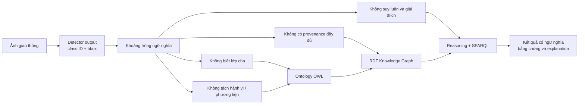


---


## 2. Phát biểu bài toán


### 2.1. Bài toán tổng quát

Cho tập ảnh giao thông `I`, tập bounding box hoặc detection `D`, tập class nguồn `C` và Ontology `O`, xây dựng Knowledge Graph `G` sao cho:

1. Mỗi ảnh, vùng ảnh, biển báo, assertion và model run có định danh ổn định.
2. Mỗi class nguồn được ánh xạ sang biểu diễn ngữ nghĩa trong ontology.
3. Mỗi assertion có nguồn gốc và confidence.
4. Dữ liệu được kiểm tra cấu trúc trước khi nhập graph.
5. Reasoner có thể suy ra assertion mới từ TBox và ABox.
6. Competency questions được trả lời bằng SPARQL.
7. Kết quả truy vấn đi kèm bằng chứng và đường giải thích.

Có thể biểu diễn ngắn gọn:

```text
G = Reason(
      Validate(
        MapToRDF(
          Normalize(
            Align(D, C)
          ),
          O
        )
      ),
      O
    )
```


### 2.2. Vấn đề nghiên cứu chính

Đồ án giải quyết bốn vấn đề:

1. **Biểu diễn:** Làm thế nào biểu diễn biển báo, vùng ảnh, ý nghĩa quy định, đối tượng áp dụng và tham số dưới dạng OWL/RDF?
2. **Tích hợp:** Làm thế nào hợp nhất annotation và detection tùy chọn mà vẫn giữ provenance?
3. **Kiểm chứng:** Làm thế nào ngăn output thiếu hoặc không hợp lệ đi vào graph?
4. **Suy luận:** Làm thế nào suy ra tri thức bậc cao và giải thích kết quả từ các fact trực tiếp?

---


## 3. Câu hỏi nghiên cứu


### RQ1 — Ontology modeling

Một Ontology OWL cần những lớp, thuộc tính và tiên đề nào để biểu diễn đầy đủ 52 lớp biển báo trong dataset mà không biến ontology thành danh sách nhãn?

### RQ2 — Semantic normalization

Làm thế nào phân rã các class ghép như `P.127*50`, `P.106a*Xe tải` hoặc `P.124d` thành các thành phần ngữ nghĩa có thể truy vấn và tái sử dụng?

### RQ3 — Provenance-aware integration

Làm thế nào tích hợp annotation gốc và detection model tùy chọn vào cùng Knowledge Graph nhưng vẫn phân biệt nguồn, model run, confidence và raw output?

### RQ4 — Validation

SHACL có thể phát hiện những lỗi dữ liệu nào trước khi materialize assertion, ví dụ bbox sai, confidence ngoài khoảng, thiếu model run hoặc relation tham chiếu object không tồn tại?

### RQ5 — Reasoning

OWL/RDFS reasoning và rule miền có thể tạo ra những kết luận hữu ích nào ngoài output detector, chẳng hạn phân loại nhóm biển, nhận diện quy định theo hành vi hoặc suy ra scene có hạn chế giao thông?

### RQ6 — Explainability

Có thể trả về kết quả SPARQL kèm đường suy luận, ảnh, bounding box và provenance theo cách dễ hiểu và có thể kiểm tra hay không?

### RQ7 — Giá trị gia tăng của ontology

So với baseline chỉ dùng class label hoặc JSON, ontology cải thiện coverage của truy vấn, khả năng tích hợp, validation và giải thích ở mức nào?

---


## 4. Mục tiêu


### 4.1. Mục tiêu tổng quát

Xây dựng và đánh giá một hệ thống Knowledge Graph có Ontology OWL làm nền tảng để biểu diễn, kiểm chứng, suy luận và truy vấn ngữ nghĩa biển báo giao thông Việt Nam từ dữ liệu thị giác.

### 4.2. Mục tiêu cụ thể

1. Phân tích và chuẩn hóa catalog 52 lớp.
2. Xây dựng Ontology OWL theo module.
3. Xây dựng schema trung gian cho annotation và detection output tùy chọn.
4. Thiết kế URI deterministic cho các resource.
5. Chuyển annotation và model output thành RDF.
6. Lưu provenance cho từng assertion.
7. Xây dựng SHACL shapes và quality gate.
8. Triển khai reasoning theo OWL 2 RL/RDFS.
9. Xây dựng rule miền bằng SPARQL `CONSTRUCT`.
10. Xây dựng 20 competency questions nghiệp vụ và 4 câu hỏi về explanation.
11. Triển khai SPARQL query service.
12. Trả về explanation subgraph cho kết luận.
13. Đánh giá bằng gold graph và ablation.
14. Minh họa pipeline end-to-end bằng pretrained model.


### 4.3. Giả thuyết nghiên cứu

- **H1:** Phân rã class thành rule, maneuver, target và parameter giúp trả lời được nhiều competency question hơn exact label lookup.
- **H2:** SHACL ngăn được phần lớn lỗi cấu trúc trước khi dữ liệu được materialize.
- **H3:** OWL/rule reasoning giúp truy vấn lớp tổng quát trả về đúng các lớp con mà không cần liệt kê thủ công.
- **H4:** Provenance-aware assertion modeling giúp giải thích và phân tích conflict tốt hơn graph chỉ chứa triple trực tiếp.
- **H5:** Pretrained model đủ để minh họa pipeline; fine-tuning không phải điều kiện cần để đánh giá lớp tri thức.

---


## 5. Phạm vi


### 5.1. Trong phạm vi

- Ảnh tĩnh có biển báo giao thông Việt Nam.
- 52 class ID hiện có trong dataset.
- Bounding box theo định dạng YOLO.
- Ngữ nghĩa biển báo ở mức class, nhóm, quy định, đối tượng, thao tác và tham số.
- Annotation gốc và pretrained detector/OVOD tùy chọn.
- RDF, RDFS, OWL 2 RL, SHACL và SPARQL.
- Provenance ở mức model, model run, image, region và assertion.
- Truy vấn có giải thích.


### 5.2. Ngoài phạm vi MVP

- Điều khiển xe tự hành thời gian thực.
- Đưa ra tư vấn pháp lý hoặc chỉ dẫn lái xe.
- Theo dõi hiệu lực biển theo toàn bộ tuyến đường.
- Nhận diện trạng thái đèn giao thông.
- Dựng bản đồ HD.
- Temporal reasoning cho video.
- Huấn luyện detector state-of-the-art.
- Xây dựng mô hình sinh ngôn ngữ hoặc giao diện hỏi đáp sinh tự do.
- Xây dựng chatbot trả lời từ kiến thức ngoài graph.


### 5.3. Ranh giới với Computer Vision và RAG

Đồ án không đánh giá thành công chỉ bằng mAP của detector. Detection output chỉ là nguồn bằng chứng tùy chọn. Thành phần trung tâm là:

```text
Ontology → RDF mapping → SHACL → Reasoning → SPARQL → Explanation
```

Hệ thống phải tiếp tục trả lời competency questions trên graph khi tắt detection model, vector retrieval và mọi thành phần RAG.

---


## 6. Cơ sở lý thuyết


### 6.1. Ontology

Ontology là đặc tả hình thức của các khái niệm, quan hệ và tiên đề trong một miền. Trong đồ án, ontology xác định:

- Biển báo là gì.
- Có những loại biển nào.
- Biển truyền đạt loại thông tin hay quy định nào.
- Quy định áp dụng lên loại phương tiện hoặc thao tác nào.
- Các lớp liên hệ theo phân cấp nào.
- Những property nào hợp lệ giữa các loại resource.
- Những kết luận nào có thể suy ra.

Ontology là **hợp đồng ngữ nghĩa**, không phải model nhận diện và không phải hệ quản trị cơ sở dữ liệu.

### 6.2. RDF

RDF biểu diễn tri thức bằng bộ ba:

```text
subject -- predicate --> object
```

Ví dụ:

```turtle
vkr:sign001 rdf:type vko:SpeedLimitSign .
vkr:sign001 vko:hasLimitValue "50"^^xsd:decimal .
vkr:sign001 vko:detectedIn vkr:image001 .
```


### 6.3. TBox và ABox

- **TBox:** lớp, thuộc tính, phân cấp, domain, range, disjointness và restriction.
- **ABox:** ảnh, region, biển báo, detection, model run và assertion cụ thể.

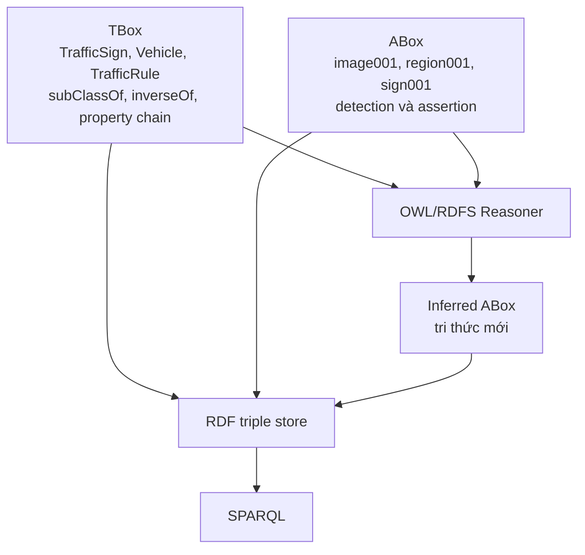


### 6.4. OWL

OWL được dùng để định nghĩa:

- `owl:Class`.
- `owl:ObjectProperty`.
- `owl:DatatypeProperty`.
- `rdfs:subClassOf`.
- `rdfs:subPropertyOf`.
- `owl:inverseOf`.
- `owl:disjointWith`.
- `owl:SymmetricProperty`.
- Property chain.
- Một số restriction phù hợp.

Đề xuất giữ ontology tương thích chủ yếu với **OWL 2 RL** để reasoning dễ triển khai, dễ kiểm thử và phù hợp graph có nhiều instance.

### 6.5. Open World Assumption

Không có một fact trong graph không đồng nghĩa fact đó sai. Nếu detector không phát hiện `TrafficSign` trong ảnh, hệ thống không thể kết luận ảnh chắc chắn không có biển báo.

Vì vậy:

- OWL dùng để suy luận.
- SHACL dùng để kiểm tra dữ liệu bắt buộc.
- Không sử dụng thiếu dữ liệu như bằng chứng phủ định.


### 6.6. SHACL

SHACL kiểm tra graph trước khi commit:

- Có đủ trường bắt buộc không?
- Datatype có đúng không?
- Confidence có trong `[0,1]` không?
- Bbox có hợp lệ không?
- Assertion có model run và source image không?
- Relation có subject/object hợp lệ không?


### 6.7. Knowledge Graph và graph database

- Ontology định nghĩa ngữ nghĩa.
- Knowledge Graph chứa instance và assertion.
- RDF triple store lưu graph và cung cấp SPARQL endpoint.
- Reasoner tạo inferred triples.
- Vector index, nếu có, chỉ hỗ trợ retrieval và không thay thế graph.

---


## 7. Phân tích dataset


### 7.1. Trạng thái archive hiện tại

Archive `data/vietnamese-traffic-signs.zip` đã được kiểm tra ở chế độ chỉ đọc:


| Thành phần       | Số lượng/định dạng                                 |
| ---------------- | -------------------------------------------------- |
| Ảnh JPEG         | 3.216                                              |
| File nhãn        | 3.216                                              |
| Lớp              | 52                                                 |
| Bounding boxes   | 8.334                                              |
| File catalog lớp | `classes.txt`, `classes_vie.txt`, `classes_en.txt` |
| Annotation       | YOLO normalized format                             |


Một dòng annotation:

```text
46 0.368750 0.509259 0.018750 0.033333
```

được hiểu là:

```text
class_id x_center y_center width height
```

trong đó tọa độ và kích thước được chuẩn hóa theo kích thước ảnh.

### 7.2. Phân bố theo prefix nguồn


| Prefix/nhóm nguồn  | Số lớp | Số bounding boxes |
| ------------------ | ------ | ----------------- |
| `P.*`              | 22     | 5.065             |
| `W.*`              | 18     | 1.727             |
| `R.*`              | 4      | 798               |
| `I.*`              | 3      | 434               |
| `S.*`              | 3      | 190               |
| `B.*`              | 1      | 82                |
| `Camera` tùy chỉnh | 1      | 38                |
| **Tổng**           | **52** | **8.334**         |


Ý nghĩa chính thức của prefix và từng mã phải được xác minh với nguồn quy chuẩn được chọn trước khi đưa vào TBox. Catalog dataset được xem là nguồn annotation ban đầu, không mặc nhiên là nguồn quy phạm hoàn chỉnh.

### 7.3. Mất cân bằng lớp


| Chỉ số                   | Giá trị          |
| ------------------------ | ---------------- |
| Nhỏ nhất                 | 3 boxes          |
| Trung vị                 | 83,5 boxes/lớp   |
| Trung bình               | 160,27 boxes/lớp |
| Lớn nhất                 | 1.071 boxes      |
| Tỷ lệ max/min            | 357:1            |
| Lớp có dưới 10 boxes     | 2                |
| Lớp có dưới 30 boxes     | 13               |
| Lớp có dưới 50 boxes     | 20               |
| Lớp có ít nhất 200 boxes | 16               |


Hai lớp hiếm nhất:

- `W.233 – Nguy hiểm khác`: 3 boxes.
- `W.246c – Chú ý chướng ngại vật, vòng tránh sang phải`: 5 boxes.

Lớp phổ biến nhất:

- `P.130 – Cấm dừng và đỗ xe`: 1.071 boxes.

Mất cân bằng ảnh hưởng mạnh đến việc train detector 52 lớp, nhưng không ngăn cản xây dựng ontology hoặc Knowledge Graph.

### 7.4. Vấn đề chất lượng dữ liệu cần audit

1. Kiểm tra ảnh có xuất phát từ video hoặc chuỗi frame liên tiếp không.
2. Kiểm tra duplicate và near-duplicate.
3. Kiểm tra file ảnh và label có khớp một-một.
4. Kiểm tra class ID ngoài khoảng `[0,51]`.
5. Kiểm tra bbox nằm trong `[0,1]`.
6. Kiểm tra box có width/height dương.
7. Kiểm tra encoding của tên tiếng Việt.
8. Xác minh các tên có dấu `*`.
9. Làm rõ class `Camera`.
10. Làm rõ nhãn `S.505a*Xe tải và công`.
11. Xác minh license và nguồn dữ liệu.
12. Xác định nguyên tắc tách development/evaluation nếu ảnh liên tiếp.


### 7.5. Chiến lược split

Vì mục tiêu chính không phải training, đề xuất:

- `development`: thiết kế mapping, threshold, prompt và ontology.
- `evaluation`: đánh giá extraction, graph và reasoning.
- `demo`: tập nhỏ đại diện để trình bày.

Nếu ảnh là các frame liên tiếp, split phải theo `video`, `route`, `location` hoặc `capture session`, không chia ngẫu nhiên theo ảnh.

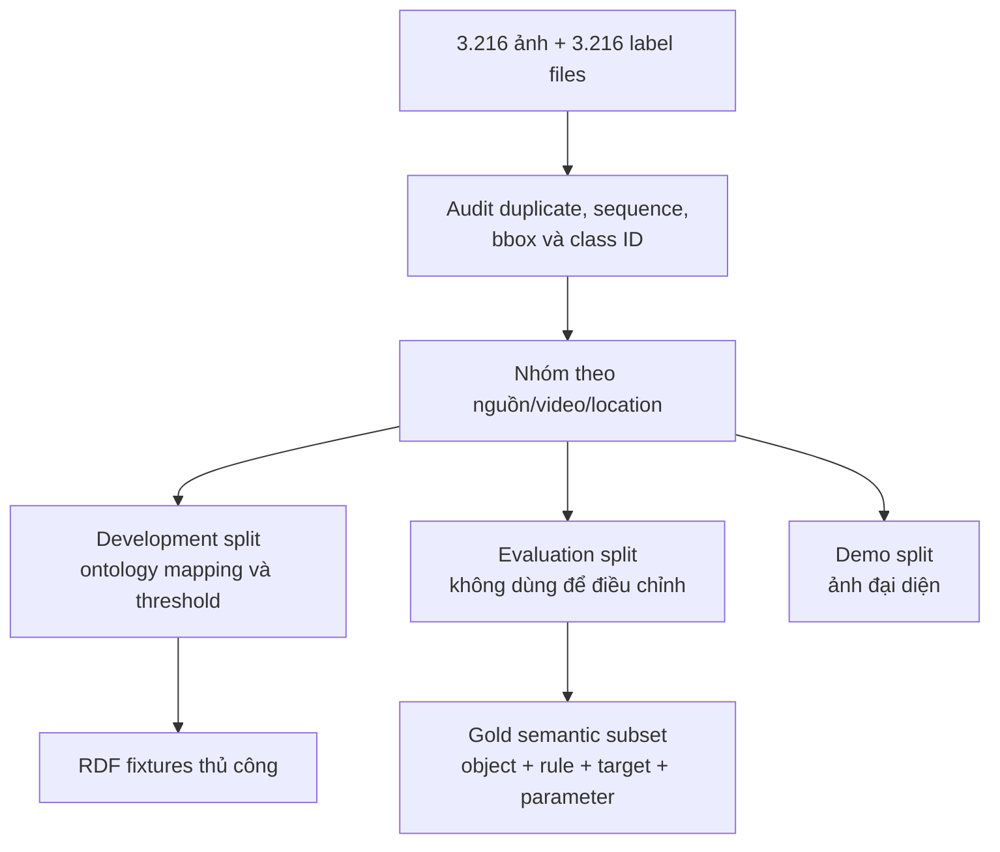


### 7.6. Hai loại ground truth

**Ground truth thị giác**

- Class ID.
- Bounding box.
- Image ID.

**Ground truth ngữ nghĩa**

- OWL class chuẩn.
- Nhóm chức năng.
- Quy định/cảnh báo.
- Phương tiện áp dụng.
- Maneuver.
- Direction.
- Numeric parameter và unit.
- Expected inferred facts.

Ground truth ngữ nghĩa cần được tạo cho toàn bộ 52 class ở mức catalog, và cho một tập ảnh đại diện ở mức instance.

---


## 8. Yêu cầu hệ thống


### 8.1. Yêu cầu chức năng


| ID    | Yêu cầu                                             |
| ----- | --------------------------------------------------- |
| FR-01 | Đọc ảnh và annotation YOLO                          |
| FR-02 | Chuyển bbox normalized sang pixel và tạo Region URI |
| FR-03 | Đọc class catalog ba ngôn ngữ/mã                    |
| FR-04 | Chạy pretrained OVOD ở chế độ tùy chọn              |
| FR-05 | Nhận detection output theo schema ở chế độ tùy chọn |
| FR-06 | Parse output vào schema trung gian                  |
| FR-07 | Chuẩn hóa label và entity linking sang ontology URI |
| FR-08 | Tạo RDF assertion kèm provenance                    |
| FR-09 | Kiểm tra candidate graph bằng SHACL                 |
| FR-10 | Đưa record lỗi vào quarantine graph                 |
| FR-11 | Materialize fact hợp lệ vào asserted graph          |
| FR-12 | Chạy OWL/RDFS reasoning                             |
| FR-13 | Chạy SPARQL `CONSTRUCT` rule miền                   |
| FR-14 | Thực thi competency queries                         |
| FR-15 | Trả về ảnh, bbox, confidence và explanation         |
| FR-16 | Export graph ra Turtle/JSON-LD                      |


### 8.2. Yêu cầu phi chức năng


| ID     | Yêu cầu                                    |
| ------ | ------------------------------------------ |
| NFR-01 | Ingestion idempotent                       |
| NFR-02 | URI deterministic                          |
| NFR-03 | Tách asserted và inferred graph            |
| NFR-04 | Raw model output không bị mất              |
| NFR-05 | Mọi assertion AI có provenance             |
| NFR-06 | Pipeline chạy được từ cached outputs       |
| NFR-07 | Ontology parse được bằng công cụ chuẩn     |
| NFR-08 | Query có regression test                   |
| NFR-09 | Không yêu cầu fine-tune để hoàn thành MVP  |
| NFR-10 | Không dùng detection model như nguồn chân lý cuối cùng |


---


## 9. Kiến trúc đề xuất


### 9.1. Kiến trúc tổng thể

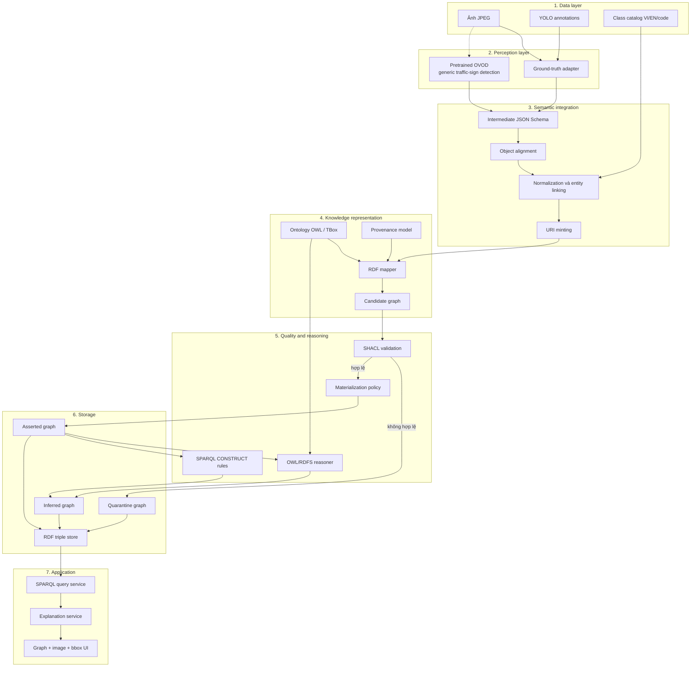


### 9.2. Nguyên tắc kiến trúc

1. Model output không ghi trực tiếp vào triple store.
2. Ontology và schema trung gian độc lập với model.
3. Mỗi pipeline run có ID và configuration riêng.
4. Validation diễn ra trước materialization.
5. Reasoning chạy trên asserted graph đã được chấp nhận.
6. Inferred graph có thể xóa và tái tạo.
7. Giao diện truy vấn đọc Knowledge Graph và inference trace, không hỏi model thị giác trực tiếp.

---


## 10. Chiến lược sử dụng model


### 10.1. Không bắt buộc train model

MVP sử dụng pretrained model. Có ba chế độ:

**Chế độ A — Ground-truth-first**

```text
YOLO annotation gốc
→ semantic mapping
→ RDF
→ SHACL
→ reasoning
```

Đây là chế độ chính để đánh giá ontology mà không bị nhiễu bởi lỗi perception.

**Chế độ B — Pretrained end-to-end**

```text
Ảnh
→ pretrained OVOD phát hiện vùng traffic sign
→ crop
→ model trả candidate class nếu có
→ catalog mapping hoặc curator review
→ Knowledge Graph
```

Chế độ này chứng minh khả năng tích hợp AI, không phải tiêu chí duy nhất để chấm chất lượng ontology.

**Chế độ C — Optional fine-tuned baseline**

Fine-tune detector 52 lớp chỉ được thực hiện nếu còn thời gian và tài nguyên. Do dataset mất cân bằng, kết quả phải báo cáo theo từng lớp và không được che khuất long-tail classes bằng chỉ số tổng.

### 10.2. Vai trò của OVOD

Pretrained OVOD phù hợp để:

- Phát hiện vùng chứa biển báo giao thông.
- Cho phép prompt theo nhóm như `traffic sign`, `speed limit sign`.
- Tạo proposal region cho bước mapping hoặc curator review.

OVOD có thể không phân biệt chính xác 52 mã biển Việt Nam. Do đó không ép OVOD giải quyết toàn bộ fine-grained classification.

### 10.3. Không sử dụng mô hình thị giác–ngôn ngữ

Project không tích hợp mô hình thị giác–ngôn ngữ. Mã biển, maneuver, target vehicle và numeric parameter được lấy từ semantic catalog đã review. Với ảnh mới, detector chỉ tạo bounding box và candidate class; candidate không khớp catalog được chuyển cho curator thay vì gọi mô hình sinh ngôn ngữ.

Explanation được tạo từ inference trace có cấu trúc, không được sinh bởi mô hình ngôn ngữ.

### 10.4. Vai trò của annotation gốc

Annotation gốc có ba vai trò:

1. Ground truth cho bounding box và class.
2. Nguồn ABox đáng tin cậy hơn model output trong thí nghiệm chính.
3. Gold reference để đo ảnh hưởng của perception error lên graph.


### 10.5. Flow model và tri thức

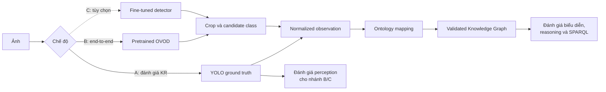


---


## 11. Thiết kế Ontology OWL


### 11.1. Phương pháp ontology engineering

Ontology được xây theo quy trình:

1. Xác định miền và stakeholder.
2. Viết competency questions.
3. Thu thập thuật ngữ từ catalog.
4. Phân nhóm thuật ngữ.
5. Chọn ontology design patterns.
6. Định nghĩa classes và properties.
7. Tạo RDF fixtures thủ công.
8. Kiểm tra bằng reasoner.
9. Viết SHACL shapes.
10. Đánh giá bằng competency questions.
11. Lặp lại thiết kế.

Không tạo class chỉ vì detector có label. Một class chỉ được thêm khi có định nghĩa rõ và phục vụ competency question hoặc semantic mapping.

### 11.2. Thiết kế module

```text
Visual Module
├── Image
├── Region
└── BoundingBoxRegion

Traffic Sign Module
├── TrafficSign
├── ProhibitionSign
├── WarningSign
├── MandatorySign
├── IndicationSign
└── SupplementarySign

Traffic Semantics Module
├── TrafficRule
├── TrafficWarning
├── TrafficManeuver
├── Direction
├── RoadFeature
└── RoadUser/Vehicle

Observation Module
├── Assertion
├── ClassificationAssertion
├── RelationAssertion
└── Detection

Provenance Module
├── Model
├── ModelRun
├── Dataset
└── AnnotationActivity
```


### 11.3. Class hierarchy sơ bộ

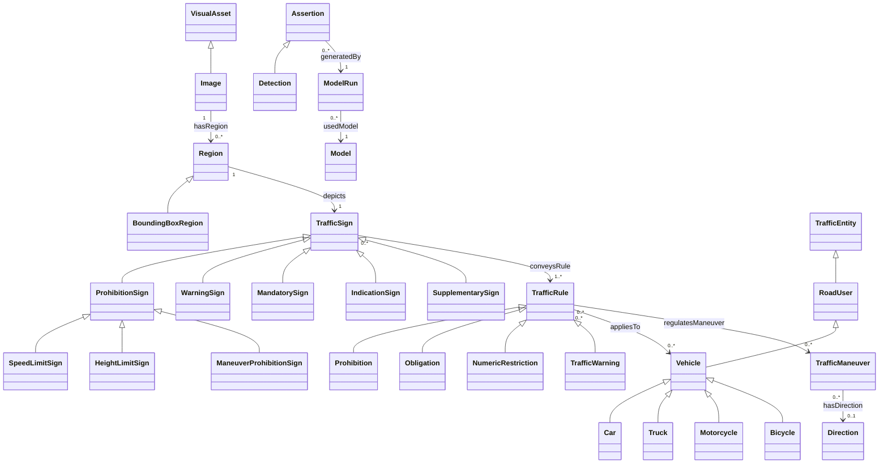


### 11.4. Object properties sơ bộ


| Property             | Domain            | Range             | Vai trò                         |
| -------------------- | ----------------- | ----------------- | ------------------------------- |
| `hasRegion`          | `Image`           | `Region`          | Ảnh có vùng                     |
| `regionOf`           | `Region`          | `Image`           | Nghịch đảo `hasRegion`          |
| `depicts`            | `Region`          | `TrafficSign`     | Region mô tả biển               |
| `depictsSign`        | `Image`           | `TrafficSign`     | Quan hệ suy ra                  |
| `hasSignCategory`    | `TrafficSign`     | `SignCategory`    | Nhóm biển                       |
| `conveysRule`        | `TrafficSign`     | `TrafficRule`     | Ý nghĩa quy định                |
| `warnsOf`            | `TrafficSign`     | `RoadFeature`     | Mối nguy/đặc điểm được cảnh báo |
| `appliesTo`          | `TrafficRule`     | `TrafficEntity`   | Đối tượng áp dụng               |
| `regulatesManeuver`  | `TrafficRule`     | `TrafficManeuver` | Thao tác được điều chỉnh        |
| `prohibitsManeuver`  | `TrafficRule`     | `TrafficManeuver` | Thao tác bị cấm                 |
| `requiresManeuver`   | `TrafficRule`     | `TrafficManeuver` | Thao tác bắt buộc               |
| `hasDirection`       | `TrafficManeuver` | `Direction`       | Hướng                           |
| `generatedBy`        | `Assertion`       | `ModelRun`        | Nguồn model run                 |
| `extractedFrom`      | `Assertion`       | `Image`           | Nguồn ảnh                       |
| `assertionSubject`   | `Assertion`       | `owl:Thing`       | Chủ thể assertion               |
| `assertionPredicate` | `Assertion`       | `rdf:Property`    | Predicate assertion             |
| `assertionObject`    | `Assertion`       | `owl:Thing`       | Object assertion                |
| `supports`           | `Assertion`       | `Assertion`       | Assertion hỗ trợ                |
| `contradicts`        | `Assertion`       | `Assertion`       | Assertion cạnh tranh            |
| `usedModel`          | `ModelRun`        | `Model`           | Model được sử dụng              |


### 11.5. Datatype properties sơ bộ


| Property            | Domain                    | Range          |
| ------------------- | ------------------------- | -------------- |
| `sourceClassId`     | `ClassificationAssertion` | `xsd:integer`  |
| `rawCode`           | `TrafficSign`             | `xsd:string`   |
| `baseCode`          | `TrafficSign`             | `xsd:string`   |
| `rawLabelVi`        | `Assertion`               | `xsd:string`   |
| `rawLabelEn`        | `Assertion`               | `xsd:string`   |
| `confidence`        | `Assertion`               | `xsd:decimal`  |
| `xCenterNormalized` | `BoundingBoxRegion`       | `xsd:decimal`  |
| `yCenterNormalized` | `BoundingBoxRegion`       | `xsd:decimal`  |
| `widthNormalized`   | `BoundingBoxRegion`       | `xsd:decimal`  |
| `heightNormalized`  | `BoundingBoxRegion`       | `xsd:decimal`  |
| `xMinPixel`         | `BoundingBoxRegion`       | `xsd:integer`  |
| `yMinPixel`         | `BoundingBoxRegion`       | `xsd:integer`  |
| `xMaxPixel`         | `BoundingBoxRegion`       | `xsd:integer`  |
| `yMaxPixel`         | `BoundingBoxRegion`       | `xsd:integer`  |
| `limitValue`        | `NumericRestriction`      | `xsd:decimal`  |
| `modelName`         | `Model`                   | `xsd:string`   |
| `modelVersion`      | `Model`                   | `xsd:string`   |
| `createdAt`         | `ModelRun`                | `xsd:dateTime` |
| `promptHash`        | `ModelRun`                | `xsd:string`   |


### 11.6. Annotation properties và đa ngôn ngữ

Sử dụng:

- `rdfs:label`.
- `rdfs:comment`.
- `skos:prefLabel`.
- `skos:altLabel`.
- Language tags `@vi`, `@en`.

Ví dụ:

```turtle
vko:SpeedLimitSign
    rdfs:label "Biển giới hạn tốc độ"@vi ;
    rdfs:label "Speed limit sign"@en ;
    skos:altLabel "P.127" .
```

Không dùng `owl:sameAs` chỉ vì hai label có nghĩa gần nhau.

### 11.7. Tách sign type và sign observation

Cần phân biệt:

- **Sign type:** khái niệm tổng quát như `SpeedLimitSign`.
- **Sign observation:** biển cụ thể xuất hiện trong một ảnh.
- **Detection assertion:** model/annotation khẳng định region chứa một sign type.
- **Traffic rule:** nội dung ngữ nghĩa mà biển truyền đạt.

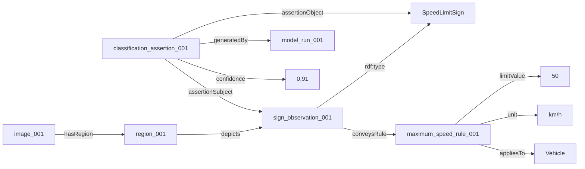


### 11.8. Named graphs

Đề xuất:

```text
graph:ontology
graph:gold
graph:asserted
graph:inferred
graph:provenance
graph:quarantine
graph:model-run/{run_id}
```

Lợi ích:

- So sánh gold và prediction.
- Phân biệt fact trực tiếp/suy luận.
- Chạy lại reasoner an toàn.
- Phân tích theo model run.
- Không mất assertion bị từ chối.

---


## 12. Semantic class catalog


### 12.1. Mục tiêu

Tạo `class_catalog.csv` với các trường:

```text
class_id
raw_code
base_code
label_vi
label_en
sign_family
semantic_effect
target
maneuver
direction
parameter_type
parameter_value
unit
ontology_class_uri
verification_status
normative_source
```


### 12.2. Ví dụ phân rã


| Raw class       | Base code | OWL class                         | Rule                       | Maneuver/target      | Parameter       |
| --------------- | --------- | --------------------------------- | -------------------------- | -------------------- | --------------- |
| `P.127*50`      | `P.127`   | `SpeedLimitSign`                  | `MaximumSpeedRestriction`  | `Vehicle`            | `50 km/h`       |
| `P.123a`        | `P.123a`  | `ManeuverProhibitionSign`         | `Prohibition`              | `TurnLeft`           | —               |
| `P.124d`        | `P.124d`  | `CompoundManeuverProhibitionSign` | `Prohibition`              | `TurnRight`, `UTurn` | —               |
| `R.301e`        | `R.301e`  | `MandatoryDirectionSign`          | `Obligation`               | `TurnLeft`           | —               |
| `P.106a*Xe tải` | `P.106a`  | `VehicleProhibitionSign`          | `Prohibition`              | `Truck`              | —               |
| `P.117*`        | `P.117`   | `HeightLimitSign`                 | `MaximumHeightRestriction` | `Vehicle`            | lấy từ quan sát |


### 12.3. Nguyên tắc mapping

1. Giữ nguyên raw code.
2. Tạo base code riêng nếu raw code chứa parameter/target.
3. Không suy ra semantics chỉ từ prefix nếu chưa xác minh.
4. Mỗi mapping có `verification_status`.
5. Class ghép có thể tạo nhiều rule assertions.
6. Numeric value là literal có unit, không mã hóa hoàn toàn trong URI.
7. Class `Camera` được đánh dấu custom cho đến khi xác minh.

---


## 13. Schema dữ liệu trung gian


### 13.1. Image manifest

```json
{
  "image_id": "image_0001",
  "file_path": "raw/images/0001.jpg",
  "width": 1920,
  "height": 1080,
  "sha256": "...",
  "source": "vietnamese-traffic-signs",
  "split": "development",
  "group_id": "capture_session_01"
}
```


### 13.2. Observation schema

```json
{
  "image_id": "image_0001",
  "observations": [
    {
      "observation_id": "obs_0001_01",
      "region": {
        "format": "yolo_normalized",
        "x_center": 0.36875,
        "y_center": 0.509259,
        "width": 0.01875,
        "height": 0.033333
      },
      "source_assertions": [
        {
          "source_type": "dataset_annotation",
          "class_id": 46,
          "raw_code": "P.131a",
          "confidence": 1.0,
          "model_run_id": null
        }
      ]
    }
  ]
}
```


### 13.3. Semantic assertion schema

```json
{
  "observation_id": "obs_0001_01",
  "canonical_class": "vko:NoParkingSign",
  "sign_family": "vko:ProhibitionSign",
  "rules": [
    {
      "rule_type": "vko:Prohibition",
      "regulated_maneuver": "vko:Parking",
      "applies_to": "vko:Vehicle"
    }
  ],
  "mapping": {
    "method": "verified_class_catalog",
    "confidence": 1.0,
    "catalog_version": "1.0"
  }
}
```


### 13.4. Model run schema

```json
{
  "model_run_id": "detector_run_2026_001",
  "model_name": "pretrained-detector",
  "model_version": "model-revision",
  "config_hash": "...",
  "parameters": {
    "temperature": 0.0
  },
  "started_at": "2026-01-01T00:00:00Z",
  "code_revision": "git-commit"
}
```

---


## 14. Pipeline chuyển đổi dữ liệu

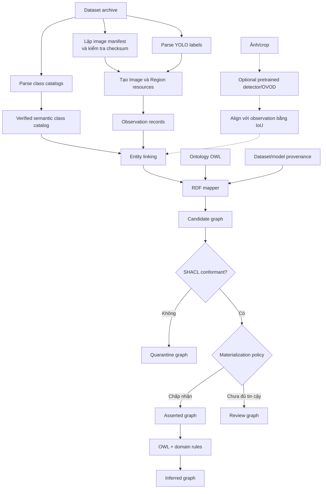


### 14.1. URI strategy

Ví dụ:

```text
vkr:image/0001
vkr:region/0001/01
vkr:sign/0001/01
vkr:assertion/dataset/0001/01/classification
vkr:model-run/detector-run-2026-001
vkr:rule-instance/0001/01/prohibition-01
```

URI phải:

- Deterministic.
- Không phụ thuộc đường dẫn tuyệt đối.
- Không dùng raw label có khoảng trắng.
- Không thay đổi khi ingest lại cùng dữ liệu.
- Có namespace tách ontology và resource.


### 14.2. Object alignment

Khi so sánh gold và output của detector/OVOD:

1. Cùng image ID.
2. Tính IoU giữa bbox.
3. Kiểm tra compatibility của canonical class.
4. Giữ assertion riêng nếu chưa chắc cùng instance.
5. Không merge hai biển cùng class trong một ảnh chỉ dựa vào label.


### 14.3. Entity linking

```text
raw code/label
→ exact code lookup
→ normalized label lookup
→ skos:prefLabel/skos:altLabel
→ candidate ontology class
→ context disambiguation
→ verified URI hoặc review queue
```

Ưu tiên mapping deterministic qua class ID và verified catalog. Semantic similarity chỉ dùng để đề xuất candidate, không tự động tạo `owl:sameAs`.

---


## 15. SHACL validation


### 15.1. Shapes tối thiểu

**ImageShape**

- Có đúng một source path.
- Có width và height dương.
- Có image ID.

**BoundingBoxRegionShape**

- Có đủ bốn thành phần YOLO.
- Giá trị trong `[0,1]`.
- Width và height lớn hơn 0.
- Thuộc đúng một image.

**ClassificationAssertionShape**

- Có assertion subject.
- Có assertion object/class.
- Có source type.
- Nếu nguồn là model thì phải có model run và confidence.

**TrafficRuleShape**

- Có rule type.
- Có sign truyền đạt rule.
- Numeric restriction phải có value và unit.

**ModelRunShape**

- Có model.
- Có thời gian chạy.
- Có model version hoặc revision.
- Có model configuration fingerprint.


### 15.2. Flow validation và reasoning

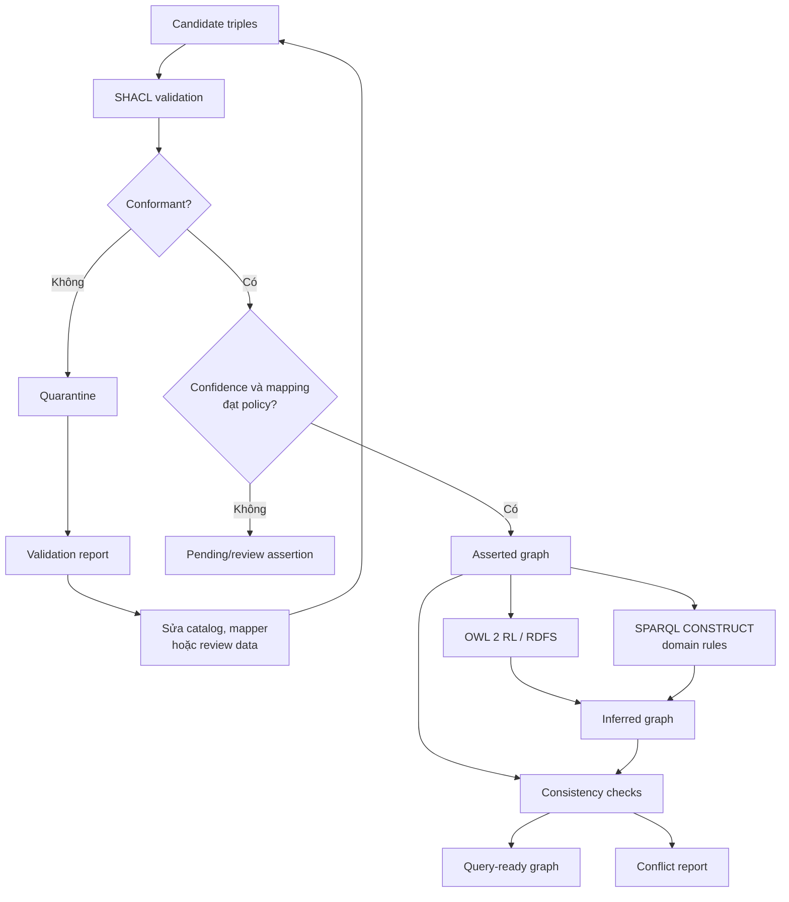


### 15.3. Confidence policy

Confidence không phải logical truth. OWL không tự diễn giải `0.91` là đúng.

Policy ngoài ontology quyết định:

```text
schema hợp lệ
AND entity mapping hợp lệ
AND confidence đạt ngưỡng
⇒ materialize triple trực tiếp
```

Mọi prediction dưới ngưỡng vẫn có thể được giữ như assertion có provenance, nhưng chưa trở thành fact trong asserted graph.

---


## 16. Suy luận tri thức


### 16.1. Suy luận phân cấp

```text
SpeedLimitSign ⊑ ProhibitionSign
ProhibitionSign ⊑ TrafficSign
```

Input:

```turtle
vkr:sign001 rdf:type vko:SpeedLimitSign .
```

Output suy luận:

```turtle
vkr:sign001 rdf:type vko:ProhibitionSign .
vkr:sign001 rdf:type vko:TrafficSign .
```


### 16.2. Property chain

```text
hasRegion o depicts → depictsSign
```

Input:

```turtle
vkr:image001 vko:hasRegion vkr:region001 .
vkr:region001 vko:depicts vkr:sign001 .
```

Output:

```turtle
vkr:image001 vko:depictsSign vkr:sign001 .
```


### 16.3. Suy luận biển ghép

`P.124d – Cấm rẽ phải và quay đầu` được phân rã:

```turtle
vkr:rule001 a vko:Prohibition ;
    vko:prohibitsManeuver vko:TurnRight ;
    vko:prohibitsManeuver vko:UTurn .
```

Nhờ đó, truy vấn “biển nào cấm rẽ phải?” tìm được `P.124d` dù không exact-match toàn bộ tên.

### 16.4. Suy luận theo loại phương tiện

```text
Truck ⊑ MotorVehicle
MotorVehicle ⊑ Vehicle
```

Một rule áp dụng cho `Truck` có thể được tìm thấy trong truy vấn rộng hơn về `VehicleRestriction` bằng property path hoặc materialized classification.

### 16.5. Suy luận numeric restriction

Ví dụ SPARQL `CONSTRUCT`:

```sparql
CONSTRUCT {
  ?sign vko:conveysRule ?restriction .
  ?restriction a vko:MaximumSpeedRestriction ;
               vko:appliesTo vko:Vehicle .
}
WHERE {
  ?sign a vko:SpeedLimitSign ;
        vko:hasLimitValue ?value .
  BIND(IRI(CONCAT(STR(?sign), "/maximum-speed-rule")) AS ?restriction)
}
```


### 16.6. Suy luận phải tránh

- Không khai báo `near`, `leftOf` hoặc `above` là transitive nếu chưa chứng minh.
- Không dùng `owl:sameAs` cho label gần nghĩa.
- Không suy ra ảnh không có biển chỉ vì detector không phát hiện.
- Không tự suy ra hiệu lực trên một road segment nếu dataset không chứa quan hệ placement.
- Không biến confidence thành xác suất logic của OWL.


### 16.7. Provenance cho inferred fact

Mỗi rule miền cần:

- Rule ID.
- Phiên bản.
- Premise.
- Conclusion.
- Thời gian materialization.
- Source graph.

Nhờ đó explanation service có thể tái dựng đường suy luận.

---


## 17. Competency questions


### 17.1. Nhóm taxonomy


| ID    | Câu hỏi                                                     |
| ----- | ----------------------------------------------------------- |
| CQ-01 | Ảnh nào chứa một `TrafficSign`?                             |
| CQ-02 | Ảnh nào chứa biển thuộc nhóm cấm?                           |
| CQ-03 | Những sign observation nào là biển cảnh báo?                |
| CQ-04 | Có bao nhiêu loại biển con của `ProhibitionSign` xuất hiện? |


### 17.2. Nhóm quy định và thao tác


| ID    | Câu hỏi                                         |
| ----- | ----------------------------------------------- |
| CQ-05 | Những biển nào cấm rẽ trái?                     |
| CQ-06 | Những biển nào cấm rẽ phải?                     |
| CQ-07 | Những biển nào cấm quay đầu?                    |
| CQ-08 | Biển nào đồng thời điều chỉnh nhiều maneuver?   |
| CQ-09 | Biển nào yêu cầu phương tiện đi theo một hướng? |


### 17.3. Nhóm phương tiện


| ID    | Câu hỏi                                        |
| ----- | ---------------------------------------------- |
| CQ-10 | Quy định nào áp dụng cho xe tải?               |
| CQ-11 | Biển nào chỉ dành cho xe máy?                  |
| CQ-12 | Biển nào điều chỉnh một lớp con của `Vehicle`? |


### 17.4. Nhóm tham số


| ID    | Câu hỏi                                                     |
| ----- | ----------------------------------------------------------- |
| CQ-13 | Ảnh nào có biển giới hạn tốc độ?                            |
| CQ-14 | Biển nào có giới hạn tốc độ không vượt quá 60 km/h?         |
| CQ-15 | Biển nào mang giới hạn chiều cao hoặc thông tin tĩnh không? |


### 17.5. Nhóm provenance và chất lượng


| ID    | Câu hỏi                                                      |
| ----- | ------------------------------------------------------------ |
| CQ-16 | Assertion nào lấy từ annotation gốc?                         |
| CQ-17 | Assertion nào do detector tạo và chưa được curator xác nhận? |
| CQ-18 | Detection nào có confidence thấp hơn ngưỡng?                 |
| CQ-19 | Record nào không qua SHACL và vì sao?                        |
| CQ-20 | Assertion nào có hai model đưa ra classification cạnh tranh? |


### 17.6. Nhóm explanation


| ID    | Câu hỏi                                                |
| ----- | ------------------------------------------------------ |
| CQ-21 | Vì sao một sign được kết luận là `TrafficSign`?        |
| CQ-22 | Vì sao `P.124d` xuất hiện trong kết quả “cấm rẽ phải”? |
| CQ-23 | Kết luận nào trực tiếp và kết luận nào được suy ra?    |
| CQ-24 | Ảnh, region và model run nào hỗ trợ kết luận?          |


MVP phải hiện thực ít nhất CQ-01 đến CQ-20; CQ-21 đến CQ-24 là bắt buộc cho phần explanation.

---


## 18. SPARQL mẫu


### 18.1. Tìm ảnh có biển cấm

```sparql
SELECT DISTINCT ?image ?sign ?type
WHERE {
  ?image vko:depictsSign ?sign .
  ?sign a ?type .
  ?type rdfs:subClassOf* vko:ProhibitionSign .
}
```


### 18.2. Tìm biển cấm rẽ phải

```sparql
SELECT DISTINCT ?image ?sign ?rule
WHERE {
  ?image vko:depictsSign ?sign .
  ?sign vko:conveysRule ?rule .
  ?rule vko:prohibitsManeuver vko:TurnRight .
}
```


### 18.3. Tìm giới hạn tốc độ không quá 60

```sparql
SELECT ?image ?sign ?limit
WHERE {
  ?image vko:depictsSign ?sign .
  ?sign a vko:SpeedLimitSign ;
        vko:conveysRule ?rule .
  ?rule vko:limitValue ?limit ;
        vko:hasUnit vko:KilometrePerHour .
  FILTER (?limit <= 60)
}
ORDER BY ?limit
```


### 18.4. Tìm assertion có confidence thấp

```sparql
SELECT ?assertion ?sign ?class ?confidence ?run
WHERE {
  ?assertion a vko:ClassificationAssertion ;
             vko:assertionSubject ?sign ;
             vko:assertionObject ?class ;
             vko:confidence ?confidence ;
             vko:generatedBy ?run .
  FILTER (?confidence < 0.5)
}
ORDER BY ?confidence
```

---


## 19. Luồng truy vấn và giải thích

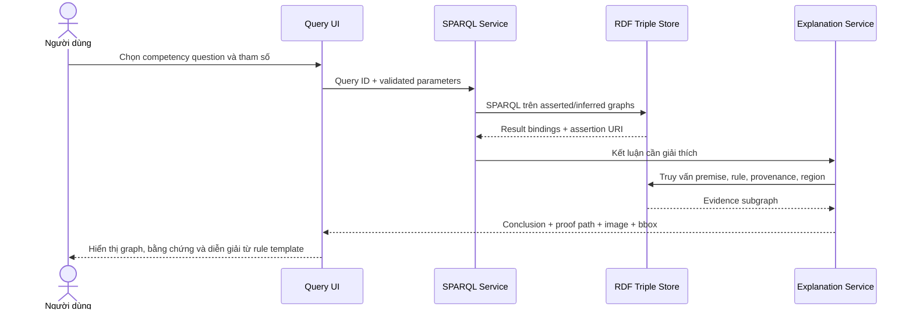


### 19.1. Explanation format

```json
{
  "conclusion": "sign_001 is a ProhibitionSign",
  "assertion_type": "inferred",
  "rule": "rdfs-subclass",
  "premises": [
    "sign_001 rdf:type SpeedLimitSign",
    "SpeedLimitSign rdfs:subClassOf ProhibitionSign"
  ],
  "evidence": {
    "image_id": "image_001",
    "region_id": "region_001",
    "bbox": [120, 80, 260, 230],
    "source": "dataset_annotation"
  }
}
```

---


## 20. Luồng người dùng và cách sử dụng hệ thống

### 20.1. Các nhóm người dùng

Hệ thống phục vụ ba nhóm người dùng với mục tiêu khác nhau:

| Vai trò | Mục tiêu | Chức năng chính |
|---|---|---|
| Người tra cứu | Tìm và hiểu ngữ nghĩa biển báo trong dataset | Semantic search, xem ảnh/bbox, xem giải thích |
| Nhà nghiên cứu | Kiểm tra ontology, graph và suy luận | SPARQL, graph explorer, asserted/inferred comparison |
| Curator/Admin | Nhập dữ liệu và kiểm soát chất lượng | Ingestion, SHACL report, review mapping/conflict |

Người tra cứu không cần biết SPARQL hoặc OWL. Nhà nghiên cứu có thể dùng SPARQL trực tiếp. Curator có quyền thay đổi trạng thái assertion nhưng mọi thay đổi phải được lưu provenance.

### 20.2. Các điểm vào của hệ thống

Giao diện có bốn entry point:

1. **Semantic Search:** truy vấn Knowledge Graph theo loại biển, hành vi, phương tiện hoặc tham số.
2. **Image Explorer:** chọn một ảnh và xem các sign observation, bbox và graph con.
3. **Reasoning Explorer:** chọn một kết luận để xem asserted facts, inferred facts và proof path.
4. **Data Review:** dành cho curator để xử lý SHACL violation, mapping mơ hồ hoặc model conflict.

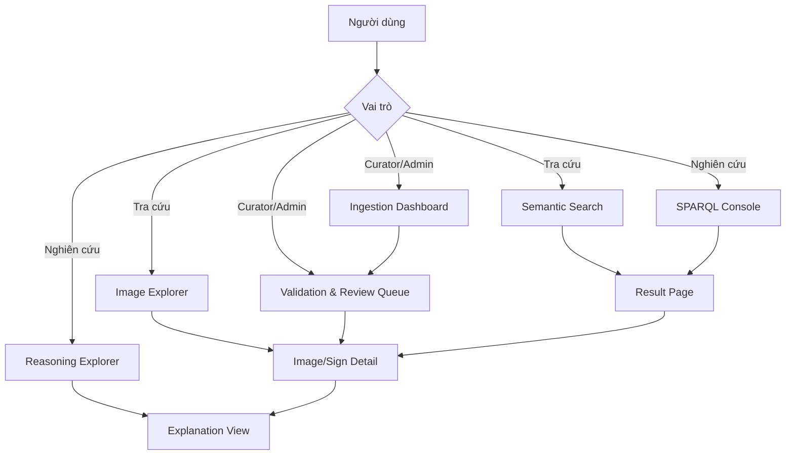

### 20.3. Luồng tra cứu ngữ nghĩa chính

Đây là luồng người dùng quan trọng nhất của MVP.

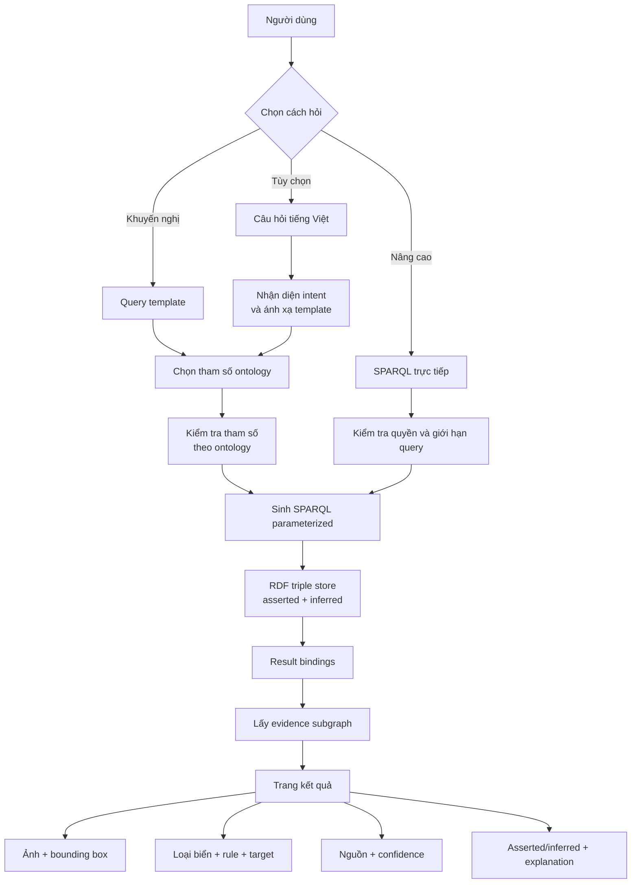

Đường trả lời chính:

```text
User intent
→ query template
→ validated ontology parameters
→ SPARQL
→ asserted/inferred graph
→ evidence subgraph
→ result và explanation
```

Nếu có natural-language interface, intent parser xác định trước chỉ được ánh xạ câu hỏi vào query template đã được duyệt. Không sử dụng mô hình sinh ngôn ngữ để tạo câu trả lời.

### 20.4. Các loại câu hỏi người dùng

#### Tra cứu theo taxonomy

- Ảnh nào chứa `TrafficSign`?
- Tìm tất cả ảnh chứa biển cấm.
- Có bao nhiêu loại biển cảnh báo xuất hiện?
- Liệt kê các lớp con của `ProhibitionSign` có instance trong graph.

#### Tra cứu theo hành vi

- Biển nào cấm rẽ trái?
- Biển nào cấm rẽ phải?
- Biển nào cấm quay đầu?
- Biển nào đồng thời cấm nhiều maneuver?
- Biển nào bắt buộc phương tiện rẽ trái?

#### Tra cứu theo phương tiện

- Biển nào áp dụng cho xe tải?
- Biển nào cấm xe máy?
- Biển nào chỉ dành cho xe tải?
- Những rule nào áp dụng cho một lớp con của `Vehicle`?

#### Tra cứu theo tham số

- Tìm biển giới hạn tốc độ 50 km/h.
- Tìm giới hạn tốc độ không vượt quá 60 km/h.
- Những ảnh nào có biển giới hạn chiều cao?
- Những numeric restriction nào thiếu unit?

#### Tra cứu provenance và chất lượng

- Assertion này đến từ annotation hay detection model?
- Model run nào tạo prediction này?
- Prediction nào có confidence dưới 0,5?
- Assertion nào được nhiều nguồn hỗ trợ?
- Classification nào đang mâu thuẫn?
- Record nào không qua SHACL và vi phạm shape nào?

#### Hỏi về suy luận

- Vì sao sign này được kết luận là `TrafficSign`?
- Vì sao `P.124d` xuất hiện khi tìm biển cấm rẽ phải?
- Kết luận nào là asserted và kết luận nào là inferred?
- Rule và premises nào tạo ra conclusion?

### 20.5. Query template cho MVP

| Template ID | Ý nghĩa | Tham số |
|---|---|---|
| `find_by_sign_family` | Tìm ảnh theo nhóm biển | `sign_family` |
| `find_by_maneuver` | Tìm rule điều chỉnh thao tác | `effect`, `maneuver` |
| `find_by_vehicle` | Tìm rule áp dụng cho phương tiện | `effect`, `vehicle_type` |
| `find_by_numeric_limit` | Tìm theo giới hạn định lượng | `limit_type`, `operator`, `value`, `unit` |
| `find_by_code` | Tìm theo mã biển | `base_code` hoặc `raw_code` |
| `find_by_source` | Tìm theo nguồn assertion | `source_type`, `model_run` |
| `find_low_confidence` | Tìm prediction cần review | `threshold` |
| `find_conflicts` | Tìm classification cạnh tranh | `conflict_type` |
| `explain_conclusion` | Giải thích kết luận | `conclusion_uri` |
| `show_image_graph` | Lấy graph con của ảnh | `image_id` |

Các tham số phải được kiểm tra với ontology vocabulary. Ví dụ `maneuver=TurnRight` được ánh xạ thành URI `vko:TurnRight`, không chèn chuỗi người dùng trực tiếp vào SPARQL.

### 20.6. Ví dụ user journey hoàn chỉnh

Người dùng hỏi:

> Tìm tất cả ảnh có biển cấm rẽ phải.

Hệ thống ánh xạ:

```json
{
  "template_id": "find_by_maneuver",
  "effect": "Prohibition",
  "maneuver": "TurnRight"
}
```

SPARQL:

```sparql
SELECT DISTINCT ?image ?sign ?code ?rule
WHERE {
  ?image vko:depictsSign ?sign .
  ?sign vko:rawCode ?code ;
        vko:conveysRule ?rule .
  ?rule a vko:Prohibition ;
        vko:prohibitsManeuver vko:TurnRight .
}
```

Kết quả có thể bao gồm:

- `P.123b – Cấm rẽ phải`.
- `P.124d – Cấm rẽ phải và quay đầu`.
- `P.137 – Cấm rẽ trái và phải`.
- `P.139 – Cấm đi thẳng và rẽ phải`.

Đây là semantic retrieval. Hệ thống tìm theo assertion `prohibitsManeuver TurnRight`, không tìm bằng exact-match chuỗi “Cấm rẽ phải”.

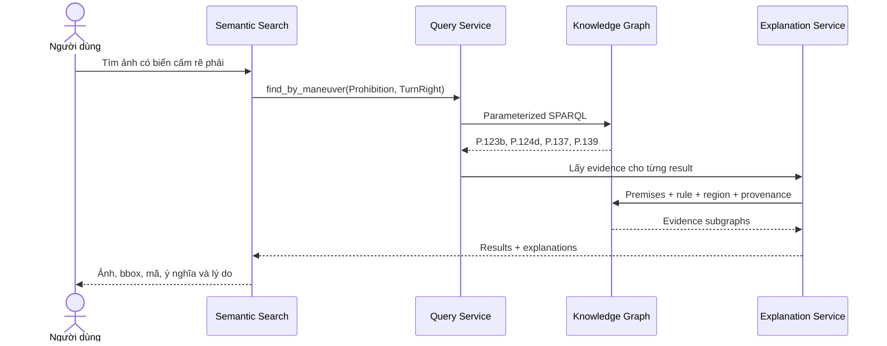

### 20.7. Cấu trúc trang kết quả

Mỗi result card hiển thị:

```text
Ảnh:             0100.jpg
Sign observation: sign/0100/01
Mã biển:         P.124d
Tên:             Cấm rẽ phải và quay đầu
OWL class:       CompoundManeuverProhibitionSign
Nhóm:            ProhibitionSign
Quy định:
  - prohibits TurnRight
  - prohibits UTurn
Nguồn:           Dataset annotation
Confidence:      1.0 theo gold policy
Bounding box:    [x_min, y_min, x_max, y_max]
Trạng thái:      Asserted + inferred classifications
```

Các action:

- `Xem ảnh`.
- `Hiện bounding box`.
- `Mở graph con`.
- `Tại sao có kết quả này?`.
- `Xem provenance`.
- `So sánh prediction với gold`.

### 20.8. Explanation view

Khi người dùng chọn “Tại sao?”, hệ thống hiển thị:

```text
Conclusion:
  rule_0100_01 prohibitsManeuver TurnRight

Type:
  Asserted semantic mapping

Premises:
  sign_0100_01 rawCode "P.124d"
  catalog:P.124d mapsTo CompoundManeuverProhibitionSign
  catalog:P.124d includesManeuver TurnRight

Evidence:
  image 0100.jpg
  region region/0100/01
  source dataset_annotation
```

Với kết luận phân cấp:

```text
Conclusion:
  sign_0100_01 rdf:type TrafficSign

Type:
  Inferred

Premises:
  sign_0100_01 rdf:type CompoundManeuverProhibitionSign
  CompoundManeuverProhibitionSign subClassOf ProhibitionSign
  ProhibitionSign subClassOf TrafficSign
```

### 20.9. Luồng Image Explorer

Người dùng:

1. Chọn ảnh theo ID hoặc từ kết quả search.
2. Xem tất cả bounding boxes.
3. Chọn một region.
4. Xem raw annotation và model predictions.
5. Xem canonical class và semantic rules.
6. Xem graph con.
7. Xem asserted/inferred facts.
8. Mở explanation cho một fact.

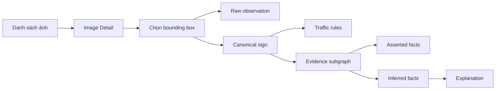

### 20.10. Luồng upload ảnh mới

Luồng này dành cho admin hoặc demo end-to-end:

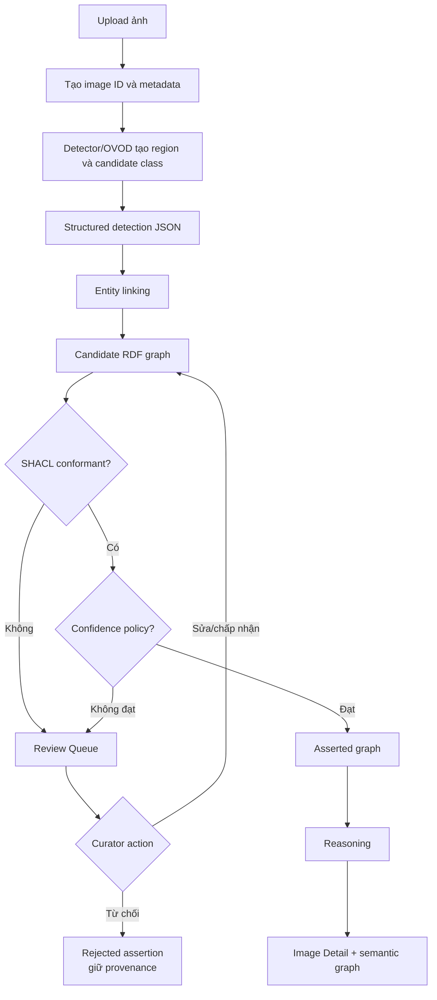

Hệ thống không tự động biến mọi prediction thành fact. Prediction không hợp lệ hoặc confidence thấp phải vào review queue.

### 20.11. Luồng curator review

Curator thực hiện:

```text
Mở Review Queue
→ lọc theo SHACL violation/conflict/low confidence
→ chọn assertion
→ xem ảnh và bounding box
→ xem raw output
→ xem candidate ontology class
→ chấp nhận, sửa mapping hoặc từ chối
→ ghi reason for change
→ chạy lại SHACL
→ materialize nếu hợp lệ
→ chạy lại reasoning
```

Mỗi thao tác curator phải lưu:

- Curator ID.
- Thời gian.
- Assertion trước và sau.
- Lý do thay đổi.
- Validation report liên quan.
- Version của catalog/ontology.

### 20.12. Cấu trúc màn hình

**Dashboard**

- Tổng ảnh và sign observations.
- Asserted/inferred triple count.
- Phân bố sign family.
- SHACL violations.
- Pending review.
- Model run summary.

**Semantic Search**

- Query template.
- Ontology-aware filters.
- Sort và pagination.
- Asserted/inferred toggle.

**Image Detail**

- Ảnh và bounding boxes.
- Raw label.
- Canonical class.
- Traffic rules.
- Source assertions.
- Evidence graph.

**Reasoning Explorer**

- Conclusion.
- Rule.
- Premises.
- Proof path.
- Source graph.

**Validation & Review**

- Violation type.
- Focus node.
- SHACL shape.
- Raw model output.
- Candidate mappings.
- Curator action.

### 20.13. Phạm vi UI của MVP

MVP bắt buộc:

1. Semantic Search bằng query template.
2. Result list có ảnh và bbox.
3. Image/Sign Detail.
4. Asserted/inferred indicator.
5. Provenance.
6. Explanation view.

Tùy chọn:

- Natural-language query.
- Upload ảnh mới.
- SPARQL console.
- Curator workflow đầy đủ.
- Export explanation theo template có cấu trúc.

Natural-language query không nên là điều kiện hoàn thành. Query template giúp chứng minh rõ ontology và SPARQL mà không đưa thêm sai số từ NL-to-SPARQL.

### 20.14. Tiêu chí nghiệm thu user flow

| ID | Tiêu chí |
|---|---|
| UF-01 | Người dùng không biết SPARQL vẫn tìm được biển theo semantics |
| UF-02 | Query “cấm rẽ phải” trả cả biển đơn và biển ghép |
| UF-03 | Mỗi kết quả có ảnh và bbox |
| UF-04 | Mỗi kết quả phân biệt asserted/inferred |
| UF-05 | Prediction hiển thị source và confidence |
| UF-06 | Inferred fact có rule và premises |
| UF-07 | Record lỗi không xuất hiện như fact đã chấp nhận |
| UF-08 | Tắt detection model vẫn dùng được Semantic Search và Explanation |

---

## 21. Thiết kế thực nghiệm


### 21.1. Thí nghiệm E1 — Ontology consistency

**Mục tiêu:** kiểm tra TBox.

**Đầu vào:** ontology OWL.

**Đo lường:**

- Parse thành công.
- Số unsatisfiable classes.
- Consistency.
- Domain/range violations trong fixture.


### 21.2. Thí nghiệm E2 — Competency question coverage

**Mục tiêu:** kiểm tra ontology và query đáp ứng yêu cầu.

**Đầu vào:** gold RDF fixtures.

**Đo lường:**

- Tỷ lệ CQ có query.
- Tỷ lệ query trả expected result.
- Tỷ lệ query cần inference.


### 21.3. Thí nghiệm E3 — SHACL effectiveness

Tạo mutation:

- Thiếu confidence.
- Confidence lớn hơn 1.
- Bbox âm.
- Width bằng 0.
- Thiếu source image.
- Thiếu model run.
- Numeric restriction thiếu unit.

Đo precision/recall phát hiện vi phạm trên fixture kiểm soát.

### 21.4. Thí nghiệm E4 — Reasoning correctness

So sánh inferred triples với gold inferred graph:

- Precision.
- Recall.
- Số suy luận theo từng loại rule.
- Số conclusion có explanation.


### 21.5. Thí nghiệm E5 — Semantic mapping

Đánh giá:

- Accuracy class ID → ontology class.
- Accuracy phân rã maneuver.
- Accuracy target vehicle.
- Accuracy numeric parameter.
- Tỷ lệ mapping cần human review.


### 21.6. Thí nghiệm E6 — Perception impact

So sánh:

```text
Gold annotation → Knowledge Graph
Pretrained detector/OVOD → Knowledge Graph
```

Đo:

- Detection match theo IoU.
- Classification accuracy.
- Semantic assertion precision/recall.
- CQ answer accuracy trên graph prediction so với gold graph.

Mục đích là đo lỗi perception truyền sang graph, không phải tối ưu model.

### 21.7. Thí nghiệm E7 — Ablation


| Cấu hình | Thành phần                       |
| -------- | -------------------------------- |
| A0       | Raw class label lookup           |
| A1       | RDF không taxonomy               |
| A2       | RDF + RDFS taxonomy              |
| A3       | OWL + domain rules               |
| A4       | OWL + rules + provenance + SHACL |


So sánh:

- CQ coverage.
- Query correctness.
- Khả năng phát hiện lỗi.
- Khả năng giải thích.


### 21.8. Các metric chính


| Nhóm               | Metric                                                 |
| ------------------ | ------------------------------------------------------ |
| Ontology           | consistency, unsatisfiable class count, CQ coverage    |
| Mapping            | class/maneuver/target/parameter accuracy               |
| Validation         | violation detection precision/recall                   |
| Reasoning          | inferred triple precision/recall                       |
| Query              | exact result accuracy, latency                         |
| Provenance         | tỷ lệ assertion có source đầy đủ                       |
| Explainability     | tỷ lệ conclusion có premise và evidence                |
| Perception phụ trợ | IoU/mAP hoặc detection recall, classification accuracy |


---


## 22. Kế hoạch kiểm thử


### 22.1. Unit tests

- YOLO parser.
- Bounding-box conversion.
- Class catalog parser.
- URI minting.
- Entity linking.
- RDF mapper.
- Model output parser.


### 22.2. Ontology tests

- Class hierarchy.
- Disjointness.
- Inverse property.
- Property chain.
- Expected classification.


### 22.3. SHACL tests

Mỗi shape có:

- Positive fixture.
- Missing-property fixture.
- Wrong-datatype fixture.
- Out-of-range fixture.


### 22.4. Reasoning regression tests

Mẫu:

```text
Given:
  sign01 rdf:type SpeedLimitSign

Expected:
  sign01 rdf:type ProhibitionSign
  sign01 rdf:type TrafficSign
```


### 22.5. SPARQL regression tests

Mỗi competency question có:

- Query `.rq`.
- Fixture `.ttl`.
- Expected result.
- Expected explanation.

---


## 23. Công nghệ đề xuất


### 23.1. Ontology và RDF

- Protégé: ontology engineering.
- Turtle: source format chính.
- RDFLib: RDF mapping và test.
- pySHACL: validation.
- SKOS: label và alias.
- PROV-O hoặc provenance vocabulary nội bộ: nguồn assertion.


### 23.2. Storage

Ưu tiên RDF triple store có SPARQL endpoint:

- Apache Jena Fuseki cho local deployment.
- Hoặc GraphDB nếu cần reasoning và giao diện quản trị tích hợp.

Neo4j không nên là kho duy nhất vì đề tài cần OWL/RDF/SPARQL.

### 23.3. Reasoning

- RDFS/OWL 2 RL rules.
- SPARQL `CONSTRUCT` cho rule miền.
- SHACL chỉ dùng validation, không thay thế reasoner.


### 23.4. Perception

- Một pretrained OVOD qua adapter.
- Không khóa schema hoặc ontology vào một model cụ thể.


### 23.5. API và UI

- API nhẹ cho ingestion, validation và query.
- UI hiển thị:
  - Ảnh.
  - Bounding box.
  - Sign type.
  - Rule.
  - Asserted/inferred status.
  - Provenance.
  - Explanation path.

---


## 24. Tổ chức source và dữ liệu

```text
Ontology-Grounded-Traffic-Sign-Knowledge-Graph/
├── data/
│   ├── vietnamese-traffic-signs.zip
│   ├── manifests/
│   ├── catalog/
│   ├── intermediate/
│   ├── model_outputs/
│   ├── gold/
│   └── generated/
├── ontology/
│   ├── traffic-sign-ontology.ttl
│   ├── traffic-sign-shapes.ttl
│   ├── rules/
│   └── examples/
├── queries/
│   ├── competency/
│   └── construct/
├── src/
│   └── traffic_sign_kg/
│       ├── dataset/
│       ├── perception/
│       ├── normalization/
│       ├── mapping/
│       ├── validation/
│       ├── reasoning/
│       ├── query/
│       └── api/
├── tests/
│   ├── fixtures/
│   ├── ontology/
│   ├── validation/
│   ├── reasoning/
│   └── queries/
└── docs/
    ├── proposal.md
    ├── ontology-design.md
    ├── competency-questions.md
    └── evaluation.md
```

Nguyên tắc:

- Không sửa file trong archive.
- Raw data bất biến.
- Mỗi model run có thư mục riêng.
- Intermediate data có schema version.
- Generated RDF có run ID.
- Gold graph được quản lý riêng.

---


## 25. Kế hoạch triển khai


### 25.1. Roadmap phụ thuộc

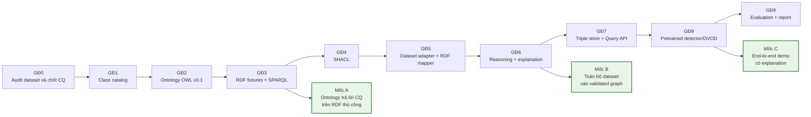


### 25.2. Giai đoạn 0 — Audit và yêu cầu

**Thời lượng:** 3–4 ngày.

**Công việc**

- Kiểm tra archive.
- Thống kê ảnh, box và class.
- Kiểm tra duplicate/sequence.
- Chọn normative source.
- Chốt competency questions.

**Deliverable**

- Dataset audit report.
- Dataset manifest.
- CQ v1.


### 25.3. Giai đoạn 1 — Semantic class catalog

**Thời lượng:** 1 tuần.

**Công việc**

- Chuẩn hóa 52 class.
- Tách code, target, maneuver và parameter.
- Gắn nguồn xác minh.
- Đánh dấu ambiguous/custom mapping.

**Deliverable**

- `class_catalog.csv`.
- `aliases.json`.
- Mapping review report.


### 25.4. Giai đoạn 2 — Ontology OWL v0.1

**Thời lượng:** 1 tuần.

**Công việc**

- Thiết kế module.
- Khai báo class/property.
- Viết annotation Việt/Anh.
- Domain/range/inverse/disjointness.
- Kiểm tra consistency.

**Deliverable**

- `traffic-sign-ontology.ttl`.
- Ontology diagram.
- Design decisions.


### 25.5. Giai đoạn 3 — RDF fixture và competency queries

**Thời lượng:** 4–5 ngày.

**Công việc**

- Tạo graph nhỏ thủ công.
- Viết 20+ SPARQL queries.
- Tạo expected results.
- Kiểm tra taxonomy và property chain.

**Mốc A**

Ontology phải trả lời đúng CQ trên RDF thủ công trước khi tích hợp AI.

### 25.6. Giai đoạn 4 — SHACL

**Thời lượng:** 3–4 ngày.

**Công việc**

- Viết shapes.
- Tạo invalid fixtures.
- Tích hợp validation report.
- Xây quarantine policy.


### 25.7. Giai đoạn 5 — Dataset adapter và RDF mapper

**Thời lượng:** 1 tuần.

**Công việc**

- Parse YOLO.
- Tạo manifest.
- Chuyển bbox.
- Mint URI.
- Map class catalog.
- Sinh provenance.
- Ingest idempotent.


### 25.8. Giai đoạn 6 — Reasoning và explanation

**Thời lượng:** 1 tuần.

**Công việc**

- OWL/RDFS inference.
- SPARQL `CONSTRUCT`.
- Tách inferred graph.
- Lưu rule provenance.
- Explanation subgraph.

**Mốc B**

Dataset annotation phải đi qua validation, mapping và reasoning thành công.

### 25.9. Giai đoạn 7 — Triple store và API

**Thời lượng:** 4–7 ngày.

**Công việc**

- Triển khai triple store.
- Load named graphs.
- Query service.
- Query templates.
- UI image/bbox/graph.


### 25.10. Giai đoạn 8 — Pretrained model integration

**Thời lượng:** 1 tuần.

**Công việc**

- OVOD adapter.
- Crop pipeline.
- Detection output adapter và JSON Schema.
- Object alignment.
- Cache output.
- So sánh predicted graph với gold graph.

**Mốc C**

Demo end-to-end trả về kết quả graph và explanation.

### 25.11. Giai đoạn 9 — Đánh giá và báo cáo

**Thời lượng:** 1 tuần.

**Công việc**

- Chạy các thí nghiệm.
- Ablation.
- Error analysis.
- Viết báo cáo.
- Chuẩn bị slide và demo.

---


## 26. Rủi ro và giảm thiểu


| Rủi ro                                   | Tác động                 | Giảm thiểu                                      |
| ---------------------------------------- | ------------------------ | ----------------------------------------------- |
| Catalog sai hoặc thiếu nghĩa             | Ontology sai             | Xác minh nguồn và trạng thái mapping            |
| Scope ontology quá lớn                   | Chậm tiến độ             | Giới hạn 52 lớp và CQ                           |
| Mất cân bằng class                       | Model bias               | Không bắt buộc train; báo cáo per-class         |
| Frame gần giống bị chia sang nhiều split | Leakage                  | Group split theo sequence/location              |
| OVOD không phân biệt mã chi tiết         | End-to-end accuracy thấp | Chuyển candidate mơ hồ sang curator review      |
| Detector output sai schema               | Ingestion thất bại       | JSON Schema, validation và cache raw output     |
| Detector dự đoán sai                     | Graph sai                | Provenance, threshold, SHACL, gold comparison   |
| Merge nhầm hai biển                      | Relation sai             | Image ID + IoU + class compatibility            |
| OWL rule quá mạnh                        | Suy luận sai             | OWL 2 RL subset và regression tests             |
| Dùng `owl:sameAs` sai                    | Lan truyền lỗi           | Dùng SKOS alias/mapping                         |
| Graph chỉ sao chép label                 | Ít giá trị học thuật     | Bắt buộc phân rã rule/target/maneuver/parameter |
| Demo lệch thành chatbot                  | Mất trọng tâm            | SPARQL là đường query chính                     |
| Thiếu GPU                                | Không chạy model lớn     | Cached output, model nhỏ, ground-truth mode     |


---


## 27. Đạo đức, an toàn và giới hạn sử dụng

1. Hệ thống là prototype nghiên cứu, không dùng trực tiếp để điều khiển phương tiện.
2. Kết quả không phải tư vấn pháp lý hoặc hướng dẫn giao thông chính thức.
3. Ngữ nghĩa mã biển phải có nguồn xác minh.
4. Không kết luận “không có biển” chỉ từ detection âm tính.
5. Confidence và provenance phải hiển thị với prediction.
6. Ảnh có người hoặc biển số xe cần tuân thủ điều kiện sử dụng dataset.
7. Không che giấu lỗi trên rare classes.
8. Model-generated assertions phải phân biệt với gold annotation.

---


## 28. Sản phẩm bàn giao


### 28.1. Artefact tri thức

- Ontology OWL/Turtle.
- SHACL shapes.
- Semantic class catalog 52 lớp.
- SPARQL competency queries.
- Domain reasoning rules.
- Gold RDF fixtures.


### 28.2. Phần mềm

- Dataset audit/parser.
- Model adapter interface.
- Semantic normalizer/entity linker.
- RDF mapper.
- Validation pipeline.
- Reasoning pipeline.
- Triple-store repository.
- Query/explanation API.
- Demo UI.


### 28.3. Báo cáo

- Ontology design document.
- Dataset audit.
- Competency-question specification.
- Evaluation report.
- Error analysis.
- Slide và demo script.

---


## 29. Tiêu chí hoàn thành

Đồ án hoàn thành khi:

1. Parse được toàn bộ 3.216 ảnh và 8.334 boxes.
2. Toàn bộ 52 class có catalog mapping và verification status.
3. Ontology mở được trong Protégé và consistent.
4. Có ít nhất 20 competency queries nghiệp vụ và 4 truy vấn/explanation case.
5. Có SHACL shapes cho resource lõi.
6. Candidate graph lỗi được chuyển sang quarantine.
7. Ingestion chạy lại không tạo duplicate.
8. Có asserted và inferred graph riêng.
9. Có ít nhất bốn loại suy luận được kiểm thử.
10. CQ trả đúng expected result trên gold fixtures.
11. Mọi AI assertion có provenance.
12. Kết quả demo hiển thị ảnh và bbox.
13. Kết luận suy luận có premise/rule explanation.
14. Có ablation chứng minh giá trị của ontology.
15. Hệ thống graph vẫn hoạt động khi tắt pretrained model.

Tiêu chí 15 là điều kiện bảo đảm đồ án tập trung vào biểu diễn và suy luận tri thức.

---


## 30. Đóng góp kỳ vọng

1. Một ontology chuyên biệt cho dữ liệu biển báo giao thông Việt Nam.
2. Một phương pháp phân rã class detector thành semantic components.
3. Một pipeline provenance-aware từ visual observation sang RDF.
4. Một quality gate kết hợp SHACL và materialization policy.
5. Một tập rule suy luận và competency questions có thể tái lập.
6. Một phương pháp đánh giá tách lỗi perception khỏi lỗi knowledge representation.
7. Một demo giải thích được kết quả bằng graph, ảnh và bounding box.

---


## 31. Kịch bản demo


### Bước 1 — Chọn ảnh

Người dùng chọn một ảnh trong dataset.

### Bước 2 — Quan sát thị giác

Hiển thị:

- Gold bounding boxes.
- Tùy chọn bật prediction từ detector/OVOD.
- Raw class và canonical ontology class.


### Bước 3 — RDF mapping

Hiển thị graph con:

```text
Image → Region → SignObservation → SignType → TrafficRule
```


### Bước 4 — Validation

Trình bày một record hợp lệ và một record lỗi để minh họa SHACL report.

### Bước 5 — Reasoning

Ví dụ:

```text
sign01 rdf:type SpeedLimitSign
SpeedLimitSign subClassOf ProhibitionSign
ProhibitionSign subClassOf TrafficSign

⇒ sign01 rdf:type ProhibitionSign
⇒ sign01 rdf:type TrafficSign
```


### Bước 6 — Semantic query

Chạy:

> Tìm tất cả ảnh có biển cấm rẽ phải.

Kết quả phải bao gồm các biển ghép chứa `TurnRight`, không chỉ class có tên exact “Cấm rẽ phải”.

### Bước 7 — Explanation

Hiển thị:

- Kết luận.
- Asserted/inferred.
- Premises.
- Rule.
- Image.
- Bounding box.
- Nguồn annotation/model.
- Confidence.

---


## 32. Kết luận đề xuất

Dataset 52 lớp và 8.334 bounding boxes đủ phù hợp để xây dựng một đồ án Knowledge Graph chuyên sâu. Giá trị chính của đề tài không nằm ở việc nhận diện thêm một nhãn biển báo, mà ở việc chuyển nhãn thành tri thức có cấu trúc, có nguồn gốc, có thể kiểm chứng, suy luận, truy vấn và giải thích.

Kiến trúc đề xuất chủ động tách lớp perception khỏi lớp knowledge representation. Ground-truth mode bảo đảm ontology và reasoning được đánh giá độc lập; pretrained mode chứng minh khả năng tích hợp thị giác; optional fine-tuning chỉ là phần mở rộng. Cách tổ chức này giữ đúng trọng tâm của môn Biểu diễn tri thức và đồng thời tạo ra một ứng dụng trực quan, có dữ liệu thật và có khả năng mở rộng.

---


## Phụ lục A — Thống kê 52 lớp


| ID  | Mã và tên tiếng Việt                                                 | Bounding boxes |
| --- | -------------------------------------------------------------------- | -------------- |
| 0   | W.224 – Đường người đi bộ cắt ngang                                  | 312            |
| 1   | W.205c – Đường giao nhau, ngã ba bên phải                            | 22             |
| 2   | P.102 – Cấm đi ngược chiều                                           | 470            |
| 3   | R.302a – Phải đi vòng sang bên phải                                  | 454            |
| 4   | W.205a – Giao nhau với đường đồng cấp                                | 33             |
| 5   | W.207 – Giao nhau với đường không ưu tiên                            | 256            |
| 6   | W.201a – Chỗ ngoặt nguy hiểm vòng bên trái                           | 182            |
| 7   | P.123a – Cấm rẽ trái                                                 | 247            |
| 8   | I.434a – Bến xe buýt                                                 | 213            |
| 9   | R.303 – Nơi giao nhau chạy theo vòng xuyến                           | 43             |
| 10  | P.130 – Cấm dừng và đỗ xe                                            | 1.071          |
| 11  | I.409 – Chỗ quay xe                                                  | 26             |
| 12  | R.415a – Biển gộp làn đường theo phương tiện                         | 280            |
| 13  | W.245a – Đi chậm                                                     | 372            |
| 14  | P.106a*Xe tải – Cấm xe tải                                           | 85             |
| 15  | W.203c – Đường bị thu hẹp về phía phải                               | 29             |
| 16  | P.117* – Giới hạn chiều cao                                          | 73             |
| 17  | P.124a* – Cấm quay đầu                                               | 105            |
| 18  | P.107 – Cấm ô tô khách và ô tô tải                                   | 214            |
| 19  | P.124d – Cấm rẽ phải và quay đầu                                     | 29             |
| 20  | P.103a – Cấm ô tô                                                    | 52             |
| 21  | W.203b – Đường bị thu hẹp về phía trái                               | 11             |
| 22  | W.221b – Gồ giảm tốc phía trước                                      | 131            |
| 23  | P.111 – Cấm xe hai và ba bánh                                        | 465            |
| 24  | P.129 – Kiểm tra                                                     | 56             |
| 25  | S.505a*Xe máy – Chỉ dành cho xe máy                                  | 25             |
| 26  | W.246a – Chướng ngoại vật phía trước                                 | 80             |
| 27  | W.225 – Trẻ em                                                       | 36             |
| 28  | S.505a*Xe tải và công – Xe tải và xe công                            | 27             |
| 29  | P.104 – Cấm mô tô và xe máy                                          | 45             |
| 30  | S.505a*Xe tải – Chỉ dành cho xe tải                                  | 138            |
| 31  | Camera – Đường có camera giám sát                                    | 38             |
| 32  | P.123b – Cấm rẽ phải                                                 | 186            |
| 33  | W.202b – Nhiều chỗ ngoặt nguy hiểm liên tiếp, chỗ đầu tiên sang phải | 19             |
| 34  | B.8a – Cấm xe sơ-mi rơ-moóc                                          | 82             |
| 35  | P.137 – Cấm rẽ trái và phải                                          | 87             |
| 36  | P.139 – Cấm đi thẳng và rẽ phải                                      | 75             |
| 37  | W.205b – Đường giao nhau, ngã ba bên trái                            | 47             |
| 38  | P.127*50 – Giới hạn tốc độ 50 km/h                                   | 189            |
| 39  | P.127*60 – Giới hạn tốc độ 60 km/h                                   | 459            |
| 40  | P.127*80 – Giới hạn tốc độ 80 km/h                                   | 210            |
| 41  | P.127*40 – Giới hạn tốc độ 40 km/h                                   | 275            |
| 42  | R.301e – Các xe chỉ được rẽ trái                                     | 21             |
| 43  | W.239b* – Chiều cao tĩnh không thực tế                               | 27             |
| 44  | W.233 – Nguy hiểm khác                                               | 3              |
| 45  | I.407a – Đường một chiều                                             | 195            |
| 46  | P.131a – Cấm đỗ xe                                                   | 435            |
| 47  | P.124b1 – Cấm ô tô quay đầu xe, được rẽ trái                         | 16             |
| 48  | W.210 – Giao nhau với đường sắt có rào chắn                          | 41             |
| 49  | P.124c – Cấm rẽ trái và quay đầu xe                                  | 221            |
| 50  | W.201b – Chỗ ngoặt nguy hiểm vòng bên phải                           | 121            |
| 51  | W.246c – Chú ý chướng ngại vật, vòng tránh sang bên phải             | 5              |
|     | **Tổng**                                                             | **8.334**      |


---


## Phụ lục B — Ma trận nguồn tri thức


| Dữ liệu           | Annotation           | Detector/OVOD | Ontology/Rule  |
| ----------------- | -------------------- | ------------- | -------------- |
| Bounding box      | Chính                | Chính         | Không          |
| Raw class         | Chính                | Có thể        | Không          |
| Canonical class   | Qua mapping          | Qua mapping   | Định nghĩa     |
| Sign hierarchy    | Không                | Không         | Chính          |
| Maneuver          | Gián tiếp từ class   | Hạn chế       | Chuẩn hóa      |
| Target vehicle    | Gián tiếp từ class   | Hạn chế       | Chuẩn hóa      |
| Numeric parameter | Một phần trong label | Hạn chế       | Biểu diễn/unit |
| Confidence        | Gold policy          | Có            | Không          |
| Provenance        | Dataset              | Model run     | Schema         |
| Inferred fact     | Không                | Không         | Reasoner       |


---


## Phụ lục C — Tài liệu nền tảng dự kiến sử dụng

- RDF 1.1 Concepts and Abstract Syntax.
- RDF Schema.
- OWL 2 Web Ontology Language.
- OWL 2 Profiles.
- SPARQL 1.1 Query Language.
- Shapes Constraint Language, SHACL.
- PROV-O: The PROV Ontology.
- SKOS Simple Knowledge Organization System.
- Nguồn quy chuẩn chính thức về hệ thống biển báo giao thông được lựa chọn và ghi phiên bản trong giai đoạn audit.
