# KIẾN TRÚC HỆ THỐNG

# Ontology-Grounded Traffic Sign Knowledge Graph

## Biểu diễn, kiểm chứng, suy luận và truy xuất lai trên dữ liệu biển báo giao thông Việt Nam

**Phiên bản:** 1.0

**Trạng thái:** Architecture Baseline

**Phạm vi:** MVP và hướng mở rộng gần

**Datastore chính:** Apache Jena Fuseki + TDB2

**Vector index:** FAISS (embedded) + SQLite metadata/manifest

---

## Tóm tắt kiến trúc

Hệ thống sử dụng một domain datastore và một lớp vector index dẫn xuất:

1. **Apache Jena Fuseki/TDB2** là nguồn chân lý cho Ontology OWL, RDF Knowledge Graph, provenance, asserted facts, inferred facts và validation state.
2. **FAISS** là thư viện vector similarity search chạy nhúng trong Vector Search Service, dùng cho tìm kiếm ảnh/crop tương tự, semantic retrieval và đề xuất entity-linking candidate. SQLite lưu ánh xạ `faiss_id ↔ rdf_uri`, metadata, trạng thái và phiên bản index.

Ảnh JPEG và crop được lưu trên file system hoặc object storage. FAISS chỉ giữ vector và ID số nguyên, không lưu tri thức chuẩn, JSON metadata hay provenance. Mọi kết quả từ vector search phải được ánh xạ sang RDF URI qua SQLite, sau đó Query Service kiểm tra lại bằng SPARQL trên Knowledge Graph trước khi trả kết quả cuối cùng.

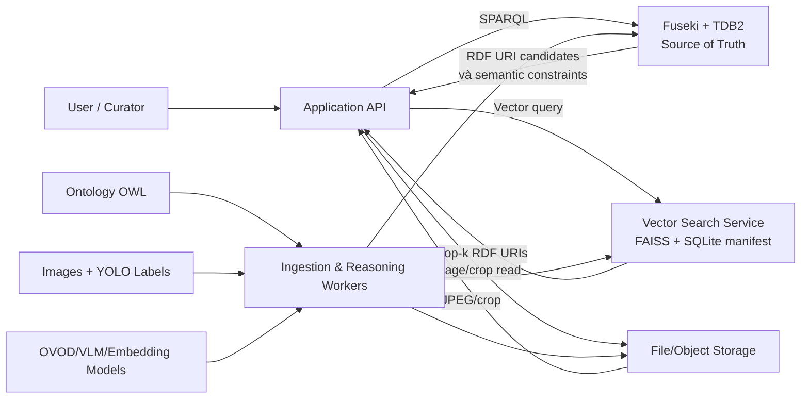

Nguyên tắc trung tâm:

> **RDF graph quyết định một kết luận có đúng theo ontology hay không; FAISS chỉ giúp tìm ứng viên có khả năng liên quan.**

---

## 1. Mục đích tài liệu

Tài liệu này mô tả:

- Kiến trúc logic và triển khai.
- Ranh giới trách nhiệm giữa các component.
- Mô hình lưu trữ RDF và vector.
- Luồng ingestion, validation, reasoning và indexing.
- Luồng SPARQL, vector search và hybrid search.
- Cách đồng bộ Fuseki, FAISS index và SQLite manifest.
- API contracts.
- Chiến lược security, observability, backup và recovery.
- Các quyết định kiến trúc và trade-off.

Tài liệu không khóa cứng model AI. OVOD, VLM và embedding model nằm sau adapter để có thể thay đổi mà không sửa ontology hoặc database schema.

---

## 2. Architectural drivers

### 2.1. Functional drivers

Hệ thống phải:

1. Ingest 3.216 ảnh và 8.334 YOLO bounding boxes.
2. Biểu diễn 52 class nguồn dưới dạng tri thức OWL/RDF.
3. Giữ provenance của annotation và model prediction.
4. Kiểm tra candidate graph bằng SHACL.
5. Tách asserted, inferred và quarantine graph.
6. Trả lời competency questions bằng SPARQL.
7. Tìm kiếm ảnh/crop tương tự bằng vector.
8. Tìm kiếm lai: vector candidate + ontology filtering.
9. Hiển thị ảnh, bbox, rule và explanation.
10. Rebuild vector index từ source of truth.

### 2.2. Quality attributes

| Thuộc tính | Mục tiêu |
|---|---|
| Correctness | SPARQL/ontology là nguồn quyết định cuối |
| Explainability | Inferred fact có rule và premise |
| Traceability | Mọi AI assertion có provenance |
| Reproducibility | Model, prompt, code và graph version được lưu |
| Idempotence | Ingest lại không tạo duplicate |
| Recoverability | FAISS index có thể rebuild từ RDF + assets |
| Evolvability | Thay model không đổi URI domain |
| Security | Database không public trực tiếp |
| Testability | Mỗi rule/query có fixture và expected result |
| Graceful degradation | FAISS index lỗi không làm SPARQL search ngừng |

### 2.3. Constraints

- Dataset nhỏ đến trung bình; không cần distributed cluster cho MVP.
- Trọng tâm là Knowledge Representation, không phải realtime autonomous driving.
- Không bắt buộc fine-tune model.
- Local development phải chạy được bằng một máy.
- Raw data không được sửa.
- Natural-language answer không được thêm fact ngoài graph.

---

## 3. Quyết định kiến trúc chính

| ID | Quyết định | Lý do |
|---|---|---|
| ADR-001 | Fuseki/TDB2 là source of truth | Phù hợp RDF/OWL/SPARQL và named graph |
| ADR-002 | FAISS là derived index | Vector similarity không thay thế logic |
| ADR-003 | RDF URI là cross-store key | Tránh hai hệ ID cạnh tranh |
| ADR-004 | RDF-first, vector-eventual consistency | Không cần distributed transaction |
| ADR-005 | Validation trước materialization | Ngăn graph bẩn |
| ADR-006 | Tách asserted/inferred graph | Dễ giải thích và rebuild |
| ADR-007 | Hai FAISS index độc lập | Visual assets và ontology concepts có embedding space/lifecycle khác |
| ADR-008 | Query template là giao diện MVP | Kiểm soát SPARQL và chứng minh ontology |
| ADR-009 | FAISS result phải qua SQLite mapping và SPARQL | Loại stale/invalid candidate |
| ADR-010 | Vector index có thể xóa và rebuild | Không chứa dữ liệu chuẩn duy nhất |
| ADR-011 | Raw/crop nằm ngoài database | Tránh nhét binary vào RDF/vector index |
| ADR-012 | Version mọi embedding | Không trộn vector từ model khác nhau |

---

## 4. System context

### 4.1. Actors

| Actor | Mô tả |
|---|---|
| End User | Tìm biển theo semantic/visual query |
| Researcher | Chạy SPARQL, kiểm tra reasoning |
| Curator | Review mapping, conflict, low confidence |
| Admin | Ingest dataset, quản lý model run |
| External Model | OVOD, VLM, embedding encoder |

### 4.2. Context diagram

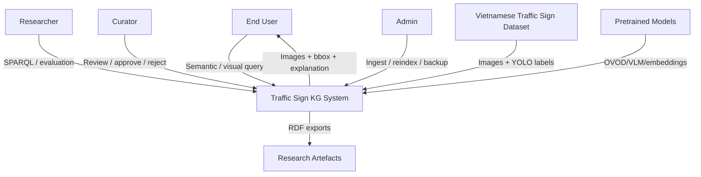

---

## 5. Container architecture

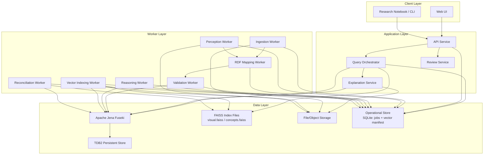

### 5.1. API Service

Trách nhiệm:

- Xác thực request.
- Validate request schema.
- Điều phối semantic, vector và hybrid query.
- Không chứa ontology logic cứng.
- Trả response có URI, evidence và provenance.
- Không truy cập trực tiếp TDB files.

### 5.2. Query Orchestrator

Trách nhiệm:

- Chọn query mode.
- Map query template sang SPARQL.
- Gọi lớp FAISS repository khi cần vector candidate.
- Ánh xạ `faiss_id` sang `rdf_uri` qua SQLite.
- Chèn candidate URI vào SPARQL `VALUES`.
- Áp dụng semantic constraints.
- Hợp nhất score và evidence.

### 5.3. Explanation Service

Trách nhiệm:

- Nhận conclusion URI/triple.
- Lấy asserted premises.
- Lấy rule ID và inferred provenance.
- Lấy image/region/model-run evidence.
- Trả proof path có cấu trúc.

### 5.4. Worker Layer

Workers chạy offline hoặc background:

- `Ingestion Worker`: đọc archive/manifest.
- `Perception Worker`: OVOD/VLM.
- `RDF Mapping Worker`: JSON → RDF.
- `Validation Worker`: SHACL.
- `Reasoning Worker`: OWL/RDFS + domain rules.
- `Vector Indexing Worker`: tạo/upsert embeddings.
- `Reconciliation Worker`: kiểm tra đồng bộ hai datastore.

### 5.5. Operational Job Store

SQLite được dùng cho MVP để lưu trạng thái job và metadata vận hành của vector index:

```text
pending
running
succeeded
failed
retrying
cancelled
```

Ngoài trạng thái job, SQLite lưu `vector_items`, `vector_index_versions`, checksum và active index version. Đây không phải domain database; RDF vẫn là nguồn chân lý. Nếu hệ thống mở rộng nhiều worker/máy, có thể thay SQLite bằng PostgreSQL và tách Vector Search Service mà không thay RDF model.

---

## 6. Data ownership và source of truth

| Dữ liệu | Source of truth | Derived/cache |
|---|---|---|
| Raw image | File/Object Storage | Thumbnail/cache |
| Crop biển báo | File/Object Storage | Có thể tái tạo từ bbox |
| Ontology TBox | Git-tracked Turtle | Fuseki ontology graph |
| Asserted facts | Fuseki/TDB2 | SQLite vector metadata projection |
| Inferred facts | Fuseki/TDB2 inferred graph | Có thể rebuild từ asserted |
| Provenance | Fuseki/TDB2 | SQLite metadata subset |
| Validation report | Fuseki/TDB2/artefact file | UI projection |
| Visual embedding | FAISS `visual.faiss` | Có thể rebuild |
| Concept embedding | FAISS `concepts.faiss` | Có thể rebuild |
| Vector ID/URI mapping | SQLite manifest | Có thể rebuild từ RDF + index job |
| Job state | SQLite/PostgreSQL | Logs/metrics |

Quy tắc:

```text
Nếu Fuseki và FAISS/SQLite khác nhau:
    Fuseki thắng.

Nếu RDF và raw image metadata khác nhau:
    manifest/raw source được audit,
    không tự động ghi đè.
```

---

## 7. RDF database architecture

### 7.1. Lựa chọn

**Apache Jena Fuseki + TDB2**.

Apache Jena là framework Semantic Web mã nguồn mở; Fuseki cung cấp SPARQL Query/Update và Graph Store Protocol, còn TDB cung cấp persistent triple storage. Jena cũng có Ontology, Inference và SHACL APIs. Tham khảo:

- [Apache Jena](https://jena.apache.org/)
- [Apache Jena Fuseki](https://jena.apache.org/documentation/fuseki2/)
- [TDB2 với Fuseki](https://jena.apache.org/documentation/tdb2/tdb2_fuseki.html)
- [Jena SHACL](https://jena.apache.org/documentation/shacl/)

### 7.2. Dataset name và endpoint

Đề xuất dataset:

```text
/traffic-signs
```

Endpoints:

```text
Query:       http://fuseki:3030/traffic-signs/sparql
Update:      http://fuseki:3030/traffic-signs/update
Graph Store: http://fuseki:3030/traffic-signs/data
```

Chỉ API/worker network được truy cập update endpoint. Frontend không gọi Fuseki trực tiếp.

### 7.3. Named graphs

```text
https://example.org/traffic-sign-kg/graph/ontology
https://example.org/traffic-sign-kg/graph/gold
https://example.org/traffic-sign-kg/graph/asserted
https://example.org/traffic-sign-kg/graph/inferred
https://example.org/traffic-sign-kg/graph/provenance
https://example.org/traffic-sign-kg/graph/quarantine
https://example.org/traffic-sign-kg/graph/review
https://example.org/traffic-sign-kg/graph/model-run/{run_id}
```

| Graph | Nội dung | Có thể rebuild |
|---|---|---|
| `ontology` | TBox | Từ Git |
| `gold` | Gold semantic annotations | Từ curated artefacts |
| `asserted` | Fact đã chấp nhận | Không tự động xóa |
| `inferred` | Fact do reasoner sinh | Có |
| `provenance` | Assertion/model/dataset lineage | Từ ingestion artefacts |
| `quarantine` | Record không hợp lệ | Từ validation reports |
| `review` | Record chờ curator | Từ pending assertions |
| `model-run/*` | Output theo từng run | Từ cached model outputs |

### 7.4. URI policy

Namespace:

```text
Ontology: https://example.org/traffic-sign-kg/ontology#
Resource: https://example.org/traffic-sign-kg/resource/
Graph:    https://example.org/traffic-sign-kg/graph/
```

Resource examples:

```text
.../resource/image/0001
.../resource/region/0001/01
.../resource/sign/0001/01
.../resource/assertion/dataset/0001/01/classification
.../resource/model-run/vlm-2026-001
.../resource/rule-instance/0001/01/prohibition-01
```

URI phải deterministic và không chứa:

- Đường dẫn tuyệt đối.
- Raw label chưa normalize.
- Model name thay đổi theo lần chạy.
- Random UUID nếu có natural key ổn định.

### 7.5. Core RDF pattern

```turtle
vkr:image0001 a vko:Image ;
    vko:sourcePath "images/0001.jpg" ;
    vko:hasRegion vkr:region0001_01 .

vkr:region0001_01 a vko:BoundingBoxRegion ;
    vko:regionOf vkr:image0001 ;
    vko:depicts vkr:sign0001_01 ;
    vko:xCenterNormalized "0.36875"^^xsd:decimal ;
    vko:yCenterNormalized "0.509259"^^xsd:decimal ;
    vko:widthNormalized "0.01875"^^xsd:decimal ;
    vko:heightNormalized "0.033333"^^xsd:decimal .

vkr:sign0001_01 a vko:NoParkingSign ;
    vko:rawCode "P.131a" ;
    vko:conveysRule vkr:rule0001_01 .

vkr:rule0001_01 a vko:Prohibition ;
    vko:prohibitsManeuver vko:Parking ;
    vko:appliesTo vko:Vehicle .
```

### 7.6. Assertion/provenance pattern

```turtle
vkr:assertion0001 a vko:ClassificationAssertion ;
    vko:assertionSubject vkr:sign0001_01 ;
    vko:assertionObject vko:NoParkingSign ;
    vko:generatedBy vkr:datasetAnnotationRun001 ;
    vko:extractedFrom vkr:image0001 ;
    vko:confidence "1.0"^^xsd:decimal ;
    vko:assertionStatus vko:Accepted .
```

### 7.7. Reasoning strategy

MVP sử dụng materialized inference:

```text
asserted graph
→ RDFS/OWL RL reasoning
→ SPARQL CONSTRUCT domain rules
→ inferred graph
```

Không cấu hình implicit reasoning như một black box duy nhất vì cần:

- Phân biệt asserted/inferred.
- Lưu rule ID.
- Tạo explanation.
- Regression test từng rule.
- Rebuild inferred graph.

### 7.8. RDF query example

```sparql
PREFIX vko: <https://example.org/traffic-sign-kg/ontology#>

SELECT DISTINCT ?image ?sign ?code
FROM <https://example.org/traffic-sign-kg/graph/asserted>
FROM <https://example.org/traffic-sign-kg/graph/inferred>
WHERE {
  ?image vko:depictsSign ?sign .
  ?sign vko:rawCode ?code ;
        vko:conveysRule ?rule .
  ?rule vko:prohibitsManeuver vko:TurnRight .
}
```

---

## 8. Vector index architecture với FAISS

### 8.1. Lựa chọn và phạm vi

Sử dụng **FAISS**, thư viện mã nguồn mở giấy phép MIT cho similarity search và clustering trên dense vector. FAISS cung cấp C++ core, Python bindings, CPU/GPU implementations và nhiều kiểu index.

FAISS không phải database server:

- Không có REST/gRPC endpoint, authentication hoặc replication tích hợp.
- Không lưu JSON payload hay RDF URI trực tiếp.
- Không cung cấp transaction giữa metadata và vector.
- Index chủ yếu được nạp vào memory và có thể ghi/đọc từ file.

Vì vậy kiến trúc bổ sung:

1. `Vector Search Service`/repository nhúng FAISS.
2. SQLite manifest lưu mapping, metadata và active index version.
3. Versioned `.faiss` files lưu vector index.
4. Fuseki vẫn là nguồn chân lý và semantic filter cuối.

Tài liệu tham khảo:

- [FAISS repository](https://github.com/facebookresearch/faiss)
- [FAISS indexes](https://github.com/facebookresearch/faiss/wiki/Faiss-indexes)
- [Guidelines to choose an index](https://github.com/facebookresearch/faiss/wiki/Guidelines-to-choose-an-index)
- [Getting started](https://github.com/facebookresearch/faiss/wiki/Getting-started)

### 8.2. Vai trò

FAISS hỗ trợ:

1. Text-to-image/crop retrieval nếu text và ảnh ở cùng embedding space.
2. Image-to-image similarity.
3. Tìm crop tương tự.
4. Gợi ý ontology concept cho raw label/câu hỏi.
5. Candidate generation trước SPARQL semantic filtering.

FAISS không chịu trách nhiệm:

- OWL/RDFS/domain-rule reasoning.
- SHACL validation.
- Xác nhận fact.
- Metadata filtering chính xác theo ontology.
- Lưu provenance đầy đủ.
- Trả lời competency query exact.
- Tự động tạo `owl:sameAs`.

### 8.3. Logical index strategy

Tạo hai index độc lập:

```text
visual-assets
ontology-concepts
```

Mỗi logical index có:

```text
data/vector-indexes/{index_name}/{version}/index.faiss
data/vector-indexes/{index_name}/{version}/manifest.json
```

| Index | Entity | Encoder | Query |
|---|---|---|---|
| `visual-assets` | Full image, sign crop/region | Image hoặc joint image-text encoder | Image-to-image, text-to-image |
| `ontology-concepts` | OWL class, maneuver, vehicle, traffic-rule type, verified alias | Multilingual text encoder | Entity-linking candidate |

Không trộn các embedding space khác dimension, model revision hoặc distance metric. Không tạo một index cho mỗi class/image/user ở MVP.

### 8.4. Index type cho MVP

Quy mô hiện tại khoảng 8.334 crop cộng 3.216 ảnh và một số lượng nhỏ ontology concepts. Đề xuất ưu tiên exact search:

```python
base_index = faiss.IndexFlatIP(dimension)
index = faiss.IndexIDMap2(base_index)
```

Quy ước:

- Vector đầu vào là `float32`.
- L2-normalize cả document vector và query vector.
- `IndexFlatIP` trên normalized vectors cho cosine-similarity ranking.
- `IndexIDMap2` cho phép gắn stable signed `int64` ID.
- Vector dimension và metric nằm trong index manifest, không hard-code trong ontology.

Lý do chọn Flat:

- Dataset nhỏ, exact recall dễ kiểm chứng.
- Không cần train index.
- Đơn giản hóa reproducibility và evaluation.
- Dễ rebuild, snapshot và so sánh với brute-force baseline.

Chỉ chuyển sang `IndexIVFFlat`, `IndexIVFPQ` hoặc HNSW sau benchmark. IVF/PQ có bước train index riêng trên vector mẫu; đây không phải train model nhận diện biển báo.

### 8.5. Metadata và manifest schema

FAISS chỉ trả `faiss_id` và score. SQLite lưu projection vận hành:

```sql
CREATE TABLE vector_items (
    faiss_id                 INTEGER PRIMARY KEY,
    rdf_uri                  TEXT NOT NULL,
    index_name               TEXT NOT NULL,
    entity_type              TEXT NOT NULL,
    image_uri                TEXT,
    region_uri               TEXT,
    asset_path               TEXT,
    class_uri                TEXT,
    sign_family_uri          TEXT,
    split                    TEXT,
    source_type              TEXT,
    graph_version            TEXT NOT NULL,
    embedding_model_id       TEXT NOT NULL,
    embedding_revision       TEXT NOT NULL,
    embedding_schema_version TEXT NOT NULL,
    preprocessing_version    TEXT NOT NULL,
    content_hash             TEXT NOT NULL,
    active                   INTEGER NOT NULL DEFAULT 1,
    created_at               TEXT NOT NULL,
    updated_at               TEXT NOT NULL,
    UNIQUE (rdf_uri, index_name, embedding_schema_version)
);

CREATE INDEX idx_vector_items_rdf_uri
    ON vector_items(rdf_uri);
CREATE INDEX idx_vector_items_lookup
    ON vector_items(index_name, active, class_uri, split);

CREATE TABLE vector_index_versions (
    index_name               TEXT NOT NULL,
    version                  TEXT NOT NULL,
    file_path                TEXT NOT NULL,
    file_sha256              TEXT NOT NULL,
    dimension                INTEGER NOT NULL,
    metric                   TEXT NOT NULL,
    index_factory            TEXT NOT NULL,
    embedding_model_id       TEXT NOT NULL,
    embedding_revision       TEXT NOT NULL,
    preprocessing_version    TEXT NOT NULL,
    item_count               INTEGER NOT NULL,
    graph_version            TEXT NOT NULL,
    status                   TEXT NOT NULL,
    created_at               TEXT NOT NULL,
    activated_at             TEXT,
    PRIMARY KEY (index_name, version)
);
```

SQLite metadata là denormalized projection để map/filter nhanh, không phải nguồn chân lý. `class_uri`, `sign_family_uri`, trạng thái và semantic constraint luôn được SPARQL xác minh trước khi trả kết quả.

### 8.6. FAISS ID policy

FAISS `IndexIDMap2` dùng signed `int64`. Không đưa RDF URI hoặc UUID string trực tiếp vào index.

Policy:

1. SQLite cấp một `faiss_id` ổn định cho tuple `(rdf_uri, index_name, embedding_schema_version)`.
2. ID không tái sử dụng cho resource khác.
3. Index builder đọc ID từ SQLite rồi gọi `add_with_ids`.
4. Mapping được backup cùng index version.
5. Rebuild giữ nguyên ID nếu embedding schema không đổi.

Không dùng random ID mỗi lần build vì làm mất khả năng reconciliation. Không cắt UUID/hash xuống 64 bit mà không kiểm tra collision.

### 8.7. Embedding và index versioning

Mỗi vector version phải xác định:

```text
embedding_model_id
embedding_revision
embedding_schema_version
preprocessing_version
dimension
metric
content_hash
graph_version
created_at
```

Khi đổi model:

1. Tạo index version mới trong trạng thái `building`.
2. Re-embed vào version directory mới.
3. Chạy integrity và retrieval evaluation.
4. Ghi file tạm bằng `faiss.write_index`.
5. Tính checksum, fsync và atomic rename.
6. Chuyển `active` version trong một SQLite transaction.
7. Vector Search Service nạp version mới và hot-swap reader.
8. Giữ version cũ trong rollback window rồi archive.

Không sửa file index đang phục vụ query. Một process chỉ đọc active version; một worker chịu trách nhiệm build/publish.

### 8.8. Metadata filtering

FAISS không có payload filter tương đương một vector database. Hybrid filtering dùng pipeline:

1. FAISS lấy `candidate_limit` lớn hơn `top_k`, ví dụ top 100 cho yêu cầu top 10.
2. SQLite map `faiss_id` sang RDF URI và loại item inactive/sai index version.
3. SPARQL `VALUES` áp dụng type, class hierarchy, rule, vehicle, maneuver và validation constraints.
4. Orchestrator giữ top-k ứng viên hợp lệ.
5. Nếu chưa đủ top-k, tăng `candidate_limit` có giới hạn và truy vấn lại.

Không tạo class-specific index trừ khi benchmark chứng minh oversampling không đủ. Semantic filtering phải nằm ở RDF layer để chứng minh vai trò ontology.

### 8.9. Search contract

Internal result sau FAISS và SQLite mapping:

```json
{
  "faiss_id": 100021,
  "score": 0.873,
  "rdf_uri": "https://example.org/traffic-sign-kg/resource/sign/0001/01",
  "image_uri": "https://example.org/traffic-sign-kg/resource/image/0001",
  "region_uri": "https://example.org/traffic-sign-kg/resource/region/0001/01",
  "index_name": "visual-assets",
  "index_version": "visual-clip-v1-20260726",
  "graph_version": "kg-2026-001"
}
```

Vector Search Service phải kiểm tra:

- Query dimension đúng manifest.
- Query được normalize theo preprocessing version.
- Requested embedding space khớp index.
- `faiss_id` tồn tại và active trong SQLite.
- File checksum/version đúng với registry.

Kết quả nội bộ không được trả thẳng cho user. Query Orchestrator phải enrich/filter qua Fuseki.

### 8.10. Concurrency và lifecycle

FAISS được bao bởi `FaissIndexRegistry`:

```text
startup
  → đọc active version từ SQLite
  → verify checksum
  → faiss.read_index(...)
  → health = ready

publish
  → build immutable version
  → validate
  → atomic activate metadata
  → load new index
  → swap reader reference
  → release old reader khi request hoàn tất
```

MVP dùng một API process hoặc một Vector Search Service process để tránh mỗi replica nạp phiên bản khác nhau. Nếu chạy nhiều API replicas, tách vector search thành service nội bộ duy nhất hoặc dùng cơ chế phát tán version + readiness gate.

---

## 9. Object/file storage

### 9.1. MVP

Local persistent directories:

```text
data/raw/images/
data/generated/crops/
data/generated/thumbnails/
data/model_outputs/
data/rdf_exports/
```

### 9.2. Production-like extension

Có thể thay bằng S3-compatible object storage. RDF chỉ lưu:

```text
asset URI
relative object key
checksum
MIME type
width/height
```

Không lưu:

- Base64 ảnh trong RDF literal.
- Binary ảnh trong FAISS/SQLite metadata.
- Absolute path phụ thuộc máy.

### 9.3. Content addressing

Mỗi asset có:

```text
sha256
byte_size
mime_type
image_width
image_height
```

Crop key:

```text
crops/{image_id}/{region_id}/{bbox_hash}.jpg
```

---

## 10. Cross-store identity và consistency

### 10.1. Canonical join key

`rdf_uri` là canonical key.

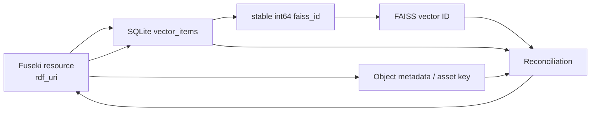

### 10.2. Consistency model

Không dùng distributed transaction giữa Fuseki, SQLite và FAISS files.

Chọn:

```text
RDF strong/domain consistency
Vector eventual consistency
```

Write order:

1. Lưu raw artefact.
2. Tạo candidate RDF.
3. SHACL validation.
4. Commit asserted/provenance graph.
5. Ghi indexing job.
6. Tạo embedding.
7. Ghi vector vào immutable FAISS index version.
8. Ghi checksum, publish version và cập nhật SQLite manifest.
9. Đánh dấu indexing job thành công.

Nếu bước 6–7 lỗi, RDF vẫn đúng; vector feature tạm thiếu.

### 10.3. Index job record

```json
{
  "job_id": "index-job-001",
  "rdf_uri": "https://example.org/.../sign/0001/01",
  "content_hash": "sha256...",
  "index_name": "visual-assets",
  "vector_space": "visual",
  "embedding_schema_version": "1",
  "status": "pending",
  "attempt": 0
}
```

### 10.4. Reconciliation

Worker chạy:

```text
Fuseki accepted resources
MINUS
SQLite active vector_items của active FAISS version
→ missing vector jobs
```

và:

```text
SQLite active vector_items / FAISS IDs
MINUS
Fuseki accepted resources
→ stale item deactivation và index rebuild
```

Kiểm tra thêm:

- Content hash khác.
- Embedding revision cũ.
- Graph version cũ.
- Asset không tồn tại.
- `faiss_id` trùng hoặc thiếu RDF URI.
- SQLite item không có ID tương ứng trong FAISS index.
- FAISS ID không có record tương ứng trong SQLite.

### 10.5. Delete semantics

Không xóa domain fact âm thầm.

Quy trình:

1. Mark resource/assertion inactive hoặc superseded trong RDF.
2. Ghi provenance của thay đổi.
3. Deactivate `vector_items` record.
4. Publish FAISS index version mới không chứa item đó.
5. Rebuild inferred graph nếu cần.
6. Giữ audit trail.

---

## 11. Ingestion architecture

### 11.1. Ground-truth ingestion

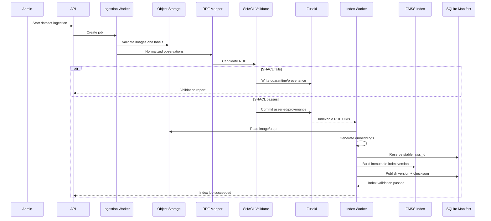

### 11.2. Pretrained model ingestion

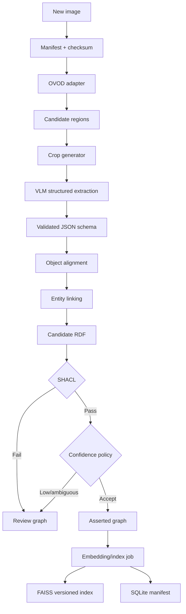

### 11.3. Idempotence

Natural ingestion key:

```text
dataset_id + image_id + region_ordinal + assertion_type + source_run
```

Upsert behavior:

- Same key + same hash: no-op.
- Same key + changed content: new assertion version, old marked superseded.
- New model run: assertion mới, không ghi đè assertion cũ.
- Cùng RDF URI/schema: tái sử dụng stable `faiss_id`; batch thay đổi tạo index version mới.

---

## 12. Validation và reasoning architecture

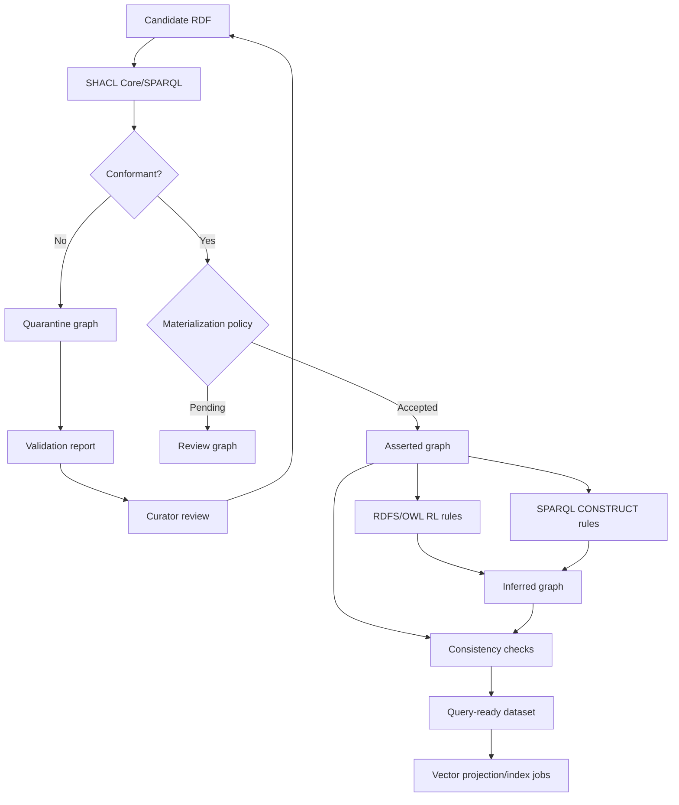

### 12.1. Validation boundary

SHACL kiểm tra:

- Required fields.
- Datatypes.
- Numeric ranges.
- Bbox constraints.
- Model-run provenance.
- Unit cho numeric restriction.
- Relation references.

OWL không thay SHACL vì Open World Assumption.

### 12.2. Materialization policy

Policy inputs:

```text
source_type
mapping_status
confidence
model_run_status
SHACL status
curator decision
```

Ví dụ:

```text
dataset_annotation + verified catalog → accept
model_prediction + high confidence + verified mapping → accept
model_prediction + low confidence → review
ambiguous entity linking → review
SHACL violation → quarantine
```

### 12.3. Rule provenance

Inferred assertion metadata:

```text
rule_id
rule_version
premise_graph
premise_resources
generated_at
reasoning_run_id
```

---

## 13. Query architecture

### 13.1. Query modes

| Mode | Datastore đầu tiên | Datastore xác nhận cuối |
|---|---|---|
| Semantic exact | Fuseki | Fuseki |
| Taxonomy/reasoning | Fuseki | Fuseki |
| Visual similarity | FAISS visual index | Fuseki |
| Text-to-image | FAISS visual index | Fuseki |
| Entity-linking suggestion | FAISS concept index | Catalog/Fuseki |
| Hybrid semantic + vector | FAISS hoặc Fuseki | Fuseki |
| Explanation | Fuseki | Fuseki |

### 13.2. Semantic query

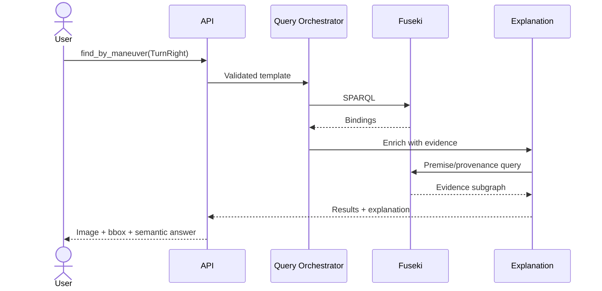

### 13.3. Visual similarity query

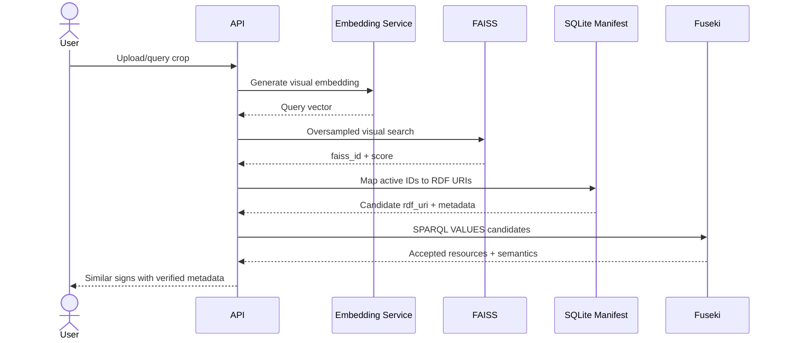

### 13.4. Hybrid query

Ví dụ:

> Tìm các biển nhìn tương tự ảnh này nhưng chỉ thuộc nhóm biển cấm và áp dụng cho xe tải.

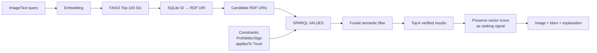

SPARQL candidate filtering:

```sparql
PREFIX vko: <https://example.org/traffic-sign-kg/ontology#>

SELECT DISTINCT ?sign ?image ?rule
WHERE {
  VALUES ?sign {
    <https://example.org/traffic-sign-kg/resource/sign/0001/01>
    <https://example.org/traffic-sign-kg/resource/sign/0210/02>
  }

  ?image vko:depictsSign ?sign .
  ?sign a ?type ;
        vko:conveysRule ?rule .
  ?type rdfs:subClassOf* vko:ProhibitionSign .
  ?rule vko:appliesTo/rdfs:subClassOf* vko:Truck .
}
```

### 13.5. Score policy

Không cộng logic truth với vector score.

Response có hai trường riêng:

```json
{
  "semantic_match": true,
  "vector_similarity": 0.873
}
```

Ranking:

1. Loại candidate không thỏa semantic constraints.
2. Xếp candidate còn lại theo vector score.
3. Có thể ưu tiên gold/asserted source bằng tie-breaker rõ ràng.

### 13.6. Entity-linking query

```text
raw VLM label
→ text embedding
→ FAISS ontology-concepts top-k IDs
→ SQLite mapping sang ontology URI
→ exact code/alias/catalog checks
→ domain/range compatibility
→ candidate list
→ deterministic accept hoặc curator review
```

Vector nearest neighbor không tự tạo mapping.

---

## 14. API architecture

### 14.1. Public/query endpoints

```text
POST /api/v1/search/semantic
POST /api/v1/search/vector
POST /api/v1/search/hybrid
GET  /api/v1/images/{image_id}
GET  /api/v1/signs/{sign_id}
GET  /api/v1/explanations
GET  /api/v1/ontology/concepts
```

### 14.2. Ingestion/admin endpoints

```text
POST /api/v1/ingestions
GET  /api/v1/ingestions/{job_id}
POST /api/v1/reasoning-runs
POST /api/v1/vector-index/rebuild
GET  /api/v1/vector-index/status
POST /api/v1/reconciliation
```

### 14.3. Review endpoints

```text
GET  /api/v1/reviews
GET  /api/v1/reviews/{assertion_id}
POST /api/v1/reviews/{assertion_id}/accept
POST /api/v1/reviews/{assertion_id}/correct
POST /api/v1/reviews/{assertion_id}/reject
```

### 14.4. Semantic search request

```json
{
  "template_id": "find_by_maneuver",
  "parameters": {
    "effect_uri": "vko:Prohibition",
    "maneuver_uri": "vko:TurnRight"
  },
  "include_inferred": true,
  "include_explanation": true,
  "page": 1,
  "page_size": 20
}
```

### 14.5. Hybrid search request

```json
{
  "query_image_id": "image_0001",
  "query_region_id": "region_0001_01",
  "vector_name": "visual",
  "candidate_limit": 100,
  "result_limit": 20,
  "semantic_filter": {
    "sign_family_uri": "vko:ProhibitionSign",
    "applies_to_uri": "vko:Truck"
  },
  "embedding_schema_version": "1"
}
```

### 14.6. Search response

```json
{
  "query_id": "query-uuid",
  "mode": "hybrid",
  "graph_version": "kg-2026-001",
  "embedding_schema_version": "1",
  "results": [
    {
      "sign_uri": "https://example.org/.../sign/0001/01",
      "image_uri": "https://example.org/.../image/0001",
      "region_uri": "https://example.org/.../region/0001/01",
      "raw_code": "P.106a*Xe tải",
      "canonical_class_uri": "https://example.org/...#TruckProhibitionSign",
      "vector_similarity": 0.873,
      "semantic_match": true,
      "assertion_type": "asserted",
      "asset_url": "/api/v1/assets/images/0001",
      "bbox": [120, 80, 260, 230],
      "provenance": {
        "source_type": "dataset_annotation",
        "confidence": 1.0
      }
    }
  ]
}
```

### 14.7. Error model

```json
{
  "error": {
    "code": "VECTOR_INDEX_STALE",
    "message": "Vector result graph version is older than the active graph.",
    "details": {
      "active_graph_version": "kg-2026-002",
      "index_graph_version": "kg-2026-001"
    },
    "request_id": "request-uuid"
  }
}
```

---

## 15. Deployment architecture

### 15.1. Local/MVP topology

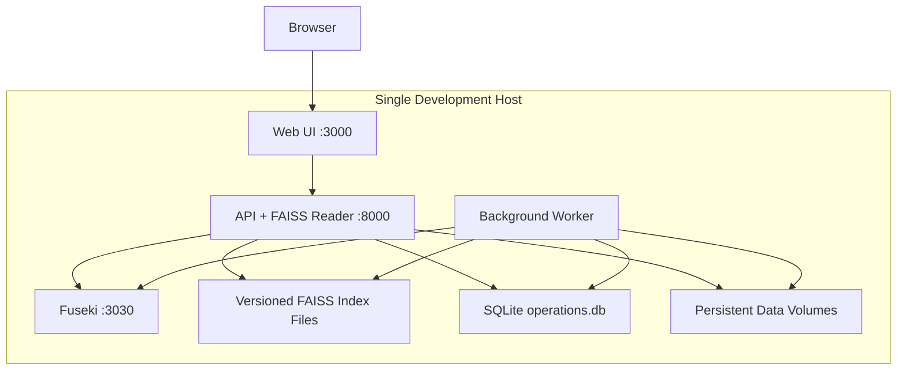

### 15.2. Services

| Service | Port internal | Public? |
|---|---:|---|
| Web UI | 3000 | Qua localhost/reverse proxy |
| API | 8000 | Qua localhost/reverse proxy |
| Fuseki | 3030 | Không |

FAISS không mở port vì chạy trong process API/worker.

### 15.3. Persistent volumes

```text
volumes/
├── fuseki/
│   └── databases/
├── vector-indexes/
│   ├── visual-assets/
│   └── ontology-concepts/
├── assets/
│   ├── images/
│   ├── crops/
│   └── thumbnails/
├── operations/
│   └── operations.db
└── backups/
```

### 15.4. Version pinning

Không dùng `latest` trong reproducible deployment.

Pin:

- Fuseki/Jena version.
- Java runtime.
- FAISS library.
- NumPy và embedding runtime.
- SQLite schema migration version.
- Embedding model revision.
- Ontology version.
- SHACL shapes version.
- Rule-set version.

### 15.5. Scale-out path

Nếu cần mở rộng:

```text
Reverse Proxy
→ stateless API replicas
→ worker pool
→ Fuseki/TDB2 dedicated host
→ dedicated internal Vector Search Service dùng FAISS
→ S3-compatible object storage
→ PostgreSQL job database
```

Quy mô dataset hiện tại không yêu cầu kiến trúc phân tán. FAISS không tự cung cấp distributed cluster; nếu nhu cầu vượt xa single-service, phải thiết kế shard/replication ở application layer hoặc đánh giá lại một vector database server.

---

## 16. Security architecture

### 16.1. Network policy

- Frontend chỉ gọi API.
- Fuseki nằm trong private network; FAISS files và SQLite chỉ được mount vào API/worker.
- Không expose update endpoint công khai.
- Chỉ worker được quyền ghi graph/index.
- Research SPARQL console dùng read-only endpoint hoặc role.

### 16.2. Authentication và authorization

Roles:

```text
viewer
researcher
curator
admin
worker
```

| Action | Viewer | Researcher | Curator | Admin | Worker |
|---|---:|---:|---:|---:|---:|
| Semantic search | ✓ | ✓ | ✓ | ✓ | — |
| SPARQL SELECT | — | ✓ | ✓ | ✓ | — |
| Review | — | — | ✓ | ✓ | — |
| Start ingestion | — | — | — | ✓ | — |
| Write RDF/vector | — | — | — | — | ✓ |

### 16.3. Query safety

- Query templates parameterized.
- URI allow-list theo ontology namespace.
- Page-size limit.
- Timeout.
- Không cho anonymous SPARQL Update.
- Rate limit vector queries.
- Restrict arbitrary `SERVICE` clauses.

### 16.4. Secret management

Không commit:

- API keys.
- Database credentials.
- VLM service tokens.

Local dùng `.env` không track; deployment dùng secret store.

### 16.5. FAISS và index-file security

FAISS không có network endpoint hoặc authentication layer. Security nằm ở host/process boundary:

- Chỉ worker có quyền ghi thư mục version mới.
- API chỉ đọc active index và SQLite manifest.
- Không nhận đường dẫn index tùy ý từ request.
- Verify checksum, index name, dimension và model revision trước `faiss.read_index`.
- Dùng file permissions riêng cho service account.
- Không nạp index file không tin cậy.

### 16.6. Fuseki security

Fuseki endpoint cần giới hạn network và authorization; cấu hình mặc định đơn giản không phù hợp public production. [Fuseki Security](https://jena.apache.org/documentation/fuseki2/fuseki-security.html)

---

## 17. Observability

### 17.1. Structured logs

Mỗi log có:

```text
timestamp
level
service
request_id
job_id
model_run_id
graph_version
embedding_schema_version
duration_ms
status
error_code
```

Không log:

- Full embedding vector.
- Secret.
- Toàn bộ ảnh binary.
- Prompt chứa dữ liệu nhạy cảm nếu không cần.

### 17.2. Metrics

**Ingestion**

```text
images_processed_total
regions_processed_total
rdf_triples_generated_total
shacl_violations_total
ingestion_duration_seconds
```

**Reasoning**

```text
inferred_triples_total
reasoning_run_duration_seconds
rule_firings_total{rule_id}
consistency_errors_total
```

**Vector**

```text
faiss_items_total{index_name,index_version}
faiss_index_load_seconds{index_name}
faiss_index_memory_bytes{index_name}
faiss_index_checksum_errors_total
vector_index_jobs_pending
vector_index_jobs_failed
vector_search_latency_seconds
stale_vector_items_total
```

**Query**

```text
sparql_query_latency_seconds{template_id}
hybrid_query_latency_seconds
query_results_total
explanation_failures_total
```

### 17.3. Health checks

```text
/health/live
/health/ready
/health/dependencies
```

Readiness kiểm tra:

- Fuseki query endpoint.
- Active FAISS index đã load, checksum/dimension đúng.
- SQLite manifest đọc được và khớp index version.
- Asset storage.
- Active ontology/graph version.

FAISS index thiếu/hỏng/không load không làm toàn API unready nếu semantic-only mode vẫn hoạt động; response phải báo vector capability degraded.

---

## 18. Backup và disaster recovery

### 18.1. Backup priorities

Thứ tự quan trọng:

1. Raw dataset và manifests.
2. Ontology/SHACL/rules trong Git.
3. Asserted/provenance/gold RDF exports.
4. TDB2 database backup.
5. Curator decisions/job records.
6. FAISS index files + SQLite manifest nhất quán.
7. Inferred graph và crops có thể rebuild.

### 18.2. Fuseki/TDB2

Thực hiện:

- Export named graphs ra N-Quads/TriG.
- Backup TDB2 khi database ở trạng thái phù hợp.
- Kiểm thử restore định kỳ.

Jena cung cấp `tdb2.tdbbackup` cho database không đang được sử dụng. [TDB2 Database Administration](https://jena.apache.org/documentation/tdb2/tdb2_admin.html)

### 18.3. FAISS index và SQLite manifest

Một backup vector hợp lệ phải chứa cùng một generation:

```text
index.faiss
manifest.json
operations.db backup
file SHA-256
FAISS version
embedding model/revision
preprocessing version
graph version
```

Quy trình backup:

1. Đọc active version trong SQLite transaction.
2. Copy immutable version directory.
3. Backup SQLite bằng SQLite backup API, không copy file đang ghi tùy ý.
4. Verify checksum và thử `faiss.read_index` trên bản backup.
5. Lưu inventory liên kết index version với graph/RDF export.

FAISS là derived index. Recovery option cuối cùng luôn là:

```text
RDF accepted resources
+ image/crop assets
+ embedding config
→ full vector reindex
```

### 18.4. Recovery objectives cho MVP

| Component | RPO | Recovery approach |
|---|---|---|
| Ontology/rules | Theo Git commit | Checkout |
| Raw dataset | Không mất | Restore archive |
| Asserted RDF | Sau mỗi ingestion batch | RDF export/TDB backup |
| Inferred RDF | Có thể mất | Rerun reasoner |
| FAISS index | Có thể mất | Restore versioned files hoặc rebuild |
| SQLite manifest/job DB | Sau mỗi job update | SQLite backup |

---

## 19. Failure modes và graceful degradation

| Failure | Hành vi |
|---|---|
| Fuseki unavailable | Không trả semantic/hybrid result; vector-only không được xem là verified |
| FAISS index missing/corrupt/not loaded | Semantic SPARQL vẫn hoạt động; vector capability degraded |
| Embedding model unavailable | Dùng cached vectors; không index dữ liệu mới |
| VLM unavailable | Ground-truth pipeline vẫn hoạt động |
| SHACL failure | Record vào quarantine |
| Reasoner failure | Asserted queries hoạt động; inferred marked unavailable |
| Stale FAISS/SQLite item | SQLite/SPARQL loại candidate; reconciliation tạo rebuild job |
| Missing image asset | Trả metadata và asset-missing warning |
| Ontology version mismatch | Chặn materialization/indexing |
| Partial ingestion | Resume từ durable job state |

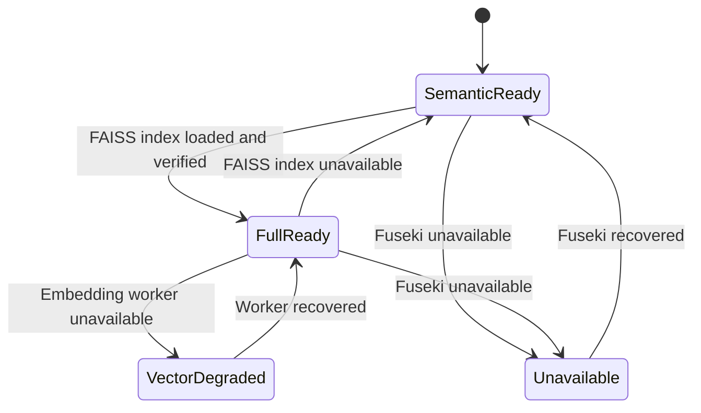

---

## 20. Performance và capacity

### 20.1. Dataset scale

Hiện tại:

```text
3.216 images
8.334 sign regions
52 source classes
```

Ước lượng vector points:

```text
3.216 full-image points
+ 8.334 sign-observation points
+ vài trăm ontology concept points
≈ dưới 12.000 points
```

Đây là quy mô nhỏ đối với Fuseki/TDB2 và FAISS; exact `IndexFlatIP` trên single-node là đủ và dễ đánh giá.

### 20.2. RDF sizing

Nếu mỗi sign observation tạo 30–80 triples:

```text
8.334 × 30–80
≈ 250.000–670.000 triples
```

Cộng ontology, provenance và inferred facts vẫn nằm trong quy mô phù hợp single-node.

### 20.3. Query budgets

Mục tiêu MVP:

| Query | Mục tiêu |
|---|---:|
| Semantic template | dưới 1 giây median local |
| Vector top-k | dưới 500 ms median local, không tính embedding |
| Hybrid query | dưới 2 giây median local |
| Explanation | dưới 1 giây median local |

Các con số là acceptance target nội bộ, cần đo trên hardware thực tế.

### 20.4. Optimization order

1. Đo trước.
2. Tạo SPARQL query regression/performance tests.
3. Giới hạn candidate size.
4. Dùng SQLite indexes cho metadata lookup.
5. Batch embedding và `add_with_ids`.
6. Cache immutable ontology queries.
7. Chỉ scale-out khi có bằng chứng.

---

## 21. Caching

Có thể cache:

- Ontology vocabulary list.
- Query-template compilation.
- Image thumbnails.
- Explanation cho immutable inference run.
- Embedding query theo content hash.

Không cache lâu:

- Review queue.
- Active graph version.
- Low-confidence/conflict counts.

Cache key luôn chứa:

```text
ontology_version
graph_version
rule_set_version
embedding_schema_version nếu liên quan vector
```

---

## 22. Versioning và migration

### 22.1. Version dimensions

```text
ontology_version
shapes_version
rule_set_version
catalog_version
graph_version
embedding_schema_version
model_revision
api_version
```

### 22.2. Ontology migration

Quy trình:

1. Update ontology source.
2. Run consistency tests.
3. Run CQ regression.
4. Migrate asserted facts nếu property/class đổi.
5. Revalidate.
6. Rebuild inferred graph.
7. Reproject affected SQLite vector metadata.
8. Re-embed concept index nếu labels/definitions đổi.

### 22.3. Embedding migration

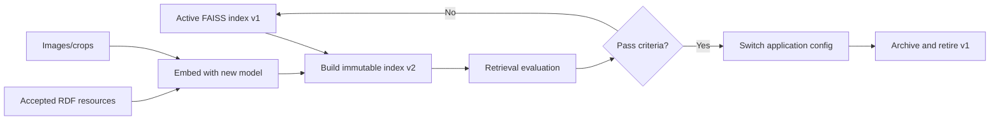

---

## 23. Testing architecture

### 23.1. Unit tests

- YOLO parser.
- URI builder.
- Stable FAISS ID allocator.
- FAISS index builder/registry.
- RDF mapper.
- SQLite metadata projector.
- Query template compiler.
- Score/result merger.

### 23.2. Contract tests

- Fuseki SPARQL JSON response.
- FAISS repository search response.
- SQLite manifest schema.
- API request/response schemas.
- Embedding vector dimension.
- Model adapter structured output.

### 23.3. Integration tests

```text
fixture image/label
→ RDF
→ SHACL
→ Fuseki
→ reasoning
→ FAISS + SQLite manifest
→ hybrid query
→ explanation
```

### 23.4. Consistency tests

- Mọi active SQLite vector item có accepted RDF URI và FAISS ID.
- Mọi indexable accepted RDF URI có item đúng active index version.
- Mọi FAISS ID có đúng một SQLite mapping.
- Metadata class URI tồn tại trong ontology.
- Asset path tồn tại.
- Content hash khớp.

### 23.5. Retrieval evaluation

Đo:

- Recall@k.
- Precision@k.
- Mean Reciprocal Rank nếu có relevance ranking.
- Hybrid filter correctness.
- Entity-linking top-k recall.

### 23.6. Failure injection

- Không load FAISS index khi semantic query.
- Tắt Fuseki khi hybrid query.
- Chèn stale graph version.
- Embedding dimension sai.
- FAISS ID thiếu SQLite mapping.
- Index file sai checksum.
- SHACL invalid candidate.
- Reasoner tạo lỗi.

---

## 24. Repository structure

```text
Ontology-Grounded-Traffic-Sign-Knowledge-Graph/
├── data/
│   ├── vietnamese-traffic-signs.zip
│   ├── manifests/
│   ├── catalog/
│   ├── intermediate/
│   ├── model_outputs/
│   ├── generated/
│   └── gold/
├── ontology/
│   ├── traffic-sign-ontology.ttl
│   ├── traffic-sign-shapes.ttl
│   ├── rules/
│   └── examples/
├── queries/
│   ├── templates/
│   ├── construct/
│   └── reconciliation/
├── src/
│   └── traffic_sign_kg/
│       ├── api/
│       ├── dataset/
│       ├── perception/
│       ├── embeddings/
│       ├── normalization/
│       ├── mapping/
│       ├── validation/
│       ├── reasoning/
│       ├── repositories/
│       │   ├── fuseki_repository.py
│       │   ├── faiss_repository.py
│       │   ├── vector_manifest_repository.py
│       │   ├── asset_repository.py
│       │   └── job_repository.py
│       ├── query/
│       ├── explanation/
│       └── workers/
├── deployment/
│   ├── compose/
│   ├── fuseki/
│   └── vector-indexes/
├── tests/
│   ├── fixtures/
│   ├── unit/
│   ├── integration/
│   ├── ontology/
│   ├── reasoning/
│   ├── vector/
│   └── reconciliation/
└── docs/
    ├── architecture.md
    └── Ontology-Grounded-Traffic-Sign-Knowledge-Graph-Proposal.md
```

---

## 25. Component interfaces

### 25.1. Fuseki repository interface

```python
class KnowledgeGraphRepository:
    def select(self, query: str) -> list[dict]: ...
    def construct(self, query: str) -> bytes: ...
    def ask(self, query: str) -> bool: ...
    def upload_graph(self, graph_uri: str, rdf_bytes: bytes) -> None: ...
    def replace_graph(self, graph_uri: str, rdf_bytes: bytes) -> None: ...
    def delete_graph(self, graph_uri: str) -> None: ...
```

### 25.2. Vector repository interface

```python
class VectorRepository:
    def build_version(
        self,
        index_name: str,
        items: list["VectorItem"],
        version: str,
    ) -> "BuiltIndex": ...
    def activate_version(self, index_name: str, version: str) -> None: ...
    def search_assets(
        self,
        vector: list[float],
        candidate_limit: int,
    ) -> list["VectorCandidate"]: ...
    def search_concepts(
        self,
        vector: list[float],
        limit: int,
    ) -> list["VectorCandidate"]: ...
    def mark_inactive(self, rdf_uri: str, index_name: str) -> None: ...
    def active_version(self, index_name: str) -> "IndexVersion": ...
```

### 25.3. Embedding interface

```python
class EmbeddingProvider:
    @property
    def model_id(self) -> str: ...

    @property
    def revision(self) -> str: ...

    @property
    def dimension(self) -> int: ...

    def embed_images(self, image_paths: list[str]) -> list[list[float]]: ...
    def embed_texts(self, texts: list[str]) -> list[list[float]]: ...
```

### 25.4. Query orchestrator interface

```python
class QueryOrchestrator:
    def semantic_search(self, request: "SemanticRequest") -> "SearchResponse": ...
    def vector_search(self, request: "VectorRequest") -> "SearchResponse": ...
    def hybrid_search(self, request: "HybridRequest") -> "SearchResponse": ...
```

Interfaces ngăn business logic phụ thuộc trực tiếp vào client library cụ thể.

---

## 26. Implementation phases

### Phase A — Storage foundation

- Chạy Fuseki/TDB2 local.
- Cài FAISS CPU và tạo SQLite schema.
- Định nghĩa volumes và network.
- Tạo repository adapters.
- Health checks.

### Phase B — RDF-first ingestion

- Parse dataset.
- URI policy.
- Candidate RDF.
- SHACL.
- Asserted/provenance graphs.

### Phase C — Reasoning

- OWL/RDFS materialization.
- Domain `CONSTRUCT` rules.
- Inferred graph.
- Explanation metadata.

### Phase D — Vector indexing

- Crop generation.
- Embedding provider.
- Hai logical FAISS index và SQLite metadata indexes.
- Stable `faiss_id`, immutable build và atomic activation.
- Reconciliation.

### Phase E — Query

- Semantic templates.
- Vector search.
- Hybrid search.
- Explanation.

### Phase F — Operations

- Metrics/logging.
- Backup/restore.
- Failure injection.
- Version migration.

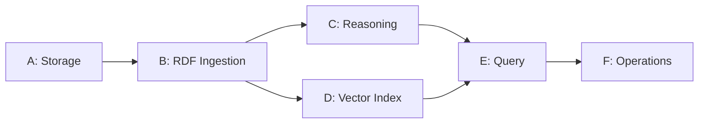

---

## 27. Acceptance criteria

### 27.1. RDF database

- Fuseki persist dữ liệu qua restart.
- Named graphs được tách đúng.
- SPARQL templates trả expected results.
- Asserted/inferred phân biệt được.
- Update endpoint không public.

### 27.2. Vector index

- Hai logical FAISS indexes có manifest đúng schema.
- Mỗi FAISS ID có mapping `rdf_uri` duy nhất trong SQLite.
- Visual similarity trả candidate hợp lệ.
- Concept search trả top-k candidate.
- SQLite indexes tồn tại cho field metadata chính.
- Active index load được, đúng checksum/dimension/model revision.
- Rebuild index từ RDF/assets thành công.

### 27.3. Hybrid consistency

- Stale FAISS/SQLite item bị SPARQL loại.
- FAISS index unavailable không làm semantic search lỗi.
- Fuseki unavailable không trả result vector như verified.
- Reconciliation phát hiện missing/stale vector item.
- Graph/embedding version xuất hiện trong response.

### 27.4. Security và operations

- Datastores chỉ accessible trong private network.
- Secrets không commit.
- Có backup và restore test.
- Có structured logs và health checks.
- Model/ontology/embedding versions được pin.

---

## 28. Kiến trúc MVP được khuyến nghị

```text
Frontend:
  Semantic Search + Image Detail + Explanation

Backend:
  Python API + background worker

Knowledge Graph:
  Apache Jena Fuseki + TDB2

Vector Index:
  FAISS CPU embedded, IndexIDMap2(IndexFlatIP)

Vector metadata/manifest:
  SQLite

Validation:
  pySHACL hoặc Jena SHACL trước commit

Reasoning:
  OWL RL/RDFS + SPARQL CONSTRUCT

Assets:
  Local persistent filesystem

Operational jobs:
  SQLite
```

MVP không cần:

- Kubernetes.
- Distributed vector search.
- Message broker.
- Dedicated relational cluster.
- Fine-tuned detector.
- Natural-language-to-SPARQL.

---

## 29. Tài liệu kỹ thuật tham chiếu

### Apache Jena

- [Apache Jena overview](https://jena.apache.org/)
- [Apache Jena Fuseki](https://jena.apache.org/documentation/fuseki2/)
- [Fuseki Quickstart](https://jena.apache.org/documentation/fuseki2/fuseki-quick-start.html)
- [TDB2 with Fuseki](https://jena.apache.org/documentation/tdb2/tdb2_fuseki.html)
- [TDB2 administration](https://jena.apache.org/documentation/tdb2/tdb2_admin.html)
- [Jena SHACL](https://jena.apache.org/documentation/shacl/)
- [Fuseki security](https://jena.apache.org/documentation/fuseki2/fuseki-security.html)

### FAISS

- [FAISS Open Source repository](https://github.com/facebookresearch/faiss)
- [FAISS license](https://github.com/facebookresearch/faiss/blob/main/LICENSE)
- [Getting started](https://github.com/facebookresearch/faiss/wiki/Getting-started)
- [FAISS indexes](https://github.com/facebookresearch/faiss/wiki/Faiss-indexes)
- [Guidelines to choose an index](https://github.com/facebookresearch/faiss/wiki/Guidelines-to-choose-an-index)

---

## 30. Kết luận

Kiến trúc sử dụng Fuseki/TDB2, FAISS và SQLite manifest không nhằm duy trì nhiều nguồn chân lý song song. Fuseki/TDB2 quản lý tri thức chuẩn, ontology, provenance và suy luận. FAISS chỉ quản lý vector index dẫn xuất; SQLite quản lý ID/metadata vận hành để tăng khả năng truy xuất từ ảnh và ngôn ngữ tự nhiên.

Mọi đường query quan trọng đều kết thúc ở Knowledge Graph:

```text
Semantic query:
  SPARQL → Knowledge Graph → result

Vector query:
  FAISS IDs → SQLite RDF URI mapping → SPARQL → verified result

Hybrid query:
  vector similarity → semantic constraints → explanation
```

Cách phân chia này bảo đảm vector search làm tăng trải nghiệm truy xuất nhưng không làm suy yếu tính đúng đắn, khả năng kiểm chứng và khả năng giải thích của hệ thống biểu diễn tri thức.
