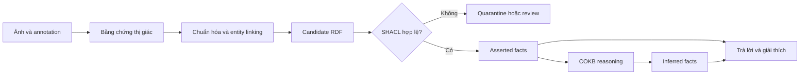
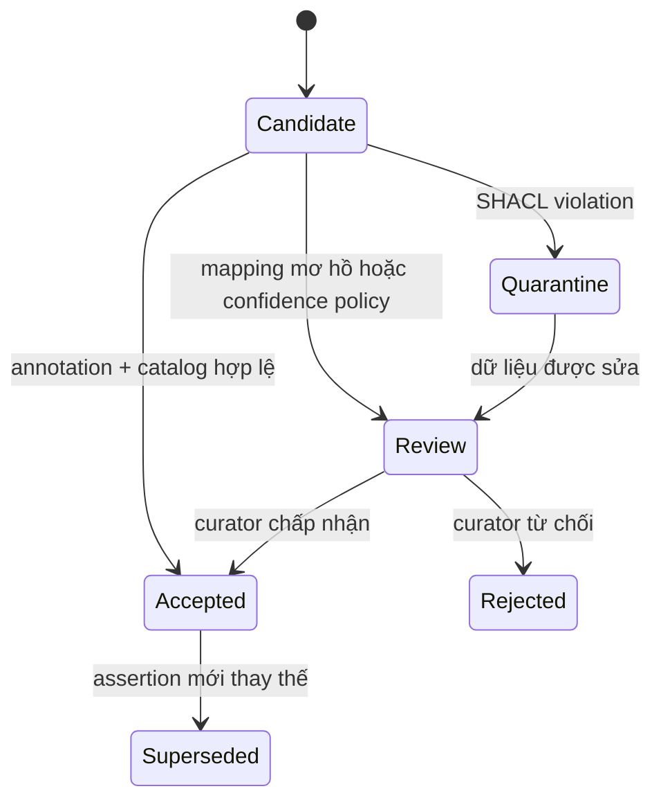
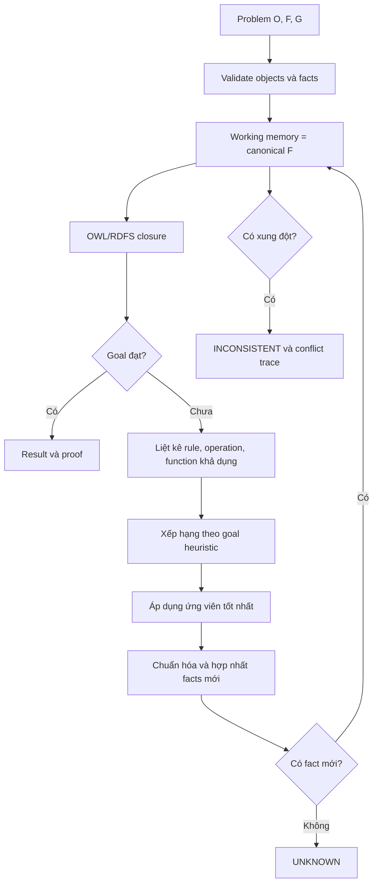
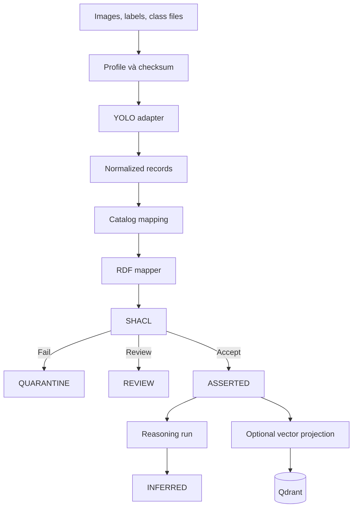
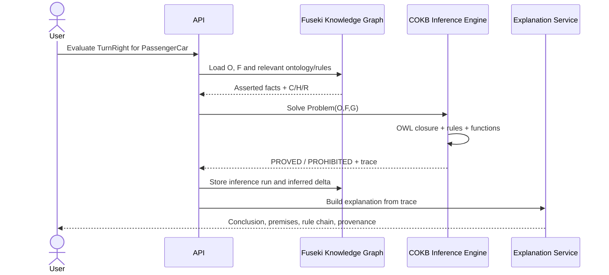

# Kế hoạch triển khai COKB cho Knowledge Graph biển báo giao thông Việt Nam

## Trạng thái tài liệu

| Thuộc tính | Giá trị |
|---|---|
| Vai trò | Tài liệu kiến trúc và triển khai chuẩn của project |
| Phiên bản | 1.0 |
| Ngày lập | 2026-08-15 |
| Trọng tâm | Biểu diễn, kiểm chứng, suy luận và giải thích tri thức |
| Mô hình | COKB-inspired, OWL-grounded |
| RDF database | Apache Jena Fuseki/TDB2 |
| Vector database | Qdrant, thành phần dẫn xuất và tùy chọn |
| Nguồn dữ liệu MVP | Annotation YOLO có sẵn |
| Model thị giác | Không bắt buộc train; pretrained model là phần mở rộng |

Tài liệu này là nguồn chuẩn cho việc triển khai mới. Khi có mâu thuẫn giữa tài liệu này với proposal hoặc source hiện tại, ưu tiên semantic contract và quyết định được ghi ở đây.

Trạng thái triển khai và các boundary chưa xác nhận được theo dõi tại
[implement_state.md](./implement_state.md).

Tài liệu lý thuyết đi kèm: [Phân tích COKB trong paper](./cokb-theory-paper-analysis.md).

## 1. Mục tiêu project

Xây dựng một hệ cơ sở tri thức theo hướng COKB để chuyển dữ liệu quan sát biển báo giao thông Việt Nam thành tri thức có cấu trúc, có thể kiểm chứng, suy luận, truy vấn và giải thích.

Hệ thống không chỉ trả lời:

> Ảnh chứa biển báo nào?

Hệ thống phải trả lời được:

> Biển báo thuộc loại nào, truyền đạt quy tắc gì, áp dụng cho phương tiện nào, cấm hoặc yêu cầu hành vi nào, và kết luận được suy ra từ dữ kiện cùng luật nào?



### 1.1. Mục tiêu cụ thể

1. Xây semantic catalog cho 52 lớp biển báo của dataset.
2. Xây Ontology OWL biểu diễn loại biển, biển xuất hiện trong ảnh, quy tắc, hành vi, phương tiện và giới hạn định lượng.
3. Hiện thực sáu thành phần COKB: `C`, `H`, `R`, `Ops`, `Funcs`, `Rules`.
4. Biểu diễn yêu cầu người dùng theo `(O,F) → G`.
5. Kiểm tra dữ liệu bằng SHACL trước khi chấp nhận vào Knowledge Graph.
6. Suy diễn bằng OWL-RL, SPARQL rules và các hàm tính toán được kiểm soát.
7. Lưu nguồn gốc cho facts trực tiếp và facts suy ra.
8. Trả kết quả kèm proof/explanation path.
9. Đánh giá bằng competency questions và gold fixtures.
10. Chứng minh hệ thống vẫn hoạt động khi tắt detection model và Qdrant.

### 1.2. Ngoài phạm vi MVP

- Huấn luyện detector 52 lớp từ đầu.
- Tối ưu mAP hoặc latency của Computer Vision.
- Điều khiển phương tiện ngoài đời thực.
- Suy ra hiệu lực biển trên road segment khi dataset không có vị trí, hướng và làn đường.
- Chatbot RAG tổng quát.
- Dùng confidence như xác suất logic của OWL.

## 2. Định nghĩa mức tuân thủ COKB

Project chỉ được gọi là **COKB profile đã triển khai** khi thỏa tất cả điều kiện:

- Có artefact cụ thể cho cả sáu thành phần `(C,H,R,Ops,Funcs,Rules)`.
- Có fact model tương ứng các nhóm sự kiện COKB cần dùng.
- Có ít nhất ba lớp bài toán biểu diễn dưới dạng `(O,F) → G`.
- Có bộ suy diễn tiến tạo facts mới.
- Có heuristic ưu tiên facts/rules liên quan tới goal.
- Có cơ chế hợp nhất và loại facts trùng.
- Có điều kiện dừng và kết quả `PROVED`, `DISPROVED`, `UNKNOWN` hoặc `INCONSISTENT`.
- Có inference trace cho mỗi kết luận.
- Có regression tests trên gold fixtures.

Nếu chỉ có OWL classes, RDF triples và SPARQL query thì project mới là Ontology/KG, chưa phải COKB.

### 2.1. Mức triển khai được chọn

Project không xây một framework COKB tổng quát cho mọi miền. Project xây một **COKB domain profile cho biển báo giao thông**, gồm:

- mô hình dữ liệu tổng quát đủ để biểu diễn 12 loại sự kiện;
- implementation và test đầy đủ cho các loại sự kiện được sử dụng trong miền biển báo;
- tài liệu rõ các loại sự kiện chưa có use case;
- operations/functions chỉ được thêm khi có ý nghĩa miền và competency question tương ứng.

## 3. Các quyết định kiến trúc bắt buộc

| ID | Quyết định |
|---|---|
| ADR-001 | Fuseki/TDB2 là nguồn chân lý cho ontology, facts, provenance và inferred facts |
| ADR-002 | Qdrant chỉ lưu vector và payload dẫn xuất; không lưu chân lý ngữ nghĩa |
| ADR-003 | Annotation gốc là nguồn bằng chứng chính cho MVP |
| ADR-004 | Observation/assertion, sign occurrence và OWL sign class là ba thực thể khác nhau |
| ADR-005 | Không gắn domain object property trực tiếp lên OWL class để thay thế instance reasoning |
| ADR-006 | SHACL dùng để validation; OWL/rules dùng để inference |
| ADR-007 | Asserted, inferred, provenance, review và quarantine được lưu ở named graphs riêng |
| ADR-008 | Mọi query khai báo graph scope rõ ràng; không phụ thuộc implicit default union graph |
| ADR-009 | Không suy ra “được phép” chỉ vì không tìm thấy luật cấm |
| ADR-010 | Mỗi inferred fact có rule ID, premises và reasoning-run provenance |
| ADR-011 | Semantic catalog phải được review trước full ingestion |
| ADR-012 | Detection model và Qdrant chỉ tạo candidate, không tự ghi accepted knowledge |

## 4. Semantic contract chuẩn

### 4.1. Các lớp thực thể chính

| Thực thể | Ý nghĩa |
|---|---|
| `Image` | Ảnh nguồn |
| `ImageRegion` | Vùng ảnh hoặc bounding box |
| `TrafficSignOccurrence` | Biển báo cụ thể được thể hiện trong một vùng ảnh |
| `TrafficSign` | Lớp tổng quát của biển báo |
| `P123bSign` | OWL class cho loại biển P.123b |
| `ClassificationAssertion` | Bản ghi bằng chứng khẳng định occurrence thuộc một sign class |
| `DatasetAnnotationRun` | Nguồn annotation dataset |
| `ModelRun` | Một lần chạy model |
| `TrafficRule` | Nội dung quy tắc biển truyền đạt |
| `Maneuver` | Hành vi như rẽ phải, quay đầu, dừng hoặc đỗ |
| `VehicleCategory` | Nhóm phương tiện mà rule áp dụng |
| `InferenceRun` | Một lần materialize hoặc giải bài toán |
| `InferenceStep` | Một bước suy diễn có premises và conclusion |

### 4.2. Quan hệ chuẩn

```text
Image              ──hasRegion──────────────▶ ImageRegion
ImageRegion        ──depicts────────────────▶ TrafficSignOccurrence
SignOccurrence     ──rdf:type───────────────▶ ConcreteSignClass
Classification     ──assertionSubject───────▶ TrafficSignOccurrence
Classification     ──assertedType───────────▶ ConcreteSignClass
Classification     ──generatedBy────────────▶ DatasetAnnotationRun | ModelRun
SignOccurrence     ──conveysRule────────────▶ TrafficRule
TrafficRule        ──prohibitsManeuver──────▶ Maneuver
TrafficRule        ──requiresManeuver───────▶ Maneuver
TrafficRule        ──appliesTo──────────────▶ VehicleCategory
InferenceStep      ──usedPremise────────────▶ FactReference
InferenceStep      ──generatedConclusion────▶ FactReference
InferenceStep      ──appliedRule────────────▶ KnowledgeRule
```

### 4.3. Quy tắc materialize classification

Candidate assertion không tự động trở thành fact:



Chỉ khi assertion có trạng thái `Accepted`, materializer mới tạo:

```turtle
vkr:sign-occurrence/dataset/image/region
    rdf:type vko:P123bSign .
```

### 4.4. Gắn meaning vào sign class

Không dùng:

```turtle
vko:P123bSign vko:conveysRule vkr:no-right-turn-rule .
```

nếu `conveysRule` được thiết kế cho sign occurrence. Thay vào đó dùng OWL `hasValue` restriction:

```turtle
vko:P123bSign
    a owl:Class ;
    rdfs:subClassOf
        vko:ProhibitionSign ,
        [
            a owl:Restriction ;
            owl:onProperty vko:conveysRule ;
            owl:hasValue vkr:no-right-turn-rule
        ] .

vkr:no-right-turn-rule
    a vko:ProhibitionRule ;
    vko:prohibitsManeuver vko:TurnRight ;
    vko:appliesTo vko:Vehicle .
```

Khi có:

```turtle
vkr:sign001 a vko:P123bSign .
```

OWL-RL có thể suy ra:

```turtle
vkr:sign001 vko:conveysRule vkr:no-right-turn-rule .
```

## 5. Ánh xạ sáu thành phần COKB

### 5.1. `C` — Concepts và computational objects

Các nhóm concept:

```text
Entity
├── VisualEntity
│   ├── Image
│   ├── ImageRegion
│   └── TrafficSignOccurrence
├── TrafficSign
│   ├── ProhibitionSign
│   ├── WarningSign
│   ├── MandatorySign
│   ├── IndicationSign
│   └── SupplementarySign
├── TrafficRule
│   ├── ProhibitionRule
│   ├── ObligationRule
│   ├── WarningRule
│   └── InformationRule
├── Maneuver
├── VehicleCategory
├── NumericRestriction
├── EvidenceAssertion
└── ReasoningEntity
    ├── Problem
    ├── Goal
    ├── InferenceRun
    └── InferenceStep
```

Một `TrafficSignOccurrence` được xem như computational object vì hệ thống có thể xác định:

- loại của biển;
- tập rule được truyền đạt;
- hành vi bị cấm hoặc bắt buộc;
- phương tiện áp dụng;
- restriction value;
- trạng thái một goal liên quan đến biển;
- provenance của kết luận.

### 5.2. `H` — Hierarchical và special relations

`H` bao gồm:

- `rdfs:subClassOf` cho taxonomy;
- `rdfs:subPropertyOf` cho property hierarchy;
- `owl:inverseOf` cho quan hệ hai chiều;
- quan hệ cấu thành sign–rule–restriction được định nghĩa rõ;
- concept dependency layers nếu cần mô tả `C[0]...C[k]`.

Phân tầng đề xuất:

| Tầng | Nội dung |
|---|---|
| `C[0]` | Literal, unit, maneuver, vehicle category |
| `C[1]` | Traffic rule, numeric restriction |
| `C[2]` | Traffic sign classes được định nghĩa qua rule/target/value |
| `C[3]` | Sign occurrence, observation/assertion và scene-level object |
| `C[4]` | Problem, goal, inference và explanation |

### 5.3. `R` — Domain relations

Các relation tối thiểu:

- `hasRegion`, `regionOf`, `depicts`;
- `conveysRule`, `appliesTo`;
- `governsManeuver`, `prohibitsManeuver`, `requiresManeuver`;
- `hasRestrictionValue`, `hasUnit`;
- `generatedBy`, `derivedFrom`;
- `assertionSubject`, `assertedType`, `assertionStatus`;
- `hasObject`, `hasFact`, `hasGoal`;
- `appliedRule`, `usedPremise`, `generatedConclusion`.

Mỗi property phải có:

- `rdfs:label@vi` và `rdfs:label@en`;
- domain/range nếu không tạo suy luận ngoài ý muốn;
- inverse/subproperty khi có ý nghĩa;
- SHACL shape tương ứng nếu là dữ liệu bắt buộc.

### 5.4. `Ops` — Operations

Operation là hành động giải quyết bài toán, không phải mọi bước ETL.

| Operation | Input | Output | Vai trò |
|---|---|---|---|
| `InterpretSign` | Sign occurrence | Tập rule | Xác định meaning của biển |
| `ResolveCompositeSign` | Sign class | Tập atomic restriction | Phân rã biển cấm nhiều hành vi |
| `EvaluateManeuver` | Vehicle, maneuver, sign set | Status | Xác định cấm/bắt buộc/unknown |
| `EvaluateVehicleApplicability` | Rule, vehicle class | Boolean/unknown | Kiểm tra rule áp dụng |
| `MaterializeKnowledge` | Asserted graph, ruleset | Inferred delta | Sinh inferred facts |
| `ExplainConclusion` | Conclusion fact | Proof graph | Tạo đường giải thích |

Metadata operation được lưu trong RDF hoặc YAML versioned:

```yaml
id: EvaluateManeuver
input_types: [VehicleCategory, Maneuver, TrafficSignOccurrence]
output_type: ManeuverStatus
preconditions:
  - accepted_classification
implementation: traffic_sign_kg.cokb.operations.evaluate_maneuver
version: 1.0.0
```

### 5.5. `Funcs` — Knowledge functions

Function phải thuần, deterministic và không có side effect.

| Function | Chữ ký |
|---|---|
| `rulesOf` | `TrafficSignOccurrence → set[TrafficRule]` |
| `prohibitedManeuvers` | `TrafficRule → set[Maneuver]` |
| `requiredManeuvers` | `TrafficRule → set[Maneuver]` |
| `applicableVehicles` | `TrafficRule → set[VehicleCategory]` |
| `restrictionValue` | `TrafficRule → Quantity | Unknown` |
| `isApplicableTo` | `(TrafficRule, VehicleCategory) → True | False | Unknown` |
| `maneuverStatus` | `(SignSet, Vehicle, Maneuver) → Prohibited | Required | Unknown | Inconsistent` |

Implementation được đăng ký bằng IRI và whitelist. Rule không được gọi arbitrary Python path từ dữ liệu không tin cậy.

### 5.6. `Rules` — Knowledge rules

Tập rule MVP:

| ID | Premise | Conclusion |
|---|---|---|
| `R-TAX-001` | `x rdf:type C`, `C subClassOf D` | `x rdf:type D` |
| `R-SIGN-001` | `x type SignClass`, SignClass có `hasValue conveysRule r` | `x conveysRule r` |
| `R-MAN-001` | `x conveysRule r`, `r prohibits m` | `x prohibits m` |
| `R-MAN-002` | Composite sign cấm hai maneuver | Sinh hai atomic prohibition facts |
| `R-VEH-001` | Rule áp dụng cho superclass của vehicle | Rule áp dụng cho vehicle |
| `R-NUM-001` | Speed-limit sign có value | Sinh `MaximumSpeedRestriction` |
| `R-NUM-002` | Height-limit sign có value | Sinh `MaximumHeightRestriction` |
| `R-CONFLICT-001` | Cùng context vừa cấm vừa bắt buộc maneuver | Sinh conflict fact |

OWL/RDFS xử lý taxonomy và restrictions phù hợp. SPARQL `CONSTRUCT` xử lý domain rule. Python operation chỉ dùng khi rule cần function hoặc goal evaluation.

## 6. Fact model và 12 loại sự kiện

Runtime dùng cấu trúc chung:

```python
Fact(
    id: str,
    kind: FactKind,
    subject: Term,
    predicate: Term,
    object: Term,
    source: FactSource,
    asserted: bool,
)
```

| COKB type | `FactKind` | Ví dụ trong project |
|---:|---|---|
| 1 | `TYPE` | `sign001 rdf:type P123bSign` |
| 2 | `DETERMINED` | loại của `sign001` đã được xác định |
| 3 | `VALUE` | `confidence = 0.93`, `limitValue = 50` |
| 4 | `EQUALITY` | hai reference cùng chỉ một occurrence; chỉ dùng khi được curator xác nhận |
| 5 | `DEPENDENCY` | maneuver status phụ thuộc sign rule và vehicle |
| 6 | `RELATION` | `rule001 prohibitsManeuver TurnRight` |
| 7 | `FUNCTION_DEFINED` | function `maneuverStatus` đã đăng ký |
| 8 | `FUNCTION_VALUE` | `restrictionValue(rule001) = 50 km/h` |
| 9 | `OBJECT_FUNCTION_EQUALITY` | effective rule set bằng `rulesOf(sign001)` |
| 10 | `FUNCTION_EQUALITY` | hai function expression tương đương; chưa dùng trong MVP |
| 11 | `FUNCTION_DEPENDENCY` | `maneuverStatus` phụ thuộc `rulesOf` và `isApplicableTo` |
| 12 | `FUNCTION_RELATION` | `isApplicableTo(rule001, Truck) = true` |

Nguyên tắc:

- RDF triple là biểu diễn chuẩn của type/value/relation facts.
- Function facts có representation trong runtime và provenance RDF.
- Không tự dùng `owl:sameAs` cho `EQUALITY`.
- Các fact type không xuất hiện trong use case phải được đánh dấu `not_exercised`, không giả lập dữ liệu để đủ số lượng.

## 7. Mô hình bài toán `(O,F) → G`

### 7.1. Cấu trúc runtime

```python
Problem(
    problem_id: str,
    problem_type: ProblemType,
    objects: tuple[KnowledgeObject, ...],
    facts: tuple[Fact, ...],
    goals: tuple[Goal, ...],
    context_graphs: tuple[str, ...],
)
```

```python
Goal(
    goal_id: str,
    predicate: str,
    arguments: tuple[Term, ...],
    expected: Term | None,
)
```

### 7.2. Ba lớp bài toán MVP

#### P1 — Giải nghĩa một biển báo

```text
O = {sign001: P123bSign}
F = {type(sign001, P123bSign)}
G = {determine(rulesOf(sign001))}
```

#### P2 — Đánh giá một hành vi

```text
O = {sign001, PassengerCar, TurnRight}
F = {
  type(sign001, P123bSign),
  subclass(PassengerCar, Vehicle)
}
G = {maneuverStatus(sign001, PassengerCar, TurnRight)}
```

Kết quả mong đợi: `PROHIBITED`.

#### P3 — Xác định giới hạn định lượng

```text
O = {sign001: P127_50Sign, PassengerCar}
F = {type(sign001, P127_50Sign)}
G = {effectiveSpeedLimit(sign001, PassengerCar)}
```

Kết quả mong đợi: `50 km/h` kèm rule và nguồn classification.

### 7.3. Trạng thái kết quả

| Status | Ý nghĩa |
|---|---|
| `PROVED` | Có proof cho goal |
| `DISPROVED` | Có fact phủ định tường minh hoặc proof cho goal đối nghịch |
| `UNKNOWN` | Không đủ tri thức; không đồng nghĩa false |
| `INCONSISTENT` | Có proof cho hai kết luận xung đột |
| `INVALID_INPUT` | Facts đầu vào không qua validation |

## 8. Bộ suy diễn COKB

### 8.1. Quy trình



### 8.2. Heuristic

Ưu tiên theo thứ tự:

1. Rule có conclusion predicate trùng goal predicate.
2. Rule tạo fact về cùng object trong goal.
3. Function có output type trùng goal type.
4. Quan hệ sign–rule–maneuver nằm trên đường phụ thuộc tới goal.
5. Taxonomy rule cần để mở khóa rule mục tiêu.
6. Các rule khác theo priority cố định và rule ID để bảo đảm deterministic.

### 8.3. Điều kiện dừng

Bộ suy diễn dừng khi:

- đạt toàn bộ goals;
- không sinh fact mới;
- phát hiện conflict cần trả `INCONSISTENT`;
- đạt giới hạn `max_steps`;
- phát hiện cycle với cùng working-memory fingerprint.

### 8.4. Inference trace

Mỗi bước lưu:

```json
{
  "step": 3,
  "rule_id": "R-MAN-001",
  "premises": [
    "sign001 conveysRule no-right-turn-rule",
    "no-right-turn-rule prohibitsManeuver TurnRight"
  ],
  "conclusion": "sign001 prohibitsManeuver TurnRight",
  "source_graphs": ["graph/asserted", "graph/ontology"],
  "reasoning_run": "reasoning-run/2026-001"
}
```

## 9. Ontology modules

```text
ontology/
├── modules/
│   ├── cokb-core.ttl
│   ├── visual-observation.ttl
│   ├── traffic-sign-core.ttl
│   ├── traffic-rule.ttl
│   └── provenance.ttl
├── catalog/
│   └── vietnamese-sign-catalog.ttl
├── shapes/
│   ├── observation-shapes.ttl
│   ├── catalog-shapes.ttl
│   ├── rule-shapes.ttl
│   └── reasoning-shapes.ttl
└── rules/
    ├── sign-rule-materialization.rq
    ├── maneuver-rules.rq
    ├── vehicle-applicability.rq
    ├── numeric-restrictions.rq
    └── conflict-rules.rq
```

### 9.1. `cokb-core.ttl`

Định nghĩa:

- `ComputationalConcept`;
- `KnowledgeObject`;
- `KnowledgeOperation`;
- `KnowledgeFunction`;
- `KnowledgeRule`;
- `Fact`, `Goal`, `Problem`;
- `InferenceRun`, `InferenceStep`;
- relations giữa problem, fact, goal và inference.

### 9.2. `traffic-sign-core.ttl`

Định nghĩa taxonomy ổn định, không chứa observation dataset cụ thể.

### 9.3. `vietnamese-sign-catalog.ttl`

Mỗi lớp dataset phải có:

- `class_id`;
- `raw_code`;
- `base_code`;
- canonical OWL class URI;
- Vietnamese/English labels;
- sign family;
- rule type;
- maneuver/target;
- vehicle applicability;
- numeric value và unit nếu có;
- composite components;
- definition source;
- mapping status;
- curator/review status.

## 10. RDF datasets và named graphs

| Graph | Nội dung | Mutable | Rebuild |
|---|---|---:|---:|
| `/graph/ontology` | OWL TBox và COKB core | Có version | Từ Git |
| `/graph/catalog` | Catalog 52 lớp đã review | Có version | Từ Git/catalog |
| `/graph/gold` | Gold fixtures | Có review | Từ fixtures |
| `/graph/asserted` | Accepted facts | Append/version | Từ ingestion artefacts |
| `/graph/inferred/{run}` | Inferred delta | Immutable | Có |
| `/graph/provenance` | Dataset/model/assertion lineage | Append | Từ ingestion |
| `/graph/review` | Candidate chờ quyết định | Mutable | Từ candidate cache |
| `/graph/quarantine` | Invalid candidate + report | Mutable | Từ ingestion |
| `/graph/model-run/{id}` | Raw model assertions | Immutable | Từ cached output |

Mọi SPARQL query phải khai báo graph scope:

```sparql
FROM <https://w3id.org/vn-ts-cokb/graph/ontology>
FROM <https://w3id.org/vn-ts-cokb/graph/catalog>
FROM <https://w3id.org/vn-ts-cokb/graph/asserted>
FROM <https://w3id.org/vn-ts-cokb/graph/inferred/current>
```

URI `w3id.org` chỉ được dùng sau khi project đăng ký redirect; nếu chưa đăng ký, chọn namespace do project kiểm soát và cố định trước ingestion.

## 11. Validation bằng SHACL

### 11.1. Candidate validation

Kiểm tra:

- image, region và occurrence tồn tại;
- bbox có đủ bốn tọa độ và nằm trong ảnh;
- classification có đúng một subject và asserted type;
- class có trong catalog;
- provenance có source và version;
- confidence có datatype/range đúng;
- numeric restriction có value và unit;
- rule reference đúng loại;
- accepted assertion không có mapping status `ambiguous`.

### 11.2. Validation boundary

Không trộn ontology triples vào candidate graph chỉ để candidate conform. Gọi PySHACL với:

- `data_graph`: candidate RDF;
- `shacl_graph`: shapes;
- `ont_graph`: ontology + catalog;
- cấu hình inference được ghi rõ.

Test phải chứng minh candidate độc lập không chứa TBox nhưng vẫn được kiểm tra dựa trên `ont_graph`.

### 11.3. Routing

| Điều kiện | Destination |
|---|---|
| SHACL fail | Quarantine |
| SHACL pass, mapping mơ hồ | Review |
| SHACL pass, annotation + reviewed catalog | Asserted |
| Model confidence thấp | Review |
| Curator reject | Retain provenance, không materialize fact |

## 12. Dataset ingestion

### 12.1. Dataset hiện có

- 3.216 images.
- 3.216 label files.
- 8.334 bounding boxes.
- 52 classes.
- 25 empty labels, phải giữ như negative images.
- Split hiện có chỉ chứa 3.191 ảnh có bbox.

Dataset đủ cho ontology/KG và gold annotation ingestion. Không cần train model để hoàn thành MVP.

### 12.2. Normalized record

```json
{
  "dataset_id": "vn-traffic-signs",
  "dataset_version": "sha256:...",
  "image_id": "0001",
  "image_path": "archive/images/0001.jpg",
  "image_width": 1920,
  "image_height": 1080,
  "region_id": "0001-00",
  "bbox_format": "xyxy_absolute",
  "bbox": [690, 532, 726, 568],
  "source_class_id": 46,
  "raw_code": "P.131a",
  "canonical_class_uri": ".../P131aSign",
  "mapping_version": "catalog-1.0.0",
  "source_type": "dataset_annotation",
  "confidence": 1.0,
  "content_hash": "sha256:..."
}
```

### 12.3. Idempotence keys

```text
image_uri      = dataset_id + dataset_version + image_id
region_uri     = image_uri + region_index
occurrence_uri = region_uri + accepted_entity_version
assertion_uri  = source_run + region_uri + asserted_class
```

Không dùng random UUID nếu đã có natural key ổn định.

### 12.4. Ingestion flow



## 13. Database architecture

### 13.1. Fuseki/TDB2

Fuseki lưu:

- ontology và catalog;
- accepted RDF facts;
- inferred facts;
- provenance;
- validation/review state cần truy vấn ngữ nghĩa.

Fuseki là nơi quyết định một kết luận có được xác nhận bởi Knowledge Graph hay không.

### 13.2. Qdrant

Qdrant lưu hai collection tùy chọn:

```text
traffic_sign_visual_assets
traffic_sign_concepts
```

Payload tối thiểu:

```json
{
  "rdf_uri": ".../sign-occurrence/0001-00",
  "entity_type": "TrafficSignOccurrence",
  "class_uri": ".../P123bSign",
  "catalog_version": "1.0.0",
  "graph_version": "kg-2026-001",
  "source_type": "dataset_annotation"
}
```

Qdrant không lưu:

- OWL axioms;
- SHACL status như nguồn chân lý;
- domain rules;
- proof path;
- accepted/rejected truth độc lập với Fuseki.

Mọi Qdrant result phải được ánh xạ sang RDF URI và kiểm tra lại trên asserted/inferred graph.

### 13.3. SQLite

SQLite chỉ cần cho operational jobs nếu chưa có worker database riêng:

- ingestion job;
- reasoning job;
- Qdrant projection job;
- retry/error state.

Xóa các bảng FAISS-specific sau khi migration sang Qdrant hoàn tất.

## 14. Source architecture

```text
src/traffic_sign_kg/
├── api/
│   ├── routes/problems.py
│   ├── routes/queries.py
│   ├── routes/ingestions.py
│   ├── routes/explanations.py
│   └── schemas.py
├── cokb/
│   ├── facts.py
│   ├── objects.py
│   ├── problems.py
│   ├── goals.py
│   ├── operations.py
│   ├── functions.py
│   ├── rules.py
│   ├── engine.py
│   └── trace.py
├── dataset/
│   ├── models.py
│   ├── yolo_adapter.py
│   ├── profiler.py
│   └── manifest.py
├── mapping/
│   ├── catalog.py
│   ├── rdf_mapper.py
│   └── uri_policy.py
├── reasoning/
│   ├── owl_rl.py
│   ├── sparql_rules.py
│   └── materializer.py
├── services/
│   ├── ingestion_service.py
│   ├── problem_service.py
│   ├── explanation_service.py
│   └── query_service.py
└── repositories/
    ├── fuseki_repository.py
    ├── qdrant_repository.py
    └── operations_repository.py
```

## 15. API MVP

### 15.1. Giải bài toán maneuver

```http
POST /api/v1/problems/evaluate-maneuver
```

```json
{
  "sign_uris": [".../sign001"],
  "vehicle_uri": ".../PassengerCar",
  "maneuver_uri": ".../TurnRight"
}
```

Response:

```json
{
  "status": "PROVED",
  "answer": "PROHIBITED",
  "goal": "maneuverStatus(PassengerCar, TurnRight)",
  "conclusion_uri": ".../fact/conclusion-001",
  "explanation_uri": ".../explanation/001",
  "steps": 4
}
```

### 15.2. Giải nghĩa biển

```http
GET /api/v1/signs/{sign_id}/meaning
```

Trả về sign class, rule, maneuver, vehicle, numeric restriction và provenance.

### 15.3. Explanation

```http
GET /api/v1/explanations/{explanation_id}
```

Trả về premises, rule chain, source graphs, dataset/model run và inferred conclusion.

### 15.4. Competency query

```http
POST /api/v1/queries/{cq_id}
```

Chỉ chấp nhận template và typed parameters. Không nhận raw SPARQL từ người dùng phổ thông.

## 16. Competency questions tối thiểu

### Taxonomy

1. Một occurrence thuộc loại biển cụ thể và nhóm biển tổng quát nào?
2. Những lớp nào là subclass của `ProhibitionSign`?
3. Mã `P.123b` ánh xạ tới OWL class nào?

### Rule và maneuver

4. Biển nào cấm rẽ phải?
5. Biển nào cấm quay đầu?
6. Biển ghép nào cấm nhiều hơn một maneuver?
7. Biển nào bắt buộc rẽ trái?

### Vehicle applicability

8. Rule nào áp dụng cho xe tải?
9. Biển nào cấm tất cả ô tô?
10. Một rule cho `Vehicle` có áp dụng cho `PassengerCar` không?

### Numeric restriction

11. Những biển nào giới hạn tốc độ không quá 60 km/h?
12. Giá trị và unit của biển giới hạn chiều cao là gì?

### Observation và provenance

13. Occurrence nào xuất hiện trong ảnh cụ thể?
14. Classification được tạo bởi annotation hay model run nào?
15. Observation nào có confidence thấp?
16. Facts nào là asserted và facts nào là inferred?

### Validation và conflict

17. Record nào không qua SHACL và vì sao?
18. Mapping nào đang chờ curator review?
19. Có conclusion nào bị conflict không?

### Explanation

20. Vì sao hệ thống kết luận xe không được rẽ phải?
21. Rule nào đã tạo conclusion?
22. Premises và source graph của conclusion là gì?

## 17. Testing strategy

### 17.1. Ontology tests

- Tất cả Turtle files parse được.
- Không có class không mong muốn bị unsatisfiable.
- 52 catalog entries có class URI duy nhất.
- Mỗi concrete sign class thuộc đúng sign family.
- Mỗi class semantic có meaning/rule hoặc lý do không áp dụng.

### 17.2. SHACL tests

Mỗi shape có ít nhất:

- một valid fixture;
- một invalid fixture;
- expected focus node/path/message.

### 17.3. Rule tests

Mỗi rule có:

- minimal premise graph;
- expected conclusion graph;
- negative fixture không được fire;
- deterministic rule ID/version.

### 17.4. Problem-solving tests

Ít nhất:

- P.123b → `TurnRight = PROHIBITED`;
- P.124d → `TurnRight` và `UTurn = PROHIBITED`;
- P.127*50 → `effectiveSpeedLimit = 50 km/h`;
- thiếu sign meaning → `UNKNOWN`;
- rule conflict → `INCONSISTENT`.

### 17.5. Named-graph integration tests

- Loader nạp đúng graph.
- Query không phụ thuộc default graph.
- Inferred graph chỉ chứa delta và provenance.
- Rebuild inferred graph cho kết quả giống nhau.
- Invalid candidate không lọt vào asserted graph.

### 17.6. Ingestion tests

- YOLO normalized-to-absolute conversion.
- Bbox trong kích thước ảnh.
- CRLF parsing.
- Empty labels được giữ.
- Stable URI.
- Ingest hai lần không duplicate.
- Catalog version mismatch được chặn.

### 17.7. Qdrant tests

- Upsert bằng stable point ID.
- Payload chứa RDF URI/version.
- Candidate không tồn tại trong accepted graph bị loại.
- Qdrant unavailable không làm semantic query ngừng hoạt động.

## 18. Evaluation

| Nhóm | Metric |
|---|---|
| Representation | 52-class catalog coverage, property/rule coverage |
| Validation | Precision/recall phát hiện lỗi trên invalid fixtures |
| Reasoning | Expected inferred fact precision/recall |
| Competency | CQ pass rate |
| Explanation | Tỷ lệ conclusion có đủ rule, premise và source |
| Ingestion | Idempotence và valid/review/quarantine counts |
| Performance | Thời gian ingestion, reasoning và query trên dataset |
| Optional retrieval | Recall@K của Qdrant candidate retrieval |

Metric detector được báo cáo riêng và không thay thế metric ontology/reasoning.

## 19. Kế hoạch triển khai

### Phase 0 — Semantic reset

- [x] Viết ADR semantic contract.
- [x] Chọn namespace ổn định.
- [x] Chốt 22 competency questions.
- [x] Chốt ba problem types MVP.
- [x] Tạo gold fixture thủ công đầu tiên.

**Gate:** Không ingestion toàn dataset trước khi Phase 0 hoàn thành.

### Phase 1 — Ontology và catalog

- [ ] Tạo ontology modules.
- [x] Tạo COKB core classes.
- [x] Tạo catalog 52 lớp.
- [ ] Review maneuver, vehicle và numeric meaning.
- [x] Viết OWL restrictions.
- [x] Viết ontology tests.

**Gate:** 52/52 entries được review và ontology tests pass.

### Phase 2 — SHACL và fixtures

- [ ] Tạo shapes modules.
- [ ] Tạo 10–20 image gold fixture.
- [x] Tạo invalid fixtures.
- [x] Sửa validation boundary dùng `ont_graph`.
- [x] Tạo validation report model.

**Gate:** valid fixtures conform và invalid fixtures bị bắt đúng lỗi.

### Phase 3 — RDF ingestion

- [x] Implement dataset profiler/manifest.
- [x] Implement YOLO adapter.
- [x] Implement catalog linker.
- [x] Rewrite RDF mapper.
- [ ] Implement graph routing.
- [ ] Implement idempotent Fuseki commit.

**Gate:** fixture ingest end-to-end hai lần không duplicate.

### Phase 4 — COKB runtime

- [x] Implement `FactKind` và 12 fact categories.
- [x] Implement `Problem`, `Goal`, working memory.
- [x] Implement operation/function registry.
- [x] Implement rule registry.
- [x] Implement forward chaining và heuristic.
- [x] Implement step limit; cycle fingerprint còn thiếu.
- [x] Implement trace và conflict detection.

**Gate:** năm problem-solving tests pass.

### Phase 5 — Materialization và explanation

- [x] OWL-RL closure.
- [ ] SPARQL rule runner.
- [ ] Inferred delta extraction.
- [x] Reasoning-run provenance RDF mapper; chưa nối commit Fuseki.
- [ ] Explanation graph/API.
- [ ] Named-graph integration tests.

**Gate:** mọi gold conclusion có proof tái lập được.

### Phase 6 — Full data và evaluation

- [ ] Ingest đủ 3.216 ảnh, bao gồm 25 negative images.
- [ ] Materialize graph.
- [ ] Chạy toàn bộ competency queries.
- [ ] Đo representation/validation/reasoning/explanation metrics.
- [ ] Đóng gói demo semantic-first.

**Gate:** 100% gold CQ pass và báo cáo metric hoàn chỉnh.

### Phase 7 — Qdrant và detection model tùy chọn

- [x] Xóa FAISS-specific implementation.
- [ ] Thêm Qdrant service/client/repository.
- [ ] Tạo concept và visual collections.
- [ ] Tích hợp pretrained embedding.
- [ ] Tích hợp pretrained detector hoặc OVOD nếu cần xử lý ảnh mới.
- [ ] Đánh giá retrieval/perception riêng.

**Gate:** tắt Qdrant/model vẫn chạy được toàn bộ semantic/COKB tests.

## 20. Migration từ source hiện tại

### Giữ lại

- FastAPI skeleton.
- Settings/dependency injection.
- Fuseki HTTP adapter sau khi bổ sung graph-aware methods.
- RDFLib/PySHACL/OWL-RL dependencies.
- Bounding-box Pydantic model.
- Docker/Fuseki base.
- Pytest/Ruff setup.

### Viết lại

- `ontology/traffic-sign-ontology.ttl` thành ontology modules.
- `ontology/traffic-sign-shapes.ttl` thành shapes modules.
- `mapping/rdf_mapper.py` theo semantic contract mới.
- `services/knowledge_service.py` thành materialization pipeline.
- `services/query_service.py` dùng named graphs và competency templates.
- Rule `propagate-sign-rule.rq` thành rules có version/provenance.
- API từ search-centric sang problem/query/explanation-centric.

### Loại bỏ sau migration

- `FaissVectorRepository`.
- FAISS-specific models, APIs và tests.
- SQLite tables chỉ dùng cho FAISS ID/index manifest.
- Deterministic embedding khỏi luồng demo chính.
- Các tài liệu kiến trúc/trạng thái FAISS cũ.

Không xóa source cũ trước khi semantic v2 có fixtures và regression tests. Thực hiện thay thế theo module để luôn có trạng thái chạy được.

## 21. Definition of Done

Project hoàn thành khi:

- [ ] Có đủ artefact `C`, `H`, `R`, `Ops`, `Funcs`, `Rules`.
- [ ] 52 lớp dataset được mapping vào catalog đã review.
- [ ] Có ít nhất ba problem types `(O,F)→G`.
- [ ] Có forward reasoner, goal heuristic và fact unification.
- [ ] Có OWL-RL và domain-rule materialization.
- [ ] Có asserted/inferred/provenance/review/quarantine graphs.
- [ ] Có SHACL validation trước commit.
- [ ] Có ít nhất 20 competency queries với expected results.
- [ ] Có explanation path cho mọi gold conclusion.
- [ ] Có full dataset ingestion idempotent.
- [ ] Có evaluation report cho ontology, validation, reasoning và explanation.
- [ ] Semantic system chạy được khi Qdrant và detection model bị tắt.
- [ ] README, proposal, source và implementation-state không còn mâu thuẫn.

## 22. Kịch bản demo cuối

1. Chọn ảnh có annotation P.123b.
2. Hiển thị image region và classification assertion.
3. Hiển thị candidate RDF và SHACL result.
4. Chấp nhận assertion và materialize `sign001 rdf:type P123bSign`.
5. Tạo problem: ô tô có được rẽ phải không?
6. Bộ suy diễn tìm sign rule và vehicle applicability.
7. Trả `PROHIBITED`.
8. Hiển thị proof gồm source image, annotation, OWL restriction và domain rule.
9. Chạy SPARQL competency query tìm tất cả biển cấm rẽ phải.
10. Tắt Qdrant/model và chạy lại để chứng minh knowledge layer độc lập.



## 23. Nguyên tắc bảo vệ trọng tâm đồ án

Trong mọi quyết định triển khai, ưu tiên theo thứ tự:

```text
Semantic contract
→ Ontology/catalog
→ Validation
→ COKB reasoning
→ Explanation
→ Evaluation
→ Ingestion scale
→ Qdrant
→ Detection model tùy chọn
```

Nếu thiếu thời gian, cắt model, vector retrieval và frontend trước. Không cắt ontology, problem model, reasoning trace hoặc competency-question evaluation, vì đó là phần chứng minh giá trị của đồ án Biểu diễn tri thức.
