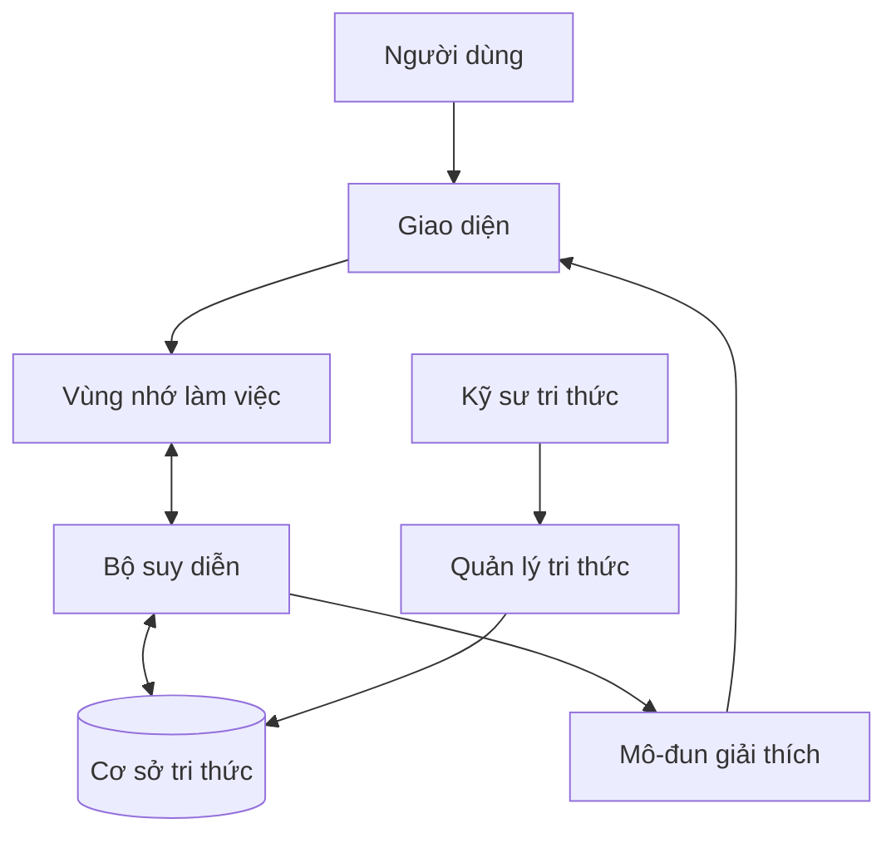
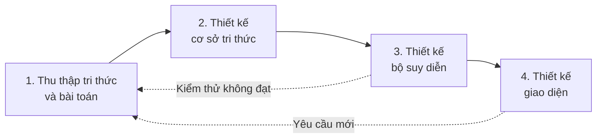
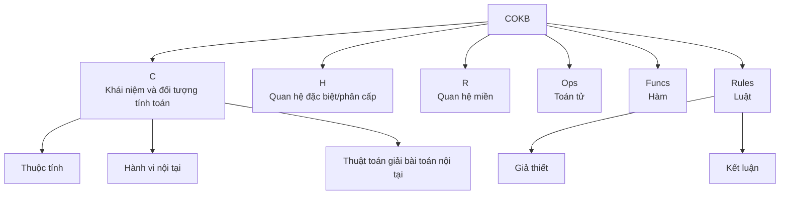
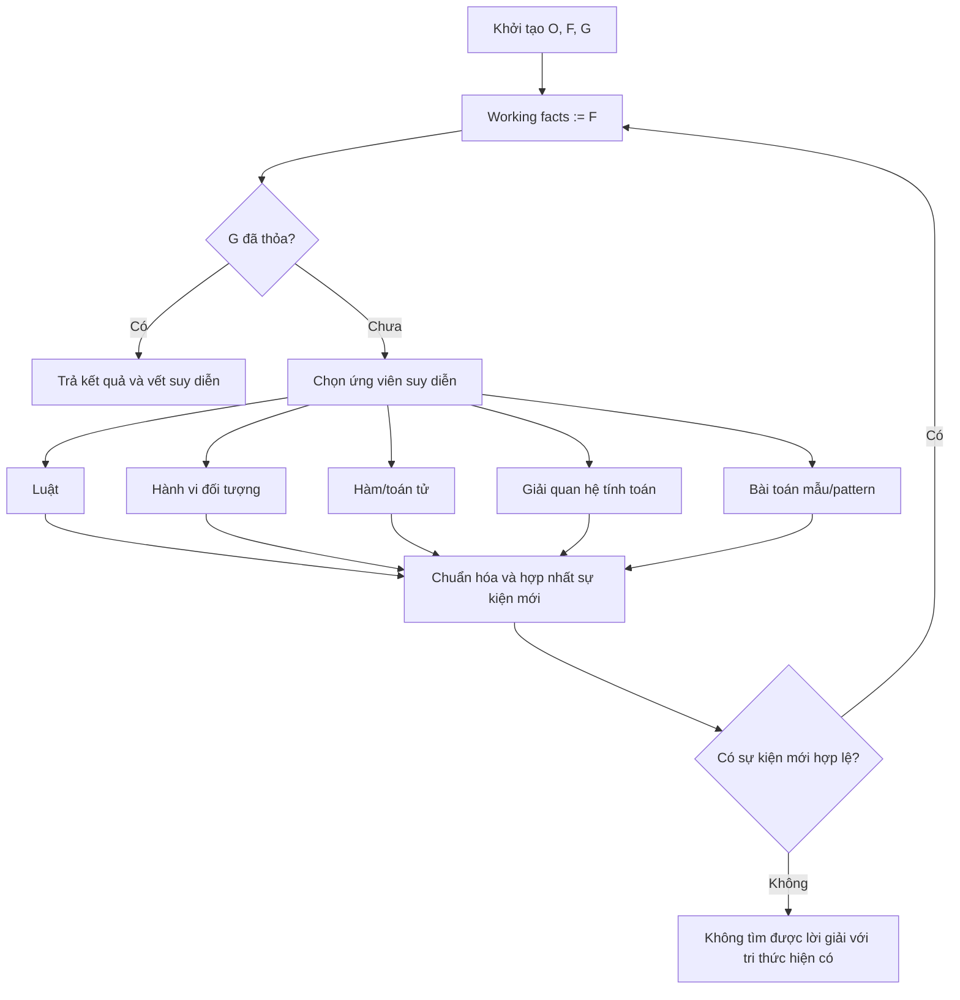
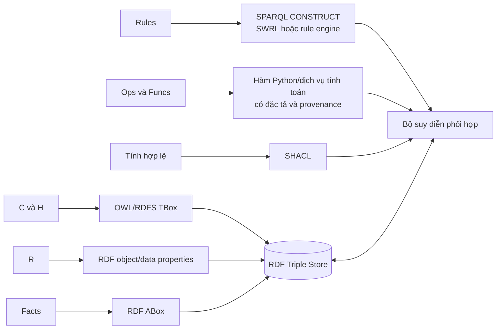
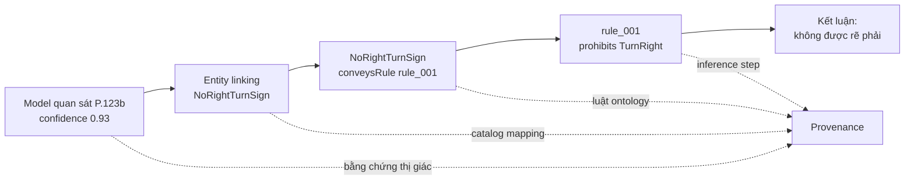
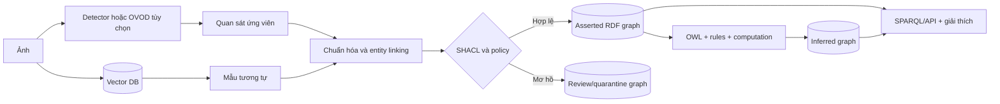

# Phân tích lý thuyết Ontology COKB và ứng dụng trong bài báo

## 1. Thông tin tài liệu và phạm vi phân tích

- Bài báo: **“Phương pháp thiết kế hệ cơ sở tri thức dựa trên Ontology và ứng dụng”**.
- Tác giả: Đỗ Văn Nhơn, Mai Trung Thành, Hoàng Ngọc Long.
- Nguồn: *Tạp chí Khoa học – Trường Đại học Quốc tế Hồng Bàng*, số đặc biệt 12/2022, trang 718–728.
- Tệp nguồn: [84.+Đỗ+Văn+Nhơn+(718-728).pdf](<./84.+Đỗ+Văn+Nhơn+(718-728).pdf>).

Trong tài liệu này, ký hiệu “tr.” chỉ số trang được in trên bài báo. Vì công thức phân tầng tập khái niệm ở trang 722 được nhúng dưới dạng ảnh raster có độ phân giải thấp, phần tương ứng được **diễn giải theo ngữ nghĩa** thay vì chép lại tuyệt đối từng ký hiệu.

Mục tiêu của phân tích là:

1. Làm rõ COKB là gì và khác gì với cách hiểu phổ biến về ontology OWL.
2. Phân tích sáu thành phần của mô hình COKB, mô hình bài toán và cơ chế suy diễn.
3. Phân tích cách COKB được áp dụng trong các hệ thống được trình bày trong bài báo.
4. Đánh giá điểm mạnh, giới hạn của paper.
5. Đề xuất cách vận dụng tư tưởng COKB vào đồ án Knowledge Graph biển báo giao thông Việt Nam.

## 2. Kết luận chính

COKB (*Computational Objects Knowledge Base*) trong paper không chỉ là một taxonomy hay tập class–property. Đây là một **mô hình biểu diễn tri thức gắn với mô hình bài toán và bộ suy diễn**, gồm sáu thành phần:

\[
\mathrm{COKB} = (C, H, R, Ops, Funcs, Rules)
\]

Điểm đặc trưng là mỗi khái niệm trong `C` được xem như một **đối tượng tính toán**: có thuộc tính, có cấu trúc nội tại, có hành vi và có thể được trang bị các thủ tục giải những bài toán nội tại. Vì vậy COKB đi xa hơn ontology OWL thuần túy ở khả năng biểu diễn toán tử, hàm, công thức, thủ tục tính toán và chiến lược giải bài toán.

Paper liên kết ba lớp vốn thường bị tách rời:

```mermaid
flowchart LR
    A[Tri thức miền] --> B[Ontology COKB<br/>C, H, R, Ops, Funcs, Rules]
    P[Bài toán thực tế] --> M[Mô hình bài toán<br/>(O, F) → G]
    B --> I[Bộ suy diễn]
    M --> I
    I --> N[Sự kiện mới]
    N --> Q{Đạt mục tiêu G?}
    Q -- Chưa --> I
    Q -- Có --> E[Kết quả và chuỗi giải thích]
```

Đóng góp có giá trị nhất của paper là cách nhìn ontology như **hợp đồng ngữ nghĩa cho cả lưu trữ lẫn giải quyết vấn đề**. Tuy nhiên, paper chưa trình bày đủ chi tiết để tái lập hoàn toàn thuật toán: thiếu mã giả của hợp nhất sự kiện, phân tích độ phức tạp, chứng minh dừng/đầy đủ và đặc tả tuần tự hóa chuẩn.

Đối với đồ án biển báo, nên dùng COKB như một **khung thiết kế** chứ chưa nên tuyên bố hệ thống đã hiện thực đầy đủ COKB. OWL/RDF, SHACL, SPARQL rules và mã suy diễn có kiểm soát có thể phối hợp để hiện thực các phần thích hợp.

## 3. Bối cảnh: hệ cơ sở tri thức theo paper

Paper xem một hệ cơ sở tri thức có hai thành phần trung tâm:

- **Knowledge Base – KB:** lưu sự kiện, luật, khái niệm và quan hệ của miền.
- **Inference Engine – IE:** vận dụng tri thức trong KB lên dữ kiện của bài toán để tạo kết luận.

Kiến trúc đầy đủ còn có giao diện, bộ giải thích, vùng nhớ làm việc và mô-đun quản lý tri thức. Người dùng khai thác hệ thống; kỹ sư tri thức xây dựng và duy trì nội dung miền (tr. 721).



Paper phân biệt hệ đóng, hệ mở và hệ kết hợp. Hệ đóng chỉ vận hành với tri thức miền đã nạp; hệ mở có thể bổ sung tri thức trong quá trình hoạt động, thường qua mô-đun khám phá tri thức hoặc học máy; hệ kết hợp phối hợp nhiều nguồn hoặc nhiều kiểu hệ (tr. 721). Đây là tiền đề phù hợp với hệ thống neuro-symbolic: mô hình thị giác tạo dữ kiện mới, còn ontology và bộ suy diễn kiểm chứng ý nghĩa của chúng.

## 4. Quy trình thiết kế hệ cơ sở tri thức

Paper đề xuất bốn giai đoạn (tr. 722):



### 4.1. Giai đoạn 1 – Thu thập tri thức và bài toán

- Xác định miền và phạm vi tri thức.
- Xác định nguồn đáng tin cậy: tài liệu chính thống, sách và chuyên gia.
- Thu thập khái niệm, quan hệ, luật, sự kiện và biểu mẫu thực tế.
- Thu thập các bài toán cụ thể rồi phân lớp chúng, bắt đầu từ dạng có khuôn mẫu đến dạng tổng quát.

Điểm đáng chú ý là paper không thiết kế ontology trước rồi mới tìm nhu cầu. Các **lớp bài toán** là đầu vào trực tiếp cho thiết kế ontology và bộ suy diễn.

### 4.2. Giai đoạn 2 – Thiết kế cơ sở tri thức

- Chọn mô hình biểu diễn phù hợp hoặc xây dựng mô hình riêng.
- Tổ chức tri thức cụ thể trên máy tính theo mô hình đã chọn.
- Bảo đảm tính đầy đủ trong phạm vi và tính nhất quán, không mâu thuẫn.

### 4.3. Giai đoạn 3 – Thiết kế bộ suy diễn

- Mô hình hóa từng lớp bài toán.
- Chọn chiến lược suy diễn và xây thuật toán tương ứng.
- Kiểm tra, đánh giá và cải thiện khả năng tìm lời giải.

### 4.4. Giai đoạn 4 – Thiết kế giao diện

Paper tách ít nhất hai nhóm giao diện:

- giao diện cho người dùng cuối;
- giao diện cho người quản trị tri thức.

Sự tách biệt này quan trọng: dữ liệu do mô hình thị giác tạo ra không nên tự động trở thành “tri thức đúng” mà không có quy trình kiểm tra và quản trị.

## 5. Lý thuyết Ontology COKB

### 5.1. Sáu thành phần hình thức

Theo paper, mô hình tri thức về các đối tượng tính toán gồm sáu thành phần (tr. 722–723):

| Thành phần | Ý nghĩa trong COKB | Câu hỏi mà thành phần trả lời |
|---|---|---|
| `C` – Concepts | Tập khái niệm; mỗi khái niệm là một đối tượng tính toán có thuộc tính và cấu trúc nội tại | Miền có những loại đối tượng nào và chúng tính được gì? |
| `H` – Hierarchical/special relations | Tập các quan hệ đặc biệt trên `C`, dùng để tổ chức cấu trúc khái niệm | Khái niệm nào tổng quát/chuyên biệt hoặc phụ thuộc cấu trúc vào khái niệm nào? |
| `R` – Relations | Các quan hệ miền khác trên các đối tượng thuộc `C` | Các đối tượng liên hệ với nhau như thế nào? |
| `Ops` – Operators | Các toán tử định nghĩa trên `C` | Có thể thực hiện phép toán nào trên đối tượng? |
| `Funcs` – Functions | Tri thức về hàm, gồm thuộc tính và cách sử dụng hàm | Đại lượng hoặc đối tượng nào được tính bởi hàm nào? |
| `Rules` – Rules | Các luật có phần giả thiết và kết luận | Từ các sự kiện đã biết có thể suy ra điều gì? |

> Paper gọi `H` là “tập các quan hệ đặc biệt trên các thành phần C”. Cách hiểu `H` như quan hệ phân cấp/chuyên biệt hóa là phù hợp với ký hiệu và cấu trúc phân cấp của `C`, nhưng paper ngắn này không liệt kê đầy đủ từng loại quan hệ thuộc `H`.



### 5.2. Đối tượng tính toán là gì?

Đối tượng tính toán không chỉ là một record chứa dữ liệu. Theo paper, nó được trang bị các thành phần nội tại và thuật toán cho các lớp bài toán sau (tr. 722–723):

1. Xác định bao đóng của tập sự kiện.
2. Kiểm tra tính giải được của bài toán `H → G`.
3. Tìm lời giải cho bài toán `H → G`.
4. Xác định một đối tượng từ các thông tin đã biết.

Ví dụ, khái niệm `TAMGIAC` có thể chứa các điểm, cạnh, góc, diện tích và những quan hệ tính toán nội tại. Khi biết đủ tọa độ các đỉnh, đối tượng có thể tạo thêm sự kiện về độ dài cạnh, tính cân, vuông góc hoặc diện tích. Đây là lý do tên gọi “computational object”.

Paper còn phân tầng các khái niệm thành `C[0], C[1], ..., C[k]` dựa trên các thuộc tính hoặc miền phụ thuộc của khái niệm (tr. 722):

- `C[0]` gồm các khái niệm nền của miền.
- Một khái niệm ở tầng `C[k]` được cấu tạo hoặc phụ thuộc vào khái niệm ở các tầng thấp hơn.
- Ít nhất một thành phần cấu tạo thuộc tầng ngay trước `C[k-1]`.

Ý tưởng này ngăn định nghĩa vòng không kiểm soát và tạo thứ tự xây dựng khái niệm. Chẳng hạn: kiểu số và điểm có thể nằm ở tầng nền; đoạn thẳng phụ thuộc vào điểm; tam giác phụ thuộc vào điểm hoặc đoạn thẳng.

### 5.3. Mười hai loại sự kiện

Giả thiết và kết luận của luật COKB được chuẩn hóa thành 12 nhóm sự kiện (tr. 723):

| Loại | Nội dung | Ví dụ khái quát |
|---:|---|---|
| 1 | Thông tin về loại của đối tượng | `A` là `DIEM` |
| 2 | Đối tượng hoặc thuộc tính đã được xác định | tọa độ của `A` đã biết |
| 3 | Đối tượng/thuộc tính bằng một hằng hoặc biểu thức hằng | `A.x = 2` |
| 4 | Hai đối tượng hoặc thuộc tính bằng nhau | `AB = AC` |
| 5 | Phụ thuộc qua công thức tính hoặc đẳng thức | `S = a × h / 2` |
| 6 | Quan hệ giữa các đối tượng/thuộc tính | `VUONG(MA, BC)` |
| 7 | Một hàm đã được xác định | biết hàm `f` |
| 8 | Hàm bằng một hằng hoặc biểu thức hằng | `f = 2x + 1` |
| 9 | Đối tượng/thuộc tính bằng một hàm | `M = TRUNGDIEM(B,C)` |
| 10 | Hai hàm bằng nhau | `f = g` |
| 11 | Hàm phụ thuộc hàm/đối tượng/thuộc tính khác qua biểu thức | `f(x) = g(x) + A.x` |
| 12 | Quan hệ giữa hàm và đối tượng khác | một hàm thỏa quan hệ trên đối tượng |

Việc phân loại này cho phép bộ suy diễn có một thuật toán hợp nhất sự kiện dùng chung cho nhiều thành phần tri thức. Tuy nhiên, paper chỉ nêu sự tồn tại của thuật toán hợp nhất, không cung cấp mã giả hoặc đặc tả đủ chi tiết để triển khai độc lập.

### 5.4. Mô hình hóa bài toán `(O, F) → G`

Một lớp bài toán COKB được biểu diễn dưới dạng mạng đối tượng tính toán (tr. 724–725):

\[
(O,F) \rightarrow G
\]

Trong đó:

- `O`: các đối tượng tham gia và kiểu của chúng;
- `F`: tập sự kiện/giả thiết đã biết;
- `G`: tập mục tiêu cần chứng minh, xác định hoặc tính toán.

Ví dụ hình học giải tích trong paper cho tam giác `ABC`, các tọa độ và trung điểm `M`:

```text
O = {
  [TAMGIAC[A,B,C], "TAMGIAC"],
  [A, "DIEM"], [B, "DIEM"], [C, "DIEM"], [M, "DIEM"]
}

F = {
  A.x = 2, A.y = 3,
  B.x = -2, B.y = 2,
  C.x = 1, C.y = -1,
  M = TRUNGDIEM(B,C)
}

G = {
  CHUNG_MINH(TAMGIAC[A,B,C], TAMGIACCAN),
  CHUNG_MINH(VUONG(DOAN[M,A], DOAN[B,C])),
  TINH(TAMGIAC[A,B,M].S)
}
```

Mô hình này tách rõ **thế giới đang xét**, **điều đã biết** và **điều cần đạt**. Nhờ vậy bộ suy diễn không cần duyệt mọi tri thức một cách mù quáng mà có thể ưu tiên những luật liên quan trực tiếp tới `G`.

## 6. Suy diễn trong COKB

### 6.1. Chiến lược chính

Paper cho biết suy diễn trên COKB chủ yếu là **suy diễn tiến**: từ tập sự kiện ban đầu, mỗi bước sinh thêm sự kiện mới cho đến khi đạt mục tiêu hoặc không còn phép suy diễn phù hợp (tr. 725–726).

Các cơ chế sinh sự kiện gồm:

- sinh sự kiện mặc nhiên;
- áp dụng luật dẫn;
- sử dụng hành vi nội tại của đối tượng tính toán;
- sử dụng tính chất hoặc thủ tục của hàm;
- giải hệ phương trình tạo bởi nhiều quan hệ tính toán;
- tạo đối tượng mới bằng luật;
- suy diễn dựa trên bài toán mẫu;
- suy diễn dựa trên mẫu bài toán.



### 6.2. Heuristic hướng mục tiêu

Dù nền tảng là suy diễn tiến, paper dùng heuristic liên quan đến mục tiêu để chọn bước suy diễn (tr. 726):

- ưu tiên luật có đối tượng/hàm ở kết luận cùng tên với mục tiêu;
- ưu tiên quan hệ tính toán liên quan tới sự kiện mục tiêu;
- ưu tiên hành vi nội tại của đối tượng xuất hiện trong mục tiêu;
- ưu tiên các sự kiện hàm;
- ưu tiên bài toán mẫu hoặc mẫu bài toán có thể sinh sự kiện cùng loại/cùng tên với mục tiêu;
- sau đó mới ưu tiên các luật khác có khả năng sinh sự kiện gần mục tiêu.

Vì vậy cách tiếp cận chính xác hơn nên được gọi là **suy diễn tiến có định hướng mục tiêu**, thay vì forward chaining thuần túy.

### 6.3. Khả năng giải thích

Nếu mỗi bước lưu lại:

- sự kiện đầu vào;
- luật, hàm hoặc hành vi được áp dụng;
- sự kiện đầu ra;
- thứ tự áp dụng;

thì hệ thống có thể sinh lời giải từng bước. Đây là cơ sở cho nhận định của paper rằng hệ giải hình học tạo diễn giải tường minh, tự nhiên và gần lối tư duy con người (tr. 727).

## 7. Cách tổ chức cơ sở tri thức trong paper

Quy trình biểu diễn tri thức gồm bốn bước: thu thập, phân loại, chọn phương pháp biểu diễn và lập các danh mục tri thức (tr. 723–724). Các loại cần phân loại bao gồm khái niệm, quan hệ, luật, hàm, toán tử, dạng bài tập, phương pháp giải và heuristic.

Paper yêu cầu kho tri thức phải:

- biểu diễn đầy đủ tri thức cần thiết trong phạm vi;
- nhất quán và không gây mâu thuẫn.

Một chi tiết quan trọng là paper cho phép lưu COKB bằng tệp `*.TXT` hoặc các công cụ như MySQL, SQL Server, Access, Excel; ví dụ cơ sở tri thức hình học phẳng được chia thành nhiều tệp, trong đó có `TAMGIAC.txt` (tr. 724).

Điều này cho thấy:

> COKB là mô hình khái niệm và mô hình vận hành; nó không bắt buộc một công nghệ lưu trữ như RDF triple store, cũng không mặc nhiên là OWL.

RDF/OWL vẫn là lựa chọn tốt cho liên thông, truy vấn và suy luận chuẩn hóa, nhưng là một **cách hiện thực**, không phải định nghĩa của COKB trong paper.

## 8. Các ứng dụng được trình bày

### 8.1. Hệ giải toán hình học không gian lớp 11

Hệ thống được thử nghiệm trên các dạng toán đã phân loại. Paper nhấn mạnh khả năng đưa ra lời giải từng bước, diễn giải tường minh, tự nhiên và phù hợp lối suy nghĩ của con người (tr. 726–727).

Vai trò của COKB trong ứng dụng:

- `C`: điểm, đường thẳng, mặt phẳng, hình chóp và các đối tượng hình học;
- `R`: thuộc, song song, vuông góc, giao nhau;
- `Funcs/Ops`: các phép dựng và tính toán;
- `Rules`: định lý và quy tắc suy luận;
- `(O,F) → G`: biểu diễn đề bài và yêu cầu;
- vết suy diễn: sinh lời giải theo từng bước.

Paper không cung cấp số lượng bài kiểm thử, tỷ lệ giải đúng, coverage theo dạng bài hoặc so sánh baseline. Vì vậy bằng chứng ở đây chủ yếu là minh họa chức năng.

### 8.2. Hệ chuyên gia chẩn đoán biến chứng mạch máu nhỏ của bệnh đái tháo đường

Hệ ESDMCD được so sánh với chẩn đoán của bác sĩ trên 106 bệnh nhân thu thập tại Bệnh viện Đa khoa Quận 4. Có 102 trường hợp tương đương và 4 trường hợp khác biệt, được paper báo cáo là **96,2%** (tr. 727).

Vai trò có thể nhận diện của COKB:

- biểu diễn triệu chứng, chỉ số, bệnh và biến chứng;
- biểu diễn quan hệ giữa dấu hiệu và kết luận;
- luật hóa kinh nghiệm chuyên gia;
- suy diễn từ dữ kiện bệnh nhân đến kết luận chẩn đoán;
- lưu chuỗi luật để giải thích kết quả.

Cần diễn giải kết quả thận trọng: đây là tỷ lệ đồng thuận trên một mẫu lịch sử nhỏ, không đủ để kết luận hiệu quả lâm sàng. Paper không báo cáo sensitivity, specificity, precision, confusion matrix, kiểm định thống kê hoặc đánh giá ngoài cơ sở thu thập dữ liệu.

### 8.3. Hệ tư vấn kiến trúc nhà ở tại Việt Nam

Hệ thống tư vấn:

- quy định xây dựng nhà ở địa phương;
- bố trí không gian phòng và khu vực phụ;
- hướng bố trí phòng theo hướng chính của căn nhà;
- truy hồi nhanh các phương án thiết kế trước đó (tr. 727).

Ứng dụng này cho thấy COKB không chỉ giải bài toán tính toán. Nó còn có thể kết hợp luật quy định, ràng buộc không gian, thuộc tính công trình và tri thức ca/mẫu. Tuy nhiên paper chỉ cung cấp mô tả và hình giao diện, không có đánh giá định lượng.

### 8.4. Tổng hợp bằng chứng ứng dụng

| Ứng dụng | Dạng tri thức chính | Cách giải quyết vấn đề | Bằng chứng trong paper |
|---|---|---|---|
| Hình học không gian | Đối tượng, quan hệ, định lý, tính toán | Forward reasoning có heuristic và lời giải từng bước | Mô tả + ảnh minh họa; không có metric |
| Chẩn đoán biến chứng | Dấu hiệu, bệnh, quan hệ, luật chuyên gia | Suy từ dữ kiện bệnh nhân đến kết luận | 102/106 tương đương chuyên gia, 96,2% |
| Tư vấn kiến trúc | Quy định, không gian, hướng, phương án mẫu | Kiểm tra ràng buộc, tư vấn và truy hồi ca | Mô tả + ảnh minh họa; không có metric |

## 9. COKB khác OWL Ontology như thế nào?

Không nên đồng nhất hai khái niệm:

| Khía cạnh | COKB trong paper | OWL ontology |
|---|---|---|
| Mục tiêu | Biểu diễn tri thức và giải các lớp bài toán | Đặc tả khái niệm, quan hệ, tiên đề theo Description Logic |
| Thành phần | `C, H, R, Ops, Funcs, Rules` | Class, individual, object/data property, axiom, restriction |
| Đối tượng | Có hành vi và bài toán nội tại | Individual/class không tự chứa thủ tục thực thi |
| Hàm/toán tử | Là thành phần bậc nhất của mô hình | Không phải thế mạnh trực tiếp của OWL |
| Luật | Giả thiết–kết luận trên 12 loại sự kiện | OWL axiom; luật tổng quát thường cần SWRL/SPARQL/Datalog/code |
| Bài toán | Biểu diễn rõ `(O,F) → G` | OWL không định nghĩa sẵn cấu trúc goal-solving như vậy |
| Suy diễn | Forward reasoning, hàm, giải phương trình, mẫu và heuristic | Suy luận phân lớp/nhất quán theo ngữ nghĩa OWL |
| Lưu trữ | TXT, CSDL hoặc công nghệ khác | Thường tuần tự hóa RDF và lưu triple store |

Ngoài ra, OWL thường tuân theo **Open World Assumption**: không biết một sự kiện không có nghĩa sự kiện đó sai. Nhiều bài toán COKB lại vận hành trên tập dữ kiện cụ thể, mục tiêu cụ thể và thủ tục tính toán có tính đóng. Paper không phân tích trực tiếp khác biệt này; khi triển khai kết hợp, hệ thống phải quy định rõ phần nào dùng suy luận thế giới mở và phần nào dùng kiểm tra/ràng buộc theo dữ liệu đóng.

Một ánh xạ thực tế có thể là:



## 10. Vận dụng vào Knowledge Graph biển báo giao thông Việt Nam

### 10.1. Ánh xạ sáu thành phần

| COKB | Ánh xạ đề xuất trong đồ án biển báo |
|---|---|
| `C` | `TrafficSignType`, `ProhibitionSign`, `WarningSign`, `TrafficSignObservation`, `TrafficRule`, `Maneuver`, `Vehicle`, `Image`, `BoundingBox` |
| `H` | Cây phân cấp loại biển; phân cấp phương tiện; phân cấp loại quy tắc |
| `R` | `observedSign`, `inImage`, `hasBoundingBox`, `conveysRule`, `appliesTo`, `prohibitsManeuver`, `requiresManeuver`, `generatedBy` |
| `Ops` | Chuẩn hóa mã biển, hợp nhất thực thể, chuyển đổi tọa độ bounding box, kết hợp quy tắc biển chính–biển phụ nếu các phép này được đặc tả chính thức |
| `Funcs` | Hàm chuyển tọa độ chuẩn hóa sang pixel; hàm lấy giới hạn tốc độ/chiều cao từ thuộc tính; hàm hiệu chỉnh confidence nếu được mô hình hóa |
| `Rules` | Lan truyền loại biển sang quy tắc; suy ra hành vi bị cấm/bắt buộc; áp dụng theo loại phương tiện; kiểm tra biển ghép và hạn chế số |

Không nên đưa mọi đoạn tiền xử lý ảnh vào `Ops/Funcs`. Một phép xử lý chỉ nên được xem là tri thức miền khi có chữ ký đầu vào/đầu ra, ý nghĩa ngữ nghĩa, điều kiện áp dụng và provenance rõ ràng.

### 10.2. Ví dụ bài toán COKB cho biển P.123b

Giả sử hệ thống nhận một quan sát được mô hình gán nhãn `P.123b – Cấm rẽ phải`.

```text
O = {
  [obs_001, TrafficSignObservation],
  [sign_P123b, NoRightTurnSign],
  [rule_001, ProhibitionRule],
  [TurnRight, Maneuver]
}

F = {
  observedSign(obs_001, sign_P123b),
  conveysRule(sign_P123b, rule_001),
  prohibitsManeuver(rule_001, TurnRight),
  confidence(obs_001, 0.93),
  generatedBy(obs_001, model_run_2026_08_15)
}

G = {
  XAC_DINH(TurnRight, Prohibited),
  GIAI_THICH(TurnRight, obs_001)
}
```

Chuỗi giải thích mong muốn:



Khác với câu trả lời trực tiếp của một mô hình thị giác, kết luận này có thể truy ngược qua quan sát, mapping catalog và luật miền.

### 10.3. Vai trò của model thị giác và vector database

Trong kiến trúc COKB-inspired:

- Detection model hoặc OVOD tùy chọn tạo **ứng viên quan sát** và bằng chứng, không tạo chân lý cuối cùng.
- Vector database hỗ trợ tìm biển tương tự, tài liệu hoặc mẫu gần nhất; kết quả vector là candidate.
- RDF graph lưu các thực thể, quan hệ, luật và provenance đã được chuẩn hóa.
- SHACL kiểm tra cấu trúc dữ liệu.
- OWL/rule engine materialize kết luận có thể giải thích.
- Người quản trị xử lý dữ liệu mơ hồ hoặc mâu thuẫn.



### 10.4. Trạng thái COKB của source hiện tại

Đối chiếu với `ontology/traffic-sign-ontology.ttl` ở thời điểm viết tài liệu:

| Thành phần | Trạng thái | Nhận xét |
|---|---|---|
| `C` | Có nền tảng | Đã có các class lõi cho loại biển, quan sát, ảnh, bounding box, quy tắc, hành vi, phương tiện và nguồn sinh dữ liệu |
| `H` | Có một phần | Đã có `rdfs:subClassOf` cho nhóm biển, quy tắc và phương tiện; chưa có taxonomy đầy đủ 52 lớp dữ liệu |
| `R` | Có nền tảng | Đã có các object property quan trọng, nhưng semantic contract giữa observation, sign instance và sign type cần thống nhất xuyên suốt |
| `Ops` | Chưa thành lớp tri thức COKB | Có thể tồn tại trong code xử lý nhưng chưa được catalog hóa bằng chữ ký, điều kiện và ngữ nghĩa |
| `Funcs` | Chưa thành lớp tri thức COKB | Chưa có danh mục hàm miền và cơ chế gọi hàm từ bộ suy diễn |
| `Rules` | Mới ở mức cơ sở | Có rule lan truyền trong `ontology/rules/propagate-sign-rule.rq`; chưa đủ tập luật nghiệp vụ và vết giải thích |
| Facts/ABox | Chưa hoàn chỉnh | Chưa có knowledge base biển báo và quan sát quy mô đầy đủ để chứng minh các competency question |
| Problem solver | Chưa phải COKB đầy đủ | Chưa có lớp biểu diễn `(O,F) → G`, thuật toán hợp nhất sự kiện và bộ lập kế hoạch heuristic như paper |

Kết luận: project hiện có **OWL ontology nền tảng và một số thành phần tương ứng với COKB**, nhưng chưa phải một ontology COKB đầy đủ theo mô hình sáu thành phần của paper.

## 11. Đề xuất triển khai COKB-inspired cho đồ án

Mục tiêu hợp lý là xây một hệ **COKB-inspired, OWL-grounded**, ưu tiên biểu diễn, kiểm chứng và suy luận tri thức.

### Giai đoạn 1 – Định nghĩa năng lực suy luận

Viết trước 15–20 competency questions, ví dụ:

- Quan sát này thuộc loại biển nào?
- Biển đó truyền đạt quy tắc gì?
- Với xe tải, hành vi rẽ phải có bị cấm không?
- Kết luận được suy ra từ luật và bằng chứng nào?
- Có quan sát nào mâu thuẫn giữa annotation và model prediction?
- Bounding box hoặc quan sát nào không đạt ràng buộc dữ liệu?

Mỗi câu hỏi phải có fixture RDF, SPARQL query và kết quả mong đợi.

### Giai đoạn 2 – Hoàn chỉnh `C`, `H`, `R`

- Chuẩn hóa semantic contract: `Observation → observedSign → Sign instance → rdf:type SignClass` hoặc một mô hình tương đương được dùng thống nhất.
- Xây catalog đã review cho 52 class biển báo.
- Bổ sung mã biển, tên Việt/Anh, nhóm, quy tắc, hành vi, đối tượng phương tiện và giới hạn số.
- Tách TBox, catalog và observation ABox.

### Giai đoạn 3 – Hiện thực `Rules`

- Dùng OWL/RDFS cho suy luận phân cấp.
- Dùng SPARQL `CONSTRUCT` hoặc rule engine cho luật nghiệp vụ.
- Dùng SHACL cho ràng buộc dữ liệu, không dùng SHACL như thay thế toàn bộ suy luận.
- Lưu asserted, inferred và quarantine trong named graph riêng.

### Giai đoạn 4 – Chọn lọc `Ops` và `Funcs`

Mỗi operation/function nên có:

- tên và mục đích;
- kiểu đầu vào/đầu ra;
- precondition;
- công thức hoặc implementation reference;
- lỗi có thể xảy ra;
- provenance và version.

Chỉ cần triển khai các hàm phục vụ competency questions; không cần tái tạo toàn bộ framework COKB tổng quát.

### Giai đoạn 5 – Mô hình hóa bài toán và giải thích

- Ánh xạ request thành `O`, `F`, `G`.
- Chọn rule dựa trên loại mục tiêu.
- Với mỗi triple suy ra, lưu `rule_id`, premises, timestamp và graph nguồn.
- API trả cả kết luận và explanation path.

### Giai đoạn 6 – Đánh giá

Nên tách bốn nhóm metric:

1. **Representation coverage:** bao phủ class, relation, rule và competency question.
2. **Validation:** số observation valid/review/quarantine, loại lỗi SHACL.
3. **Reasoning:** precision/recall của facts suy ra trên gold fixtures, tỷ lệ competency query trả đúng.
4. **Explanation:** tỷ lệ kết luận có đầy đủ nguồn, premises và rule chain.

Metric detector hoặc retrieval chỉ là lớp phụ, không thay thế đánh giá biểu diễn và suy luận tri thức.

## 12. Đánh giá học thuật về paper

### 12.1. Điểm mạnh

- Mô hình hóa được miền có cấu trúc phức tạp, không giới hạn ở class và relation.
- Đưa hàm, toán tử, luật và đối tượng có hành vi vào cùng một khung.
- Liên kết ontology với mô hình bài toán `(O,F) → G`.
- Chuẩn hóa nhiều dạng sự kiện để phục vụ hợp nhất và suy diễn.
- Kết hợp forward reasoning với heuristic hướng mục tiêu.
- Chú trọng chuỗi lời giải và khả năng giải thích.
- Minh họa tính đa miền: giáo dục, y khoa và kiến trúc.

### 12.2. Hạn chế

- Công thức và thuật toán mới được mô tả ở mức tổng quan; thiếu mã giả chi tiết.
- Không có phân tích độ phức tạp, tính dừng, tính đúng hoặc tính đầy đủ của suy diễn.
- Không đặc tả chuẩn lưu trữ và khả năng liên thông với RDF/OWL.
- Không giải thích cách quản lý mâu thuẫn, bất định và confidence từ mô hình học máy.
- Không có source code, dataset hoặc bộ test để tái lập.
- Đánh giá ứng dụng không đồng đều; chỉ ứng dụng y khoa có một số liệu tổng hợp.
- Không so sánh thực nghiệm với OWL reasoner, SWRL, Datalog, production-rule engine hoặc case-based baseline.
- Không thảo luận rõ khác biệt giữa open-world reasoning của OWL và problem-solving có phạm vi đóng.

### 12.3. Giá trị đối với đồ án môn Biểu diễn tri thức

Paper phù hợp làm nền tảng lý thuyết vì buộc đồ án trả lời ba câu hỏi cốt lõi:

1. **Tri thức được biểu diễn bằng cấu trúc nào?**
2. **Bài toán người dùng được hình thức hóa ra sao?**
3. **Kết luận được suy ra và giải thích bằng chuỗi nào?**

Nếu đồ án chỉ dùng detector để nhận diện rồi trả tên biển, phần COKB gần như chưa được thể hiện. Nếu hệ thống chuẩn hóa quan sát thành RDF, kiểm tra SHACL, liên kết ontology, suy ra quy tắc áp dụng và trả provenance, thì trọng tâm đã chuyển đúng sang biểu diễn và suy luận tri thức.

## 13. Kết luận

Trong paper, COKB là một ontology theo nghĩa rộng: một đặc tả hình thức của miền tri thức cùng các đối tượng tính toán, quan hệ, toán tử, hàm và luật. Giá trị của nó không nằm ở việc gắn nhãn “ontology”, mà ở việc nối trực tiếp cấu trúc tri thức với mô hình bài toán và bộ suy diễn.

Ba ứng dụng cho thấy cùng một khung có thể phục vụ giải toán, chẩn đoán và tư vấn. Tuy vậy, mức bằng chứng trong bài báo chưa đủ để kết luận về tính tổng quát hoặc hiệu quả vượt trội; cần bổ sung đặc tả thuật toán và đánh giá tái lập.

Đối với Knowledge Graph biển báo giao thông Việt Nam, hướng phù hợp nhất là:

> Dùng OWL/RDF để hiện thực `C–H–R`, SPARQL/rule engine cho `Rules`, SHACL cho kiểm chứng, mã tính toán có provenance cho `Ops–Funcs`, và biểu diễn mỗi yêu cầu suy luận theo `(O,F) → G`.

Cách triển khai này giữ ontology và suy luận ở trung tâm, trong khi detection model và vector database tùy chọn chỉ cung cấp bằng chứng hoặc ứng viên cho lớp tri thức.

## Phụ lục A – Bản đồ nội dung theo trang

| Trang paper | Nội dung được sử dụng trong phân tích |
|---:|---|
| 718–720 | Bối cảnh, các phương pháp biểu diễn tri thức và động cơ dùng ontology |
| 721 | Phân loại, kiến trúc hệ cơ sở tri thức và vai trò KB/IE |
| 722 | Quy trình bốn giai đoạn; định nghĩa COKB và cấu trúc phân tầng `C` |
| 723 | Đối tượng tính toán; sáu thành phần; 12 loại sự kiện; quy trình biểu diễn |
| 724 | Tổ chức/lưu trữ KB; mô hình bài toán `(O,F) → G` |
| 725 | Ví dụ hình học giải tích; kỹ thuật suy diễn |
| 726 | Quy tắc sinh sự kiện, heuristic và phần mở đầu ứng dụng |
| 727 | Ba ứng dụng và kết quả 96,2% của ESDMCD |
| 728 | Kết luận và hướng tích hợp hệ cơ sở tri thức |
