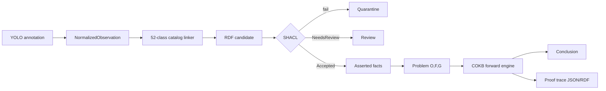

# Trạng thái triển khai COKB

Ngày cập nhật: 2026-08-15
Baseline: semantic MVP 1.0.0

## Kết luận

Project đã được refactor khỏi kiến trúc FAISS/search-centric thành một semantic
MVP tập trung vào biểu diễn, kiểm chứng, suy luận và giải thích tri thức. Demo
không cần detector hoặc vector database. Fuseki là RDF graph database đích;
reasoner cục bộ giúp demo và test không phụ thuộc service ngoài.

## Đã triển khai

| Hạng mục | Artefact | Trạng thái |
|---|---|---|
| `C`, `H`, `R` | `ontology/traffic-sign-ontology.ttl` | Hoàn thành MVP |
| `Ops`, `Funcs`, `Rules` | `src/traffic_sign_kg/cokb/` | Hoàn thành MVP |
| 12 fact categories | `cokb/facts.py::FactKind` | Đã biểu diễn; một số loại chưa có use case |
| Catalog 52 lớp | CSV authoring + generated OWL Turtle | 52/52 IDs, uniqueness test |
| Meaning đã mô hình hóa | Rule individuals + OWL `hasValue` | 21 rule patterns |
| Mapping chưa chắc chắn | `NeedsReview` | IDs 16, 23, 28, 43 |
| Bài toán `(O,F)→G` | interpret, maneuver, restriction | 3/3 MVP |
| Forward reasoner | unification, ranking, dedupe, max steps | Đã test |
| Open-world status | `PROVED`, `DISPROVED`, `UNKNOWN`, `INCONSISTENT` | Đã test |
| Explanation | premise/rule/conclusion trace | JSON + RDF mapper |
| OWL-RL | restriction materialization | Đã test |
| SHACL | image, bbox, assertion, catalog | Gold/invalid test |
| YOLO adapter | normalized bbox, checksum, catalog linking | Profile 3.216/8.334/25 |
| RDF mapper | image/region/occurrence/assertion/run | Đã test |
| Fuseki | named graph repository + loader | Code hoàn thành; chưa live-test |
| SPARQL | 5 scoped competency queries | Parse/code review; chưa chạy Fuseki |
| API | catalog, 3 problems, dataset profile/validation | OpenAPI + service tests |
| Legacy FAISS | source/API/tests/dependencies | Đã loại khỏi semantic MVP |

## Chưa hoàn thành

### Cần làm để đóng đồ án

1. Curator review bốn catalog mappings `NeedsReview` và bổ sung nguồn định nghĩa
   pháp lý/chuẩn biển báo cho toàn bộ 52 lớp.
2. Tăng gold set từ 1 lên 10–20 ảnh, phủ biển composite, speed limit, negative
   image và các mapping cần review.
3. Viết thêm invalid fixtures cho thiếu provenance, sai catalog URI, confidence
   sai range và accepted assertion chưa materialize type.
4. Implement transactional graph routing cho từng record:
   `asserted | review | quarantine`, kèm idempotency manifest.
5. Materialize inferred delta và ghi `InferenceRun`/`InferenceStep` vào Fuseki;
   hiện đã có RDF mapper nhưng chưa nối commit transaction.
6. Mở rộng từ 5 lên 20+ competency queries và tạo expected-result fixtures.
7. Chạy full ingestion 3.216 ảnh, lưu metrics và kiểm tra ingest lần hai không
   tạo duplicate.
8. Chạy integration test với Fuseki/TDB2 thật. Unit tests hiện không chứng minh
   container/service ngoài đang hoạt động.
9. Viết evaluation report: catalog coverage, SHACL detection, reasoning accuracy,
   CQ pass rate, explanation completeness và runtime.

### Tùy chọn, không chặn semantic demo

- Qdrant projection và semantic/visual retrieval.
- Pretrained detector cho ảnh mới.
- Frontend hiển thị ảnh, bbox và proof graph.

## Kết quả kiểm thử hiện tại

```text
ruff:   passed
pytest: 15 passed
dataset profile: 3,216 images; 3,216 labels; 8,334 boxes; 25 empty labels
ontology: core and generated catalog parse successfully
```

Các boundary chưa được xác nhận: Fuseki live, Docker deployment, full dataset
commit và Qdrant. Không nên trình bày các phần này là kết quả đã chạy.

## Luồng demo hiện có



## Definition of Done còn lại

Semantic MVP code đã có, nhưng đồ án chỉ nên được gọi là hoàn thành sau khi có:

- catalog review có nguồn;
- gold/invalid set đủ rộng;
- full named-graph ingestion idempotent;
- 20+ competency queries có expected results;
- Fuseki integration test;
- báo cáo evaluation tái lập được.
