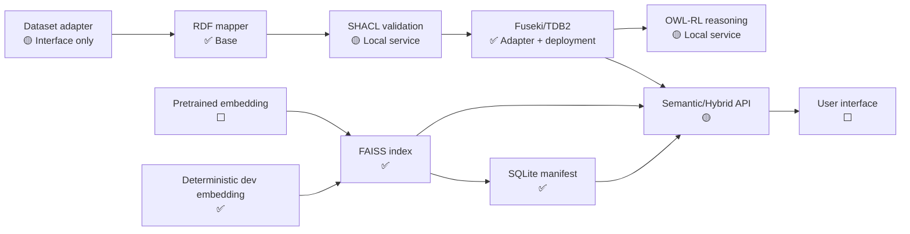

# Implementation State

## Ontology-Grounded Traffic Sign Knowledge Graph

**Ngày cập nhật:** 2026-07-26

**Phiên bản source:** `0.1.0`

**Phạm vi:** Base implementation trước khi tích hợp dataset và pretrained models

---

## 1. Tóm tắt trạng thái

Repository hiện đã có một backend nền chạy được, bao gồm:

- FastAPI application.
- Apache Jena Fuseki/TDB2 adapter.
- Ontology OWL và SHACL shapes nền.
- FAISS vector index chạy embedded.
- SQLite lưu vector manifest, stable ID và index versions.
- Semantic, vector và hybrid search APIs ở mức cơ sở.
- Dataset adapter interface và RDF mapper.
- Unit/integration tests.
- Docker deployment cho API và Fuseki.

Dataset trong `data/archive` chưa được ingest. Source hiện không train hoặc sử dụng model
nhận diện biển báo thật. Embedding deterministic chỉ được dùng để kiểm tra kỹ thuật của
pipeline.

Quy ước trạng thái:

| Ký hiệu | Ý nghĩa |
|---|---|
| ✅ | Đã triển khai và có kiểm thử |
| 🟡 | Đã có skeleton hoặc triển khai một phần |
| ⬜ | Chưa triển khai |



---

## 2. Những phần đã triển khai

### 2.1. Project foundation — ✅

Đã có:

- Python package theo `src` layout.
- Python requirement: `>=3.11,<3.14`.
- Dependency management bằng `pyproject.toml` và `uv.lock`.
- Application entry point:

```text
traffic-sign-kg
```

- Environment configuration bằng `pydantic-settings`.
- `.env.example`.
- `.gitignore` và `.dockerignore`.
- Docker image cho API.
- README hướng dẫn cài đặt và smoke test.

Các dependency chính:

```text
FastAPI
FAISS CPU
NumPy
RDFLib
OWL-RL
HTTPX
Pydantic
PySHACL (validation extra)
```

### 2.2. Application configuration — ✅

File:

```text
src/traffic_sign_kg/config.py
```

Đã cấu hình:

- Runtime directory.
- SQLite database path.
- FAISS index directory.
- Asset directory.
- Fuseki query/update/Graph Store endpoints.
- Fuseki timeout.
- Development deterministic embedding.
- Host, port và log level.

Runtime directories được tạo tự động khi application khởi động.

### 2.3. SQLite operational database — ✅

File:

```text
src/traffic_sign_kg/repositories/operations_repository.py
```

Đã có schema:

#### `stable_vector_ids`

Lưu stable mapping:

```text
(rdf_uri, index_name, embedding_schema_version) → faiss_id
```

#### `vector_index_versions`

Lưu:

- Index name và version.
- FAISS file path.
- SHA-256 checksum.
- Vector dimension.
- Distance metric.
- Index factory.
- Embedding model/revision.
- Preprocessing version.
- Graph version.
- Item count.
- Trạng thái `building/ready/active/archived/failed`.

Mỗi logical index chỉ có tối đa một active version.

#### `vector_items`

Lưu:

- `faiss_id ↔ rdf_uri`.
- Entity type.
- Image/region URI.
- Asset path.
- Class/sign-family URI.
- Dataset split và source type.
- Graph version.
- Content hash.
- Metadata JSON.

#### `jobs`

Đã tạo table cơ sở cho background jobs, nhưng chưa có job orchestration.

Đã triển khai SQLite transaction, WAL mode, foreign keys và metadata indexes.

### 2.4. FAISS vector index — ✅

File:

```text
src/traffic_sign_kg/repositories/faiss_repository.py
```

Đã triển khai:

- Hai hoặc nhiều logical indexes thông qua `index_name`.
- Exact cosine-similarity search bằng:

```text
IndexIDMap2(IndexFlatIP)
```

- Chuyển vector sang `float32`.
- L2-normalize document và query vectors.
- Stable signed `int64` FAISS IDs.
- Immutable version directory.
- `index.faiss` và `manifest.json`.
- SHA-256 verification trước khi load index.
- Atomic directory publish.
- Active version switching.
- Cache active FAISS reader trong process.
- Map search result từ `faiss_id` sang RDF URI qua SQLite.
- Kiểm tra vector dimension, finite values và zero vectors.
- Chặn path traversal trong index name/version.
- Giữ stable ID khi rebuild cùng embedding schema.

FAISS không được dùng làm nguồn chân lý. Vector result chỉ là candidate.

### 2.5. Fuseki repository — ✅

File:

```text
src/traffic_sign_kg/repositories/fuseki_repository.py
```

Đã có:

- SPARQL `ASK`.
- SPARQL `SELECT`.
- SPARQL `CONSTRUCT`.
- SPARQL Update.
- Graph Store Protocol `PUT`.
- Dependency availability check.
- HTTP timeout.
- Chuẩn hóa lỗi Fuseki thành `FusekiUnavailableError`.

### 2.6. Ontology OWL nền — ✅

File:

```text
ontology/traffic-sign-ontology.ttl
```

Đã định nghĩa TBox nền:

- `TrafficSignType`.
- `ProhibitionSign`.
- `WarningSign`.
- `MandatorySign`.
- `IndicationSign`.
- `SupplementarySign`.
- `TrafficSignObservation`.
- `Image`.
- `BoundingBox`.
- `TrafficRule`.
- `ProhibitionRule`.
- `ObligationRule`.
- `Maneuver`.
- `Vehicle`.
- `ModelRun`.
- `DatasetAnnotation`.

Đã định nghĩa các object properties chính:

- `observesSignType`.
- `depictsSign`.
- `inImage`.
- `hasBoundingBox`.
- `conveysRule`.
- `appliesTo`.
- `prohibitsManeuver`.
- `requiresManeuver`.
- `governsManeuver`.
- `generatedBy`.

Đã định nghĩa datatype properties:

- `rawCode`.
- `confidence`.
- `xMin`, `yMin`, `xMax`, `yMax`.

Đã có một số maneuver individuals và vehicle classes nền.

Đã sử dụng OWL constructs:

- `owl:Restriction`.
- `owl:someValuesFrom`.
- `owl:qualifiedCardinality`.
- `owl:unionOf`.
- `owl:inverseOf`.
- `owl:FunctionalProperty`.
- `rdfs:subClassOf`.
- `rdfs:subPropertyOf`.

Ontology hiện là core ontology, chưa chứa catalog đầy đủ của 52 class biển báo.

### 2.7. SHACL shapes nền — ✅

File:

```text
ontology/traffic-sign-shapes.ttl
```

Đã kiểm tra:

- Observation phải có đúng một sign type.
- Observation phải nằm trong đúng một image.
- Observation phải có đúng một bounding box.
- Observation phải có provenance.
- Confidence nằm trong `[0, 1]`.
- Bounding-box coordinates là non-negative integers.
- `xMin < xMax`.
- `yMin < yMax`.

Đã có cả SHACL Core constraints và SHACL-SPARQL constraint.

### 2.8. Local validation và reasoning service — 🟡

File:

```text
src/traffic_sign_kg/services/knowledge_service.py
```

Đã triển khai:

- Validate RDF graph bằng PySHACL.
- RDFS inference trong validation.
- Materialize OWL-RL closure bằng `owlrl`.

Chưa triển khai:

- Named-graph commit workflow.
- Asserted/inferred graph separation trong Fuseki.
- Quarantine graph.
- Reasoning-run provenance.
- Incremental reasoning.
- Domain-rule execution pipeline.

### 2.9. Domain-rule example — 🟡

File:

```text
ontology/rules/propagate-sign-rule.rq
```

Đã có một SPARQL `CONSTRUCT` rule mẫu để truyền traffic rule từ sign type sang
observation.

Rule file chưa được tự động chạy hoặc materialize vào inferred graph.

### 2.10. Dataset boundary và normalized model — 🟡

Files:

```text
src/traffic_sign_kg/dataset/base.py
src/traffic_sign_kg/dataset/models.py
```

Đã định nghĩa:

- `DatasetAdapter` protocol.
- `NormalizedObservation`.
- Absolute bounding-box model.
- Bbox ordering validation.
- Image-boundary validation.
- Dataset/image/region identifiers.
- Raw class code.
- Canonical class URI.
- Provenance URI.
- Confidence.

Chưa có adapter đọc dataset YOLO thực tế.

### 2.11. RDF mapper — ✅ ở mức một observation

File:

```text
src/traffic_sign_kg/mapping/rdf_mapper.py
```

Đã triển khai:

- Stable URI cho observation, image và bounding box.
- Mapping normalized observation thành RDFLib graph.
- Mapping sign type, image relation, bbox, provenance và confidence.
- Namespaces và RDF datatypes.

Mapper chưa tạo:

- Dataset/batch/model-run entities đầy đủ.
- Assertion-level provenance theo PROV-O.
- Catalog mapping status.
- Version/supersession relations.
- Rule instances.
- Review/curation records.

### 2.12. Embedding abstraction — 🟡

File:

```text
src/traffic_sign_kg/services/embedding.py
```

Đã có:

- `EmbeddingProvider` protocol.
- `embed_texts`.
- `embed_images`.
- Model ID, revision và dimension contract.
- `DeterministicEmbeddingProvider` cho development/smoke tests.

Deterministic embedding:

- Tạo vector ổn định từ text/file content.
- Không có ý nghĩa semantic.
- Không được dùng để báo cáo retrieval quality.

Chưa tích hợp CLIP/SigLIP hoặc multilingual text encoder thật.

### 2.13. Query service — 🟡

File:

```text
src/traffic_sign_kg/services/query_service.py
```

Đã triển khai:

- FAISS vector search.
- Semantic template compilation.
- URI validation chống SPARQL injection cơ bản.
- Các template:
  - `find_by_raw_code`.
  - `find_by_sign_family`.
  - `find_by_maneuver`.
- Hybrid flow:

```text
FAISS candidates
→ SQLite RDF URI mapping
→ SPARQL VALUES
→ ontology constraints
→ verified results
```

- Semantic filters cơ sở:
  - Sign family.
  - Vehicle/application class.

Chưa có:

- Full competency-question catalog.
- Pagination/cursor.
- Query timeout policy theo template.
- Inferred/asserted graph selector.
- Explanation graph.
- Score fusion/evaluation policy nâng cao.

### 2.14. FastAPI endpoints — ✅ cho base flow

Files:

```text
src/traffic_sign_kg/api/
src/traffic_sign_kg/main.py
```

Endpoints hiện có:

```text
GET  /api/v1/health/live
GET  /api/v1/health/ready

GET  /api/v1/vector-indexes
POST /api/v1/vector-indexes/{index_name}/rebuild

POST /api/v1/search/vector
POST /api/v1/search/semantic
POST /api/v1/search/hybrid
```

Đã có:

- OpenAPI/Swagger.
- Request/response validation.
- App dependency container.
- Thread-pool execution cho FAISS build/search.
- Error mapping cho invalid request, missing vector index và Fuseki unavailable.
- Trường `verified_by_knowledge_graph` phân biệt vector-only và semantic/hybrid result.

### 2.15. Docker deployment — ✅

Files:

```text
Dockerfile
deployment/compose.yaml
deployment/fuseki/Dockerfile
```

Đã có:

- API container chạy non-root.
- FAISS nằm trong API/worker process.
- Apache Jena Fuseki 6.1.0, Java 21.
- Maven artifact checksum verification.
- TDB2 persistent named volume.
- API runtime persistent named volume.
- Dataset read-only mount.
- Fuseki chỉ bind vào localhost.

### 2.16. Ontology loader — ✅

File:

```text
scripts/load_ontology.sh
```

Script nạp:

- Ontology vào ontology named graph.
- SHACL shapes vào shapes named graph.

Thông qua Fuseki Graph Store Protocol.

### 2.17. Tests — ✅

Test suite hiện có 9 tests:

- FAISS build/activate/search.
- Stable FAISS ID qua nhiều versions.
- Reject zero vectors.
- Reject index-version path traversal.
- API index/search smoke flow.
- API liveness.
- Turtle syntax của ontology và shapes.
- RDF mapping + SHACL validation.
- Semantic query template và injection rejection.

Kết quả gần nhất:

```text
Ruff: all checks passed
Pytest: 9 passed
Python compileall: passed
Docker Compose config: passed
API Docker image: build passed
Fuseki Docker image: build passed
API container liveness: passed
Fuseki ontology load: passed
```

Ontology load smoke test:

```text
Ontology graph: 145 triples
SHACL shapes graph: 54 triples
```

---

## 3. Những phần chưa triển khai

### 3.1. Dataset ingestion — ⬜

Chưa thực hiện:

- Đọc `classes.txt`, Vietnamese/English class names.
- Parse 3.216 YOLO label files.
- Kiểm tra image-label pairing.
- Chuyển normalized YOLO coordinates sang absolute coordinates.
- Dataset manifest và checksum.
- Train/validation/test split verification.
- Crop generation.
- Thumbnail generation.
- Batch/resume ingestion.
- Duplicate detection.
- Dataset quality report.

Raw dataset đang được giữ nguyên trong:

```text
data/archive/
```

### 3.2. Catalog 52 loại biển báo — ⬜

Chưa có catalog chính thức ánh xạ:

```text
class_id
raw_code
Vietnamese label
English label
canonical OWL class URI
sign family
rule type
maneuver
vehicle applicability
numeric restriction
legal/reference note
```

Đây là đầu vào quan trọng trước khi ingest dataset vào Knowledge Graph.

### 3.3. Domain ontology hoàn chỉnh — ⬜

Core ontology đã có nhưng chưa mô hình hóa đầy đủ:

- Toàn bộ 52 traffic-sign classes.
- Composite signs.
- Numeric restrictions như tốc độ và chiều cao.
- Units.
- Road context.
- Junction/intersection semantics.
- Priority relations.
- Temporal validity.
- Location.
- Legal document/reference.
- Sign variants.
- Ambiguous/unknown class.
- Model hypothesis và curator decision.

### 3.4. Provenance model đầy đủ — ⬜

Chưa có:

- PROV-O alignment.
- `ModelRun`, model version, prompt, preprocessing và code revision instances.
- Assertion-level confidence.
- Premise-to-conclusion links.
- Curator identity/decision timestamp.
- Superseded assertions.
- Dataset annotation provenance graph.

### 3.5. Named-graph lifecycle — ⬜

Chưa triển khai graph routing:

```text
ontology graph
shapes graph
asserted graph
provenance graph
review graph
quarantine graph
inferred graph
validation-report graph
```

Hiện chỉ có script nạp ontology và shapes named graphs.

### 3.6. End-to-end validation/materialization pipeline — ⬜

Chưa có flow tự động:

```text
normalized observation
→ candidate RDF
→ SHACL
→ confidence/mapping policy
→ asserted/review/quarantine graph
→ reasoning
→ inferred graph
→ vector indexing job
```

### 3.7. Pretrained perception models — ⬜

Chưa tích hợp:

- Open-Vocabulary Object Detection.
- Closed-set traffic-sign detector.
- VLM structured extraction.
- Model adapter.
- Batched inference.
- GPU/CPU configuration.
- Confidence calibration.
- Model-output JSON schema.

Hiện chưa train model và cũng chưa chạy pretrained detector.

### 3.8. Pretrained embedding models — ⬜

Chưa tích hợp:

- CLIP/SigLIP/OpenCLIP image-text embeddings.
- Multilingual Vietnamese text embedding.
- Image preprocessing.
- Crop embedding.
- Ontology-label/definition embedding.
- Model artifact download/cache.
- Real model revision pinning.

### 3.9. Production vector indexing workflow — ⬜

FAISS repository đã hoàn thành nhưng chưa có:

- Dataset-to-vector worker.
- Background rebuild job.
- Progress reporting.
- Retry/dead-letter policy.
- Scheduled reconciliation.
- Orphan file cleanup.
- Rollback API.
- Archived index retention policy.
- Benchmark để quyết định Flat/HNSW/IVF/PQ.

### 3.10. Reconciliation — ⬜

Chưa triển khai worker so sánh:

```text
Fuseki accepted RDF resources
vs.
SQLite vector_items
vs.
FAISS IDs
vs.
image/crop assets
```

### 3.11. Explanation service — ⬜

Chưa có API trả:

- Kết luận.
- Asserted premises.
- Inference rule ID.
- Reasoning run.
- Image/region evidence.
- Model/annotation provenance.
- Proof path.

### 3.12. Review/curation workflow — ⬜

Chưa có:

- Review queue.
- Accept/correct/reject actions.
- Low-confidence routing.
- Ambiguous entity-linking review.
- Conflict resolution.
- Audit history.

### 3.13. Frontend — ⬜

Chưa có:

- Semantic search UI.
- Upload/query image UI.
- Bounding-box visualization.
- Ontology browser.
- Explanation view.
- Review dashboard.
- Index/ingestion status view.

### 3.14. Authentication và authorization — ⬜

Chưa triển khai:

- User authentication.
- Roles `viewer/researcher/curator/admin/worker`.
- API authorization.
- Read-only researcher SPARQL access.
- Worker write credentials.
- Rate limiting.

Fuseki hiện chỉ được bảo vệ bằng network boundary trong Docker Compose.

### 3.15. Observability — ⬜

Chưa có:

- Structured JSON logging.
- Prometheus metrics.
- FAISS load/search metrics.
- SPARQL latency metrics.
- Ingestion/reasoning metrics.
- Distributed tracing.
- Dashboard/alerting.

Health endpoints đã có nhưng mới ở mức cơ sở.

### 3.16. Backup và restore automation — ⬜

Chưa có scripts cho:

- Fuseki/TDB2 backup.
- Named-graph RDF export.
- SQLite online backup.
- FAISS index inventory/checksum backup.
- Restore verification.
- Disaster-recovery test.

### 3.17. CI/CD — ⬜

Chưa có:

- GitHub Actions hoặc CI tương đương.
- Automated lint/test.
- Docker build test.
- Ontology syntax/consistency gate.
- SHACL/CQ regression gate.
- Dependency/security scanning.

### 3.18. Evaluation — ⬜

Chưa có:

- Competency-question benchmark.
- Expected SPARQL results.
- Reasoning correctness benchmark.
- SHACL invalid fixtures đầy đủ.
- Retrieval Recall@k/Precision@k/MRR.
- Hybrid filtering accuracy.
- Entity-linking top-k accuracy.
- Ablation ontology vs. vector-only.
- Performance benchmark.

---

## 4. Khoảng cách so với kiến trúc mục tiêu

| Hạng mục | Trạng thái | Ghi chú |
|---|---|---|
| FastAPI backend | ✅ | Chạy được |
| Fuseki/TDB2 adapter | ✅ | Query/update/GSP |
| Fuseki deployment | ✅ | Jena 6.1.0 |
| Core OWL ontology | ✅ | Chưa có 52-class catalog |
| SHACL shapes | ✅ | Constraints nền |
| Local OWL-RL reasoning | 🟡 | Chưa nối vào materialization pipeline |
| Named graph lifecycle | ⬜ | Chưa có asserted/inferred/quarantine flow |
| SQLite vector manifest | ✅ | Stable ID + versions |
| FAISS exact index | ✅ | Build/activate/search/checksum |
| Real embedding model | ⬜ | Chỉ có deterministic dev provider |
| Dataset adapter | 🟡 | Interface và normalized schema |
| YOLO parser | ⬜ | Chưa đọc dataset |
| RDF mapper | 🟡 | Observation mapping nền |
| Vector API | ✅ | Candidate, chưa KG-verified |
| Semantic API | 🟡 | Ba template cơ sở |
| Hybrid API | 🟡 | FAISS → SPARQL filtering |
| Explanation | ⬜ | Chưa có proof path |
| Curation workflow | ⬜ | Chưa có |
| Reconciliation | ⬜ | Chưa có |
| Authentication | ⬜ | Chưa có |
| Observability | ⬜ | Chỉ có health cơ sở |
| Backup/restore | ⬜ | Chưa tự động hóa |
| Frontend | ⬜ | Chưa có |
| CI/CD | ⬜ | Chưa có |

---

## 5. Thứ tự triển khai được khuyến nghị tiếp theo

### Phase 1 — Dataset profiling và catalog

1. Kiểm tra cấu trúc `data/archive`.
2. Tạo dataset manifest.
3. Tạo catalog cho 52 source classes.
4. Gán canonical OWL URI.
5. Tách sign family, rule, maneuver, vehicle và numeric restriction.
6. Curator review catalog trước ingestion.

### Phase 2 — Ground-truth RDF ingestion

1. Implement YOLO dataset adapter.
2. Convert bbox normalized → absolute.
3. Generate stable observation/image/region URIs.
4. Mở rộng provenance mapping.
5. Validate bằng SHACL.
6. Route graph sang asserted/review/quarantine.
7. Nạp Fuseki theo ingestion batch.

### Phase 3 — Knowledge reasoning

1. Hoàn thiện ontology cho 52 classes.
2. Viết competency questions.
3. Viết OWL axioms và domain rules.
4. Materialize inferred graph.
5. Lưu rule/premise/reasoning-run provenance.
6. Xây explanation query.

### Phase 4 — Real vector retrieval

1. Chọn pretrained image-text encoder.
2. Chọn multilingual text encoder cho ontology concepts.
3. Generate crops.
4. Embed assets và ontology concepts.
5. Build hai FAISS indexes.
6. Chạy retrieval evaluation.
7. Nối reconciliation worker.

### Phase 5 — Application workflow

1. Hoàn thiện semantic templates.
2. Explanation API.
3. Review/curation API.
4. Frontend.
5. Authentication/authorization.
6. Observability.
7. Backup/restore và CI.

---

## 6. Điều kiện để bắt đầu tích hợp dataset

Trước khi chạy ingestion toàn bộ, cần hoàn thành tối thiểu:

- Catalog 52 classes đã được review.
- URI policy được cố định.
- Dataset manifest và checksum.
- YOLO coordinate conversion tests.
- Mapping từ class ID sang canonical OWL URI.
- Named graph routing policy.
- Provenance fields bắt buộc.
- SHACL shapes cho observation, bbox và provenance.
- Một ingestion fixture nhỏ khoảng 5–20 ảnh chạy end-to-end.

Không nên ingest toàn bộ dataset trước khi các điều kiện trên đạt, vì việc thay URI hoặc
catalog sau đó sẽ gây migration RDF, provenance và FAISS mapping.

---

## 7. Lệnh kiểm tra hiện tại

```bash
cd /home/retailai/khoaanhtran/research/Ontology-Grounded-Traffic-Sign-Knowledge-Graph

uv sync --python 3.12 --extra dev --extra validation
uv run ruff check .
uv run pytest
docker compose -f deployment/compose.yaml config --quiet
docker compose -f deployment/compose.yaml build
```

Chạy service:

```bash
docker compose -f deployment/compose.yaml up -d
./scripts/load_ontology.sh
```

Endpoints:

```text
http://localhost:8000/docs
http://localhost:8000/api/v1/health/live
http://localhost:8000/api/v1/health/ready
```

---

## 8. Kết luận

Base implementation đã chứng minh được các ranh giới kiến trúc quan trọng:

```text
OWL/RDF/Fuseki = nguồn chân lý và semantic verification
FAISS = vector candidate generation
SQLite = vector ID/metadata/version manifest
File storage = image/crop assets
```

Phần hạ tầng nền đã sẵn sàng. Khối lượng công việc còn lại tập trung vào dataset
ingestion, catalog 52 classes, ontology/domain rules đầy đủ, pretrained models,
provenance, explanation và evaluation. Đây mới là các phần quyết định chất lượng của
đồ án biểu diễn và suy luận tri thức.
